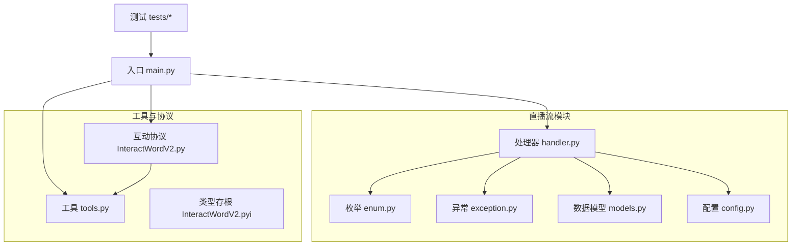
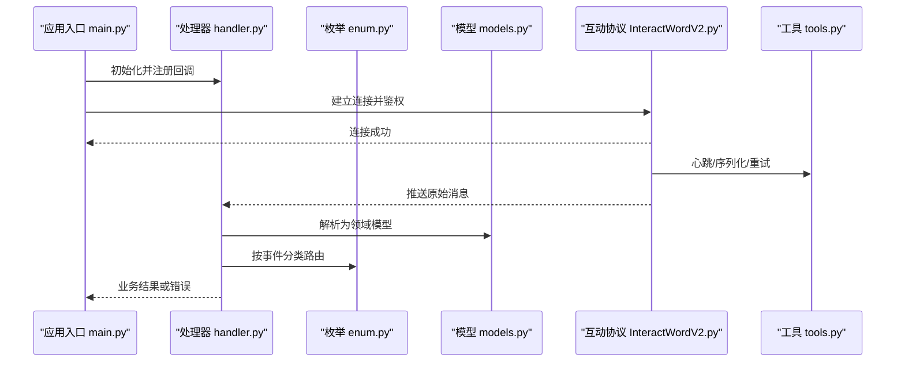
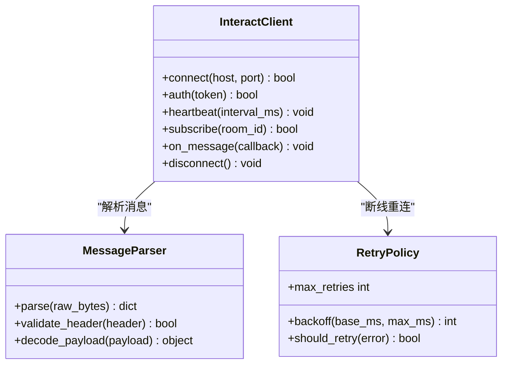
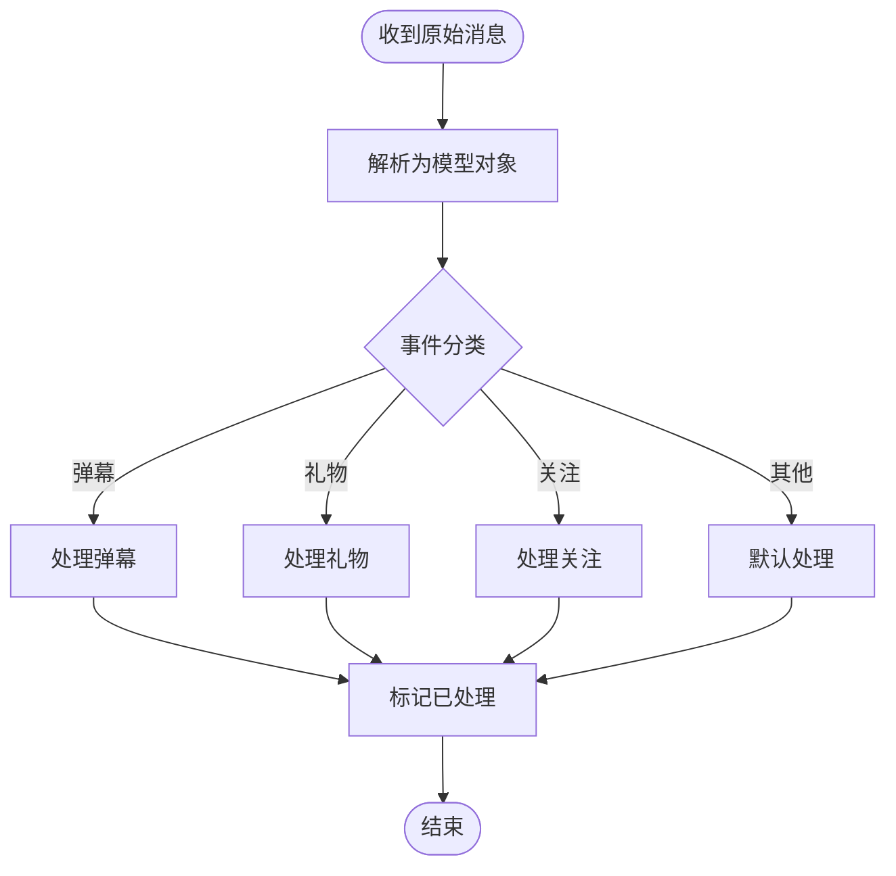
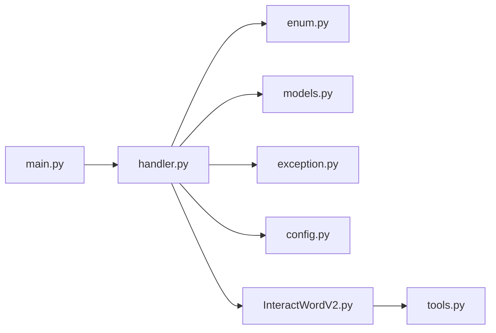

# API参考

<cite>
**本文档引用的文件**
- [enum.py](file://live_streams/enum.py)
- [exception.py](file://live_streams/exception.py)
- [tools.py](file://utils/tools.py)
- [InteractWordV2.py](file://utils/InteractWordV2.py)
- [InteractWordV2.pyi](file://utils/InteractWordV2.pyi)
- [handler.py](file://live_streams/handler.py)
- [models.py](file://live_streams/models.py)
- [config.py](file://live_streams/config.py)
- [main.py](file://main.py)
</cite>

## 目录
1. [简介](#简介)
2. [项目结构](#项目结构)
3. [核心组件](#核心组件)
4. [架构总览](#架构总览)
5. [详细组件分析](#详细组件分析)
6. [依赖关系分析](#依赖关系分析)
7. [性能考虑](#性能考虑)
8. [故障排查指南](#故障排查指南)
9. [结论](#结论)
10. [附录](#附录)

## 简介
本API参考文档面向Blive-Bot的开发者与使用者，系统化梳理公共接口、数据模型、事件枚举、异常体系与工具函数，重点覆盖B站互动协议（InteractWordV2）的实现细节、消息格式、版本兼容性与迁移建议。文档以“从概念到实现”的方式组织内容，既适合快速查阅API定义，也便于深入理解内部处理流程与最佳实践。

## 项目结构
- live_streams：直播流相关模块，包含配置、枚举、异常、处理器与数据模型等。
- utils：通用工具与B站互动协议实现，包括InteractWordV2与工具函数集合。
- tests：测试用例，用于验证房间连接与基础功能。
- main.py：应用入口，负责初始化与启动。
- config.toml/pyproject.toml：项目配置与依赖声明。

图表来源
- [main.py](file://main.py)
- [handler.py](file://live_streams/handler.py)
- [enum.py](file://live_streams/enum.py)
- [exception.py](file://live_streams/exception.py)
- [models.py](file://live_streams/models.py)
- [config.py](file://live_streams/config.py)
- [tools.py](file://utils/tools.py)
- [InteractWordV2.py](file://utils/InteractWordV2.py)
- [InteractWordV2.pyi](file://utils/InteractWordV2.pyi)

章节来源
- [main.py](file://main.py)
- [handler.py](file://live_streams/handler.py)
- [enum.py](file://live_streams/enum.py)
- [exception.py](file://live_streams/exception.py)
- [models.py](file://live_streams/models.py)
- [config.py](file://live_streams/config.py)
- [tools.py](file://utils/tools.py)
- [InteractWordV2.py](file://utils/InteractWordV2.py)
- [InteractWordV2.pyi](file://utils/InteractWordV2.pyi)

## 核心组件
- 枚举与分类（live_streams/enum.py）：集中定义弹幕事件类型、消息分类与处理状态，供上层逻辑统一识别与路由。
- 异常体系（live_streams/exception.py）：定义业务异常类型、触发条件与恢复策略，确保错误可追踪与可恢复。
- 工具函数（utils/tools.py）：提供网络、序列化、时间、日志等常用能力，降低重复代码并提升一致性。
- B站互动协议（utils/InteractWordV2.py/.pyi）：封装B站直播互动协议的握手、心跳、鉴权与消息编解码，屏蔽底层差异。
- 处理器与模型（live_streams/handler.py, models.py）：将原始消息转换为领域模型，驱动业务处理与回调。
- 配置（live_streams/config.py）：集中管理运行时参数与环境变量。

章节来源
- [enum.py](file://live_streams/enum.py)
- [exception.py](file://live_streams/exception.py)
- [tools.py](file://utils/tools.py)
- [InteractWordV2.py](file://utils/InteractWordV2.py)
- [InteractWordV2.pyi](file://utils/InteractWordV2.pyi)
- [handler.py](file://live_streams/handler.py)
- [models.py](file://live_streams/models.py)
- [config.py](file://live_streams/config.py)

## 架构总览
整体采用“协议层—工具层—业务层”的分层设计：
- 协议层：InteractWordV2负责与B站服务端交互，完成鉴权、心跳、消息收发。
- 工具层：tools提供通用能力，如JSON编解码、签名、重试、限流等。
- 业务层：handler解析消息为模型对象，结合enum的事件分类进行路由处理；exception统一捕获与上报。

图表来源
- [main.py](file://main.py)
- [handler.py](file://live_streams/handler.py)
- [enum.py](file://live_streams/enum.py)
- [models.py](file://live_streams/models.py)
- [InteractWordV2.py](file://utils/InteractWordV2.py)
- [tools.py](file://utils/tools.py)

## 详细组件分析

### 枚举与事件分类（live_streams/enum.py）
- 弹幕事件类型：涵盖评论、礼物、舰长、提督、总督、粉丝勋章、关注、取关、进入直播间、退出直播间等常见事件。
- 消息分类：区分系统消息、用户消息、活动消息、风控消息等，便于差异化处理。
- 处理状态：定义待处理、已处理、失败、重试中、忽略等状态，配合异常与重试机制使用。

使用建议
- 在处理器中使用枚举值进行分支判断，避免硬编码字符串。
- 对未知事件类型应记录告警并降级处理，保证稳定性。

章节来源
- [enum.py](file://live_streams/enum.py)

### 异常体系（live_streams/exception.py）
- 自定义异常类型：网络连接异常、鉴权失败、消息解析异常、业务校验异常、超时异常等。
- 触发条件：每种异常对应明确的触发场景，如HTTP状态码、协议字段缺失、签名错误等。
- 处理方法：建议在调用点捕获具体异常，进行重试、降级或上报；对不可恢复异常直接中断并通知运维。

最佳实践
- 异常分层：区分网络层、协议层、业务层异常，便于定位问题。
- 携带上下文：异常信息中包含房间号、用户ID、消息ID等关键上下文。
- 幂等与重试：对可重试异常实施指数退避，避免雪崩。

章节来源
- [exception.py](file://live_streams/exception.py)

### 工具函数（utils/tools.py）
- 网络工具：请求封装、重试、超时控制、代理支持。
- 序列化：JSON编解码、字段映射、默认值处理。
- 时间工具：时间戳转换、时区处理、延迟执行。
- 日志与监控：结构化日志、采样、指标上报。
- 加密与签名：HMAC、RSA、URL签名等。

参数与返回值说明
- 每个工具函数需明确输入参数类型、默认值、约束条件。
- 返回值需包含成功数据与错误信息，必要时返回状态码。
- 示例用法请参考各函数的调用位置与测试用例。

章节来源
- [tools.py](file://utils/tools.py)

### B站互动协议（utils/InteractWordV2.py/.pyi）
- 协议版本：当前实现基于V2版本，兼容部分V1特性，未来可能引入V3扩展。
- 消息格式：二进制/JSON混合，包含头部（版本号、序列号、操作码）、载荷（业务数据）、尾部（签名）。
- 兼容性说明：对不同B站服务器版本进行适配，自动降级或提示升级。
- 核心流程：连接→鉴权→心跳→订阅频道→收发消息→断线重连。

图表来源
- [InteractWordV2.py](file://utils/InteractWordV2.py)
- [InteractWordV2.pyi](file://utils/InteractWordV2.pyi)

章节来源
- [InteractWordV2.py](file://utils/InteractWordV2.py)
- [InteractWordV2.pyi](file://utils/InteractWordV2.pyi)

### 处理器与模型（live_streams/handler.py, models.py）
- 处理器：接收原始消息，调用解析器生成模型对象，根据事件类型分发到对应业务逻辑。
- 模型：定义弹幕、礼物、关注等数据结构，包含字段校验与格式化方法。
- 回调机制：支持异步回调，便于与外部系统集成。

图表来源
- [handler.py](file://live_streams/handler.py)
- [models.py](file://live_streams/models.py)
- [enum.py](file://live_streams/enum.py)

章节来源
- [handler.py](file://live_streams/handler.py)
- [models.py](file://live_streams/models.py)

## 依赖关系分析
- 模块内聚：enum、exception、models聚焦数据与错误定义，职责清晰。
- 耦合点：handler依赖enum与models；Interact依赖tools；main协调各模块。
- 外部依赖：网络库、序列化库、日志库等通过tools抽象，便于替换与测试。

图表来源
- [main.py](file://main.py)
- [handler.py](file://live_streams/handler.py)
- [enum.py](file://live_streams/enum.py)
- [models.py](file://live_streams/models.py)
- [exception.py](file://live_streams/exception.py)
- [config.py](file://live_streams/config.py)
- [InteractWordV2.py](file://utils/InteractWordV2.py)
- [tools.py](file://utils/tools.py)

章节来源
- [main.py](file://main.py)
- [handler.py](file://live_streams/handler.py)
- [InteractWordV2.py](file://utils/InteractWordV2.py)
- [tools.py](file://utils/tools.py)

## 性能考虑
- 心跳与重连：合理设置心跳间隔与超时，避免频繁重连导致资源耗尽。
- 消息批处理：批量解析与发送，减少锁竞争与序列化开销。
- 内存管理：及时释放大对象，避免内存泄漏。
- 日志采样：高吞吐场景下启用日志采样，降低IO压力。

[本节为通用指导，不直接分析具体文件]

## 故障排查指南
- 连接失败：检查网络连通性、代理配置、鉴权令牌有效性。
- 消息解析错误：核对协议版本、字段完整性、签名算法。
- 业务异常：查看异常堆栈与上下文信息，确认输入合法性。
- 性能瓶颈：监控CPU、内存、网络IO，定位热点路径。

章节来源
- [exception.py](file://live_streams/exception.py)
- [tools.py](file://utils/tools.py)
- [InteractWordV2.py](file://utils/InteractWordV2.py)

## 结论
本API参考文档系统梳理了Blive-Bot的核心组件与接口，重点覆盖了事件枚举、异常体系、工具函数与B站互动协议实现。通过分层设计与清晰的依赖关系，确保了系统的可扩展性与可维护性。建议在实际使用中遵循最佳实践，结合监控与日志快速定位问题。

[本节为总结性内容，不直接分析具体文件]

## 附录
- API版本兼容性：当前InteractWordV2支持V2为主，兼容部分V1特性；未来升级需关注字段变更与弃用警告。
- 迁移指南：逐步替换硬编码字符串为枚举值；统一异常捕获与上报；优化重试策略与超时配置。
- 示例与测试：参考tests目录下的用例，了解典型使用场景与边界条件。

[本节为补充信息，不直接分析具体文件]