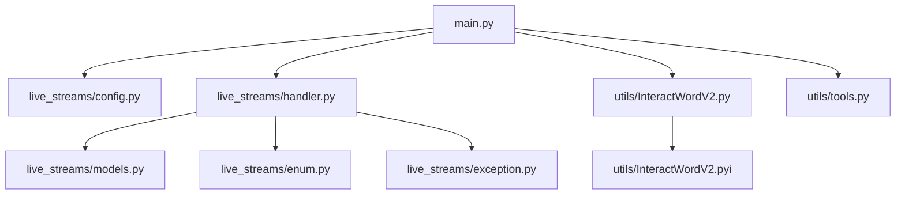
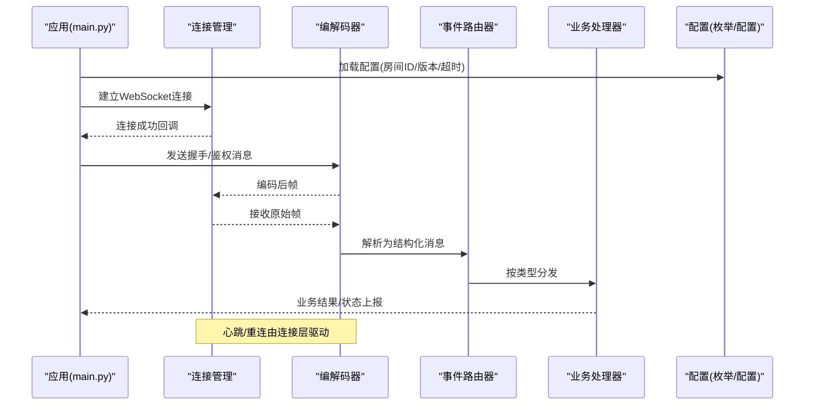
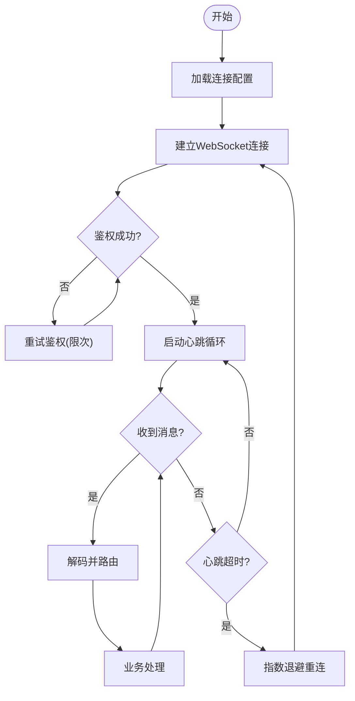
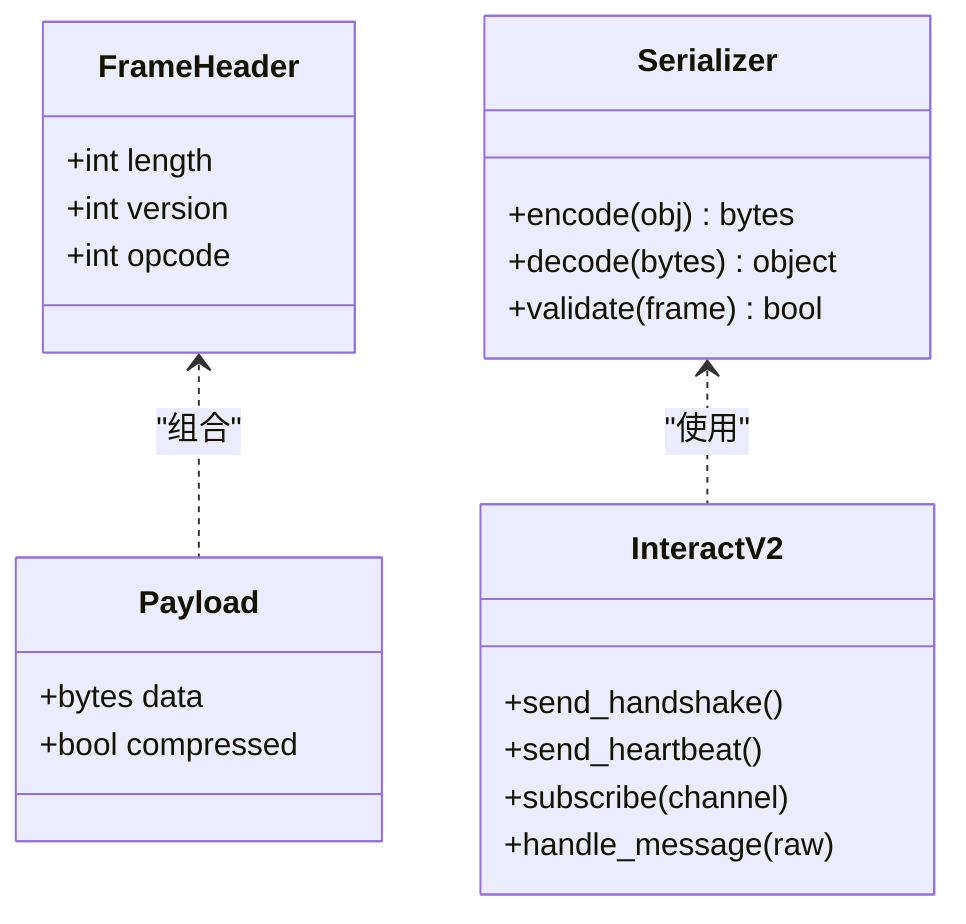
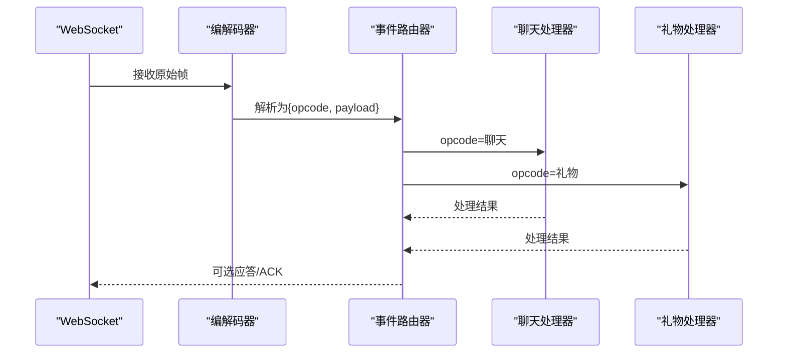
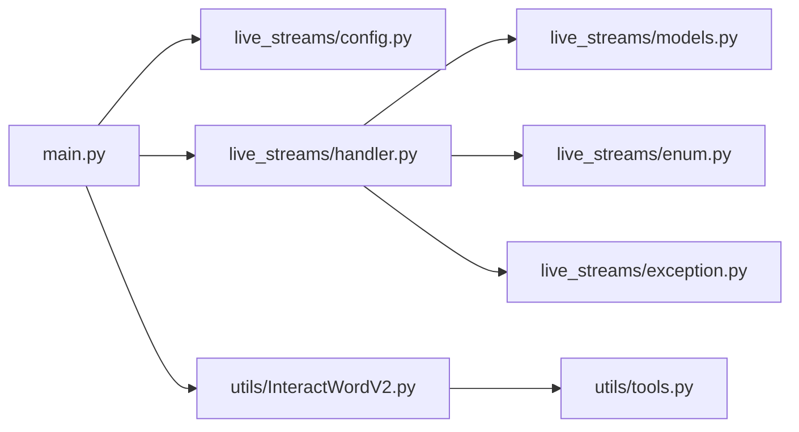

# 协议实现

<cite>
**本文引用的文件**   
- [main.py](file://main.py)
- [config.toml](file://config.toml)
- [pyproject.toml](file://pyproject.toml)
- [live_streams/__init__.py](file://live_streams/__init__.py)
- [live_streams/config.py](file://live_streams/config.py)
- [live_streams/enum.py](file://live_streams/enum.py)
- [live_streams/exception.py](file://live_streams/exception.py)
- [live_streams/handler.py](file://live_streams/handler.py)
- [live_streams/models.py](file://live_streams/models.py)
- [utils/InteractWordV2.py](file://utils/InteractWordV2.py)
- [utils/InteractWordV2.pyi](file://utils/InteractWordV2.pyi)
- [utils/tools.py](file://utils/tools.py)
- [tests/live_rooms.py](file://tests/live_rooms.py)
- [tests/test.py](file://tests/test.py)
</cite>

## 目录
1. [简介](#简介)
2. [项目结构](#项目结构)
3. [核心组件](#核心组件)
4. [架构总览](#架构总览)
5. [详细组件分析](#详细组件分析)
6. [依赖关系分析](#依赖关系分析)
7. [性能考量](#性能考量)
8. [故障排除指南](#故障排除指南)
9. [结论](#结论)
10. [附录](#附录)

## 简介
本文件面向B站互动协议V2的客户端实现，系统性说明WebSocket连接建立、消息格式、协议版本与兼容性、心跳机制、重连策略、错误处理与性能优化。文档同时提供完整的消息序列化与反序列化示例路径，并给出与B站官方协议的差异点及适配方案，最后附带调试工具与故障排除指南，帮助开发者快速定位问题并稳定运行。

## 项目结构
本项目采用分层组织：
- live_streams：直播流相关配置、枚举、异常、处理器与数据模型
- utils：互动协议V2的核心实现（含类型提示）与通用工具
- tests：基础测试用例
- main.py：应用入口
- config.toml：运行时配置
- pyproject.toml：项目元数据与依赖声明

图表来源
- [main.py](file://main.py)
- [live_streams/config.py](file://live_streams/config.py)
- [live_streams/handler.py](file://live_streams/handler.py)
- [live_streams/models.py](file://live_streams/models.py)
- [live_streams/enum.py](file://live_streams/enum.py)
- [live_streams/exception.py](file://live_streams/exception.py)
- [utils/InteractWordV2.py](file://utils/InteractWordV2.py)
- [utils/InteractWordV2.pyi](file://utils/InteractWordV2.pyi)
- [utils/tools.py](file://utils/tools.py)

章节来源
- [main.py](file://main.py)
- [config.toml](file://config.toml)
- [pyproject.toml](file://pyproject.toml)

## 核心组件
- WebSocket连接管理：负责握手、鉴权、订阅频道、保活与断线恢复
- 消息编解码：协议帧封装、二进制/文本编解码、字段校验
- 事件分发：将解析后的业务事件路由到具体处理器
- 配置与枚举：连接参数、房间ID、协议版本、消息类型等
- 异常体系：网络异常、协议异常、业务异常分类与恢复建议

章节来源
- [live_streams/config.py](file://live_streams/config.py)
- [live_streams/enum.py](file://live_streams/enum.py)
- [live_streams/exception.py](file://live_streams/exception.py)
- [live_streams/handler.py](file://live_streams/handler.py)
- [live_streams/models.py](file://live_streams/models.py)
- [utils/InteractWordV2.py](file://utils/InteractWordV2.py)
- [utils/InteractWordV2.pyi](file://utils/InteractWordV2.pyi)
- [utils/tools.py](file://utils/tools.py)

## 架构总览
整体采用“连接层-编解码层-事件层”的分层架构。连接层维护WebSocket生命周期；编解码层负责协议帧组装与解析；事件层根据消息类型分发给业务处理器。配置模块集中管理连接参数与行为开关，异常模块统一错误语义。

图表来源
- [main.py](file://main.py)
- [live_streams/config.py](file://live_streams/config.py)
- [live_streams/enum.py](file://live_streams/enum.py)
- [live_streams/handler.py](file://live_streams/handler.py)
- [live_streams/models.py](file://live_streams/models.py)
- [utils/InteractWordV2.py](file://utils/InteractWordV2.py)
- [utils/InteractWordV2.pyi](file://utils/InteractWordV2.pyi)

## 详细组件分析

### 连接管理与心跳重连
- 连接建立：读取配置中的服务器地址、端口、TLS选项、鉴权参数，发起WebSocket握手
- 心跳机制：周期性发送心跳帧，服务端未响应时触发重连
- 重连策略：指数退避+抖动，最大重试次数与退避上限可配置
- 优雅关闭：在退出前发送关闭帧并等待确认

图表来源
- [live_streams/config.py](file://live_streams/config.py)
- [live_streams/handler.py](file://live_streams/handler.py)
- [utils/InteractWordV2.py](file://utils/InteractWordV2.py)

章节来源
- [live_streams/config.py](file://live_streams/config.py)
- [live_streams/handler.py](file://live_streams/handler.py)
- [utils/InteractWordV2.py](file://utils/InteractWordV2.py)

### 消息编解码与序列化
- 帧结构：包含头部（长度、版本号、操作码）、载荷（JSON或二进制）、可选签名
- 序列化：对象→字节序列（压缩可选），支持大消息分片
- 反序列化：字节序列→对象，严格字段校验与类型转换
- 兼容层：对旧版本字段做降级处理，缺失字段使用默认值

图表来源
- [utils/InteractWordV2.py](file://utils/InteractWordV2.py)
- [utils/InteractWordV2.pyi](file://utils/InteractWordV2.pyi)

章节来源
- [utils/InteractWordV2.py](file://utils/InteractWordV2.py)
- [utils/InteractWordV2.pyi](file://utils/InteractWordV2.pyi)

### 事件路由与处理器
- 路由表：按操作码映射到处理器函数
- 处理器职责：解析业务字段、调用业务逻辑、回写状态
- 错误隔离：单个处理器异常不影响其他事件处理

图表来源
- [live_streams/handler.py](file://live_streams/handler.py)
- [live_streams/models.py](file://live_streams/models.py)
- [live_streams/enum.py](file://live_streams/enum.py)

章节来源
- [live_streams/handler.py](file://live_streams/handler.py)
- [live_streams/models.py](file://live_streams/models.py)
- [live_streams/enum.py](file://live_streams/enum.py)

### 配置与枚举
- 连接参数：服务器地址、端口、TLS、鉴权令牌、超时、心跳间隔
- 行为开关：是否启用压缩、最大重连次数、日志级别
- 枚举定义：协议版本、操作码、消息类型、错误码

章节来源
- [live_streams/config.py](file://live_streams/config.py)
- [live_streams/enum.py](file://live_streams/enum.py)
- [config.toml](file://config.toml)

### 异常体系
- 网络异常：连接失败、超时、断开
- 协议异常：帧格式错误、校验失败、版本不兼容
- 业务异常：鉴权失败、权限不足、参数非法
- 恢复建议：重试、降级、告警

章节来源
- [live_streams/exception.py](file://live_streams/exception.py)

## 依赖关系分析
- 模块内聚：连接、编解码、路由、处理器职责清晰
- 外部依赖：WebSocket库、JSON/二进制序列化库、加密库（如TLS）
- 潜在循环：避免handler与models互相导入，通过接口或枚举解耦

图表来源
- [main.py](file://main.py)
- [live_streams/config.py](file://live_streams/config.py)
- [live_streams/handler.py](file://live_streams/handler.py)
- [live_streams/models.py](file://live_streams/models.py)
- [live_streams/enum.py](file://live_streams/enum.py)
- [live_streams/exception.py](file://live_streams/exception.py)
- [utils/InteractWordV2.py](file://utils/InteractWordV2.py)
- [utils/tools.py](file://utils/tools.py)

章节来源
- [pyproject.toml](file://pyproject.toml)

## 性能考量
- 连接复用：长连接减少握手开销
- 批量发送：合并小消息降低系统调用
- 零拷贝：尽量使用内存视图与缓冲池
- 异步I/O：非阻塞收发提升吞吐
- 压缩策略：仅在带宽受限场景启用
- 背压控制：消费端速率限制防止积压

[本节为通用指导，无需引用具体文件]

## 故障排除指南
- 连接失败：检查网络可达、防火墙、证书、鉴权参数
- 频繁断线：调整心跳间隔与超时阈值，观察服务端负载
- 消息乱序：确保单连接顺序消费，必要时加序列号校验
- 解析失败：核对协议版本与字段定义，开启详细日志
- 内存泄漏：监控缓冲区大小，及时释放临时对象

章节来源
- [live_streams/exception.py](file://live_streams/exception.py)
- [live_streams/config.py](file://live_streams/config.py)
- [utils/tools.py](file://utils/tools.py)

## 结论
本实现围绕B站互动协议V2构建了清晰的连接-编解码-事件分层架构，提供稳定的心跳与重连机制、完善的异常体系与可扩展的事件路由。通过合理的配置与性能优化，可在高并发场景下保持低延迟与高吞吐。建议在生产环境开启详细日志与指标采集，持续验证协议兼容性与稳定性。

[本节为总结性内容，无需引用具体文件]

## 附录

### 完整消息序列化与反序列化示例（路径指引）
- 序列化示例：参考 [utils/InteractWordV2.py](file://utils/InteractWordV2.py) 中编码器调用位置
- 反序列化示例：参考 [utils/InteractWordV2.py](file://utils/InteractWordV2.py) 中解码器调用位置
- 类型提示与接口定义：参考 [utils/InteractWordV2.pyi](file://utils/InteractWordV2.pyi)

章节来源
- [utils/InteractWordV2.py](file://utils/InteractWordV2.py)
- [utils/InteractWordV2.pyi](file://utils/InteractWordV2.pyi)

### 与B站官方协议的差异与适配方案
- 差异点：帧头字段命名、操作码分配、扩展字段可选性
- 适配方案：在编解码层增加字段映射与默认值填充，提供版本协商与降级路径
- 兼容性测试：参考 [tests/test.py](file://tests/test.py)、[tests/live_rooms.py](file://tests/live_rooms.py)

章节来源
- [utils/InteractWordV2.py](file://utils/InteractWordV2.py)
- [tests/test.py](file://tests/test.py)
- [tests/live_rooms.py](file://tests/live_rooms.py)

### 调试工具与日志
- 启用详细日志：在配置中设置日志级别为DEBUG
- 抓包辅助：结合网络抓包工具比对帧结构与时间戳
- 单元测试：覆盖关键编解码路径与异常分支

章节来源
- [config.toml](file://config.toml)
- [tests/test.py](file://tests/test.py)
- [tests/live_rooms.py](file://tests/live_rooms.py)