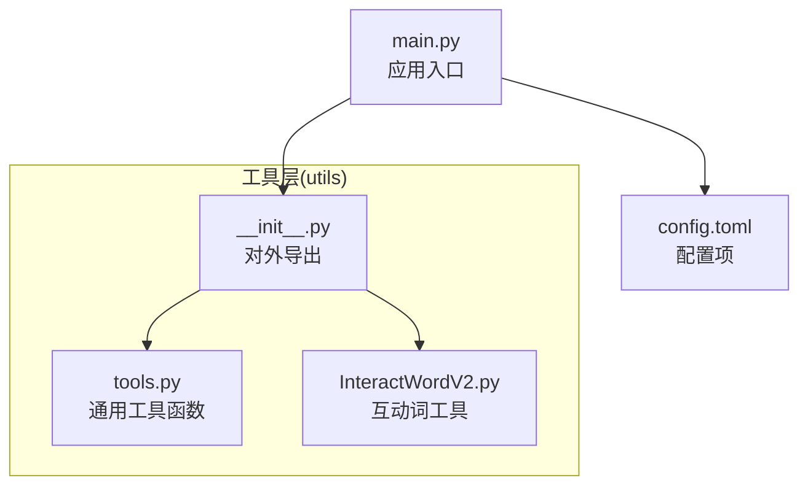
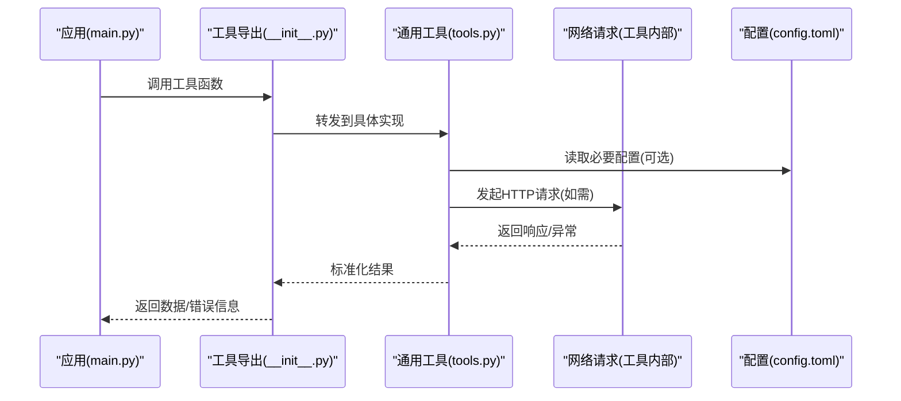
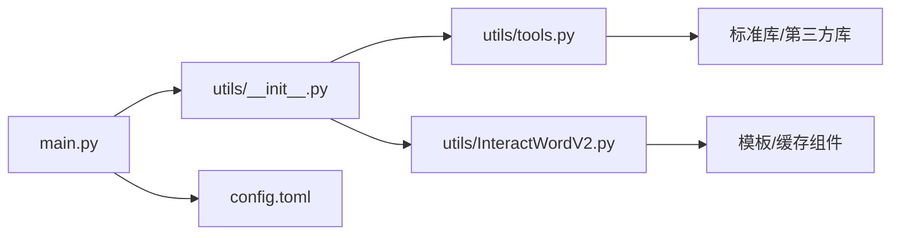

# 工具函数

<cite>
**本文档引用的文件**   
- [utils/tools.py](file://utils/tools.py)
- [utils/InteractWordV2.py](file://utils/InteractWordV2.py)
- [utils/__init__.py](file://utils/__init__.py)
- [main.py](file://main.py)
- [config.toml](file://config.toml)
</cite>

## 目录
1. [简介](#简介)
2. [项目结构](#项目结构)
3. [核心组件](#核心组件)
4. [架构总览](#架构总览)
5. [详细组件分析](#详细组件分析)
6. [依赖关系分析](#依赖关系分析)
7. [性能考虑](#性能考虑)
8. [故障排查指南](#故障排查指南)
9. [结论](#结论)
10. [附录](#附录)

## 简介
本文件为 Blive-Bot 项目的“工具函数”模块提供系统化、面向使用者的 API 文档。内容覆盖数据处理、格式转换、网络请求等常用能力，给出参数说明、返回值类型、调用示例、错误处理与性能优化建议，并梳理工具函数之间的依赖关系与使用限制，帮助开发者快速集成与排错。

## 项目结构
Blive-Bot 的工具函数集中在 utils 目录下，其中：
- tools.py：通用工具函数集合（数据处理、格式转换、网络请求等）
- InteractWordV2.py：互动词相关工具（如弹幕/礼物词生成或解析）
- __init__.py：对外暴露的便捷入口（按需导出）

图表来源
- [utils/tools.py](file://utils/tools.py)
- [utils/InteractWordV2.py](file://utils/InteractWordV2.py)
- [utils/__init__.py](file://utils/__init__.py)
- [main.py](file://main.py)
- [config.toml](file://config.toml)

章节来源
- [utils/tools.py](file://utils/tools.py)
- [utils/InteractWordV2.py](file://utils/InteractWordV2.py)
- [utils/__init__.py](file://utils/__init__.py)
- [main.py](file://main.py)
- [config.toml](file://config.toml)

## 核心组件
本节概述工具函数的职责边界与典型能力分类，便于使用者按场景检索：
- 数据处理
  - 列表/字典过滤、映射、聚合
  - 时间戳与日期格式化
  - 字符串清洗与编码转换
- 格式转换
  - JSON/字典互转与校验
  - 数值精度与单位换算
  - 枚举/状态码映射
- 网络请求
  - HTTP 客户端封装（超时、重试、鉴权头）
  - 响应体解析与错误码统一
  - 流式下载/上传进度回调（如有）
- 互动词工具
  - 词库加载与采样
  - 模板渲染与变量替换
  - 频率控制与去重

章节来源
- [utils/tools.py](file://utils/tools.py)
- [utils/InteractWordV2.py](file://utils/InteractWordV2.py)

## 架构总览
工具函数以“无状态纯函数 + 轻量封装”为主，通过 __init__.py 统一对外暴露。上层 main.py 仅依赖导出的接口，避免直接耦合实现细节。配置由 config.toml 集中管理，工具函数在需要时读取或通过参数注入。

图表来源
- [main.py](file://main.py)
- [utils/__init__.py](file://utils/__init__.py)
- [utils/tools.py](file://utils/tools.py)
- [config.toml](file://config.toml)

## 详细组件分析

### 通用工具函数(tools.py)
- 功能范围
  - 数据处理：过滤、映射、分组、排序、分页
  - 格式转换：JSON、时间、数值、单位、编码
  - 网络请求：GET/POST/PUT/DELETE 封装、重试、超时、鉴权
  - 日志与调试：结构化日志、请求追踪、耗时统计
- 关键设计
  - 函数尽量无副作用，输入输出明确
  - 错误采用统一异常或错误码，便于上层捕获
  - 可配置项通过参数或全局配置对象传入
- 使用建议
  - 网络请求务必设置超时与重试上限
  - 对敏感字段进行脱敏后再记录日志
  - 批量操作注意内存占用，必要时分片处理

章节来源
- [utils/tools.py](file://utils/tools.py)

### 互动词工具(InteractWordV2.py)
- 功能范围
  - 词库加载：从本地文件或远程资源加载词表
  - 模板渲染：基于变量替换生成最终文本
  - 采样策略：随机、轮询、权重采样
  - 频率控制：限流、冷却、去重
- 关键设计
  - 词库缓存以减少 IO 开销
  - 渲染引擎支持占位符与条件分支
  - 限流器可插拔，支持令牌桶/滑动窗口
- 使用建议
  - 预热词库并在进程内复用实例
  - 合理设置采样权重，避免热点词过载
  - 监控生成失败率与延迟分布

章节来源
- [utils/InteractWordV2.py](file://utils/InteractWordV2.py)

### 对外导出(__init__.py)
- 作用
  - 将 tools.py 与 InteractWordV2.py 的能力统一暴露给上层
  - 提供简洁命名空间，隐藏内部实现细节
- 使用建议
  - 仅导入需要的符号，减少依赖面
  - 保持导出稳定，内部重构不影响外部调用

章节来源
- [utils/__init__.py](file://utils/__init__.py)

### 应用入口(main.py)
- 作用
  - 初始化配置、启动服务或任务调度
  - 调用工具函数完成业务逻辑
- 使用建议
  - 将配置项集中管理，避免硬编码
  - 对工具函数调用增加统一错误处理与监控埋点

章节来源
- [main.py](file://main.py)

## 依赖关系分析
- 模块内依赖
  - __init__.py 依赖 tools.py 与 InteractWordV2.py
  - tools.py 可能依赖标准库与第三方网络库（如 httpx/requests）
  - InteractWordV2.py 可能依赖模板引擎与缓存组件
- 外部依赖
  - 配置文件：config.toml
  - 运行时依赖：网络访问、文件系统、序列化库
- 潜在风险
  - 循环导入需避免
  - 第三方库版本升级兼容性
  - 网络不可用时的降级策略

图表来源
- [main.py](file://main.py)
- [utils/__init__.py](file://utils/__init__.py)
- [utils/tools.py](file://utils/tools.py)
- [utils/InteractWordV2.py](file://utils/InteractWordV2.py)
- [config.toml](file://config.toml)

章节来源
- [utils/__init__.py](file://utils/__init__.py)
- [utils/tools.py](file://utils/tools.py)
- [utils/InteractWordV2.py](file://utils/InteractWordV2.py)
- [main.py](file://main.py)
- [config.toml](file://config.toml)

## 性能考虑
- 网络请求
  - 连接池复用、Keep-Alive 开启
  - 合理设置超时与最大重试次数
  - 大文件下载使用流式传输，避免一次性加载至内存
- 数据处理
  - 优先使用生成器与惰性求值
  - 批量操作分片处理，控制并发度
  - 避免重复计算，引入缓存或记忆化
- 模板渲染
  - 预编译模板，减少运行时开销
  - 控制变量替换深度与复杂度
- 监控与度量
  - 记录关键路径耗时、错误率、QPS
  - 对慢查询与高内存占用进行告警

[本节为通用指导，不直接分析具体文件]

## 故障排查指南
- 常见问题
  - 网络超时/连接失败：检查代理、DNS、防火墙；增加重试与退避
  - 解析失败：确认响应格式与字段名；增加容错与默认值
  - 模板渲染错误：检查占位符与变量类型；启用严格模式
  - 内存溢出：检查是否一次性加载大对象；改用流式或分页
- 定位方法
  - 开启详细日志，记录请求/响应摘要
  - 使用断点与堆栈跟踪定位异常路径
  - 通过指标面板观察延迟与错误分布
- 恢复策略
  - 自动重试与熔断
  - 降级到本地缓存或默认值
  - 优雅关闭与状态回滚

章节来源
- [utils/tools.py](file://utils/tools.py)
- [utils/InteractWordV2.py](file://utils/InteractWordV2.py)

## 结论
Blive-Bot 的工具函数以清晰的分层与稳定的导出接口，为上层应用提供了可靠的数据处理、格式转换与网络请求能力。遵循本文的使用建议与最佳实践，可在保证稳定性的同时获得良好的性能表现。建议在接入前完善监控与告警，确保问题可观测、可定位、可恢复。

[本节为总结性内容，不直接分析具体文件]

## 附录
- 术语
  - 工具函数：无状态、可复用的基础能力封装
  - 模板渲染：基于模板与变量生成目标文本的过程
  - 限流：控制单位时间内请求数量的机制
- 参考
  - 配置项说明见 config.toml
  - 主流程入口见 main.py

[本节为补充信息，不直接分析具体文件]