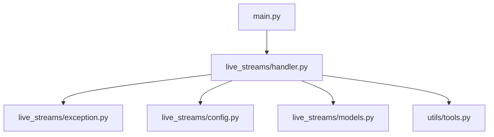
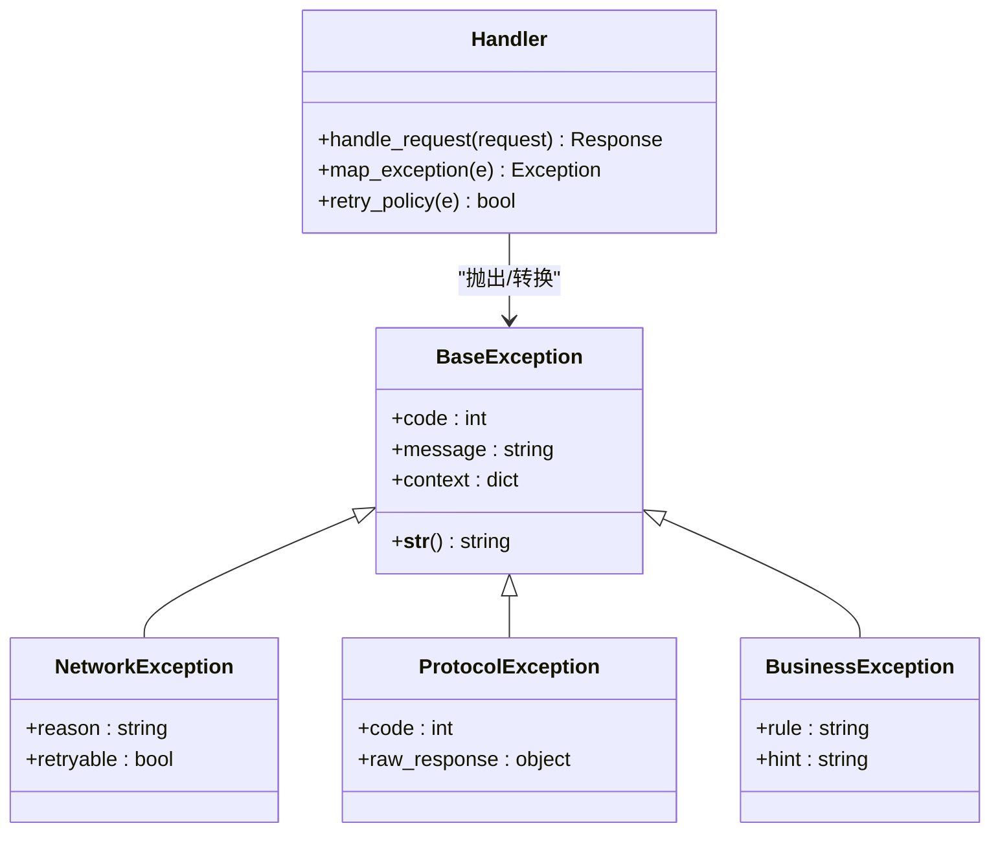
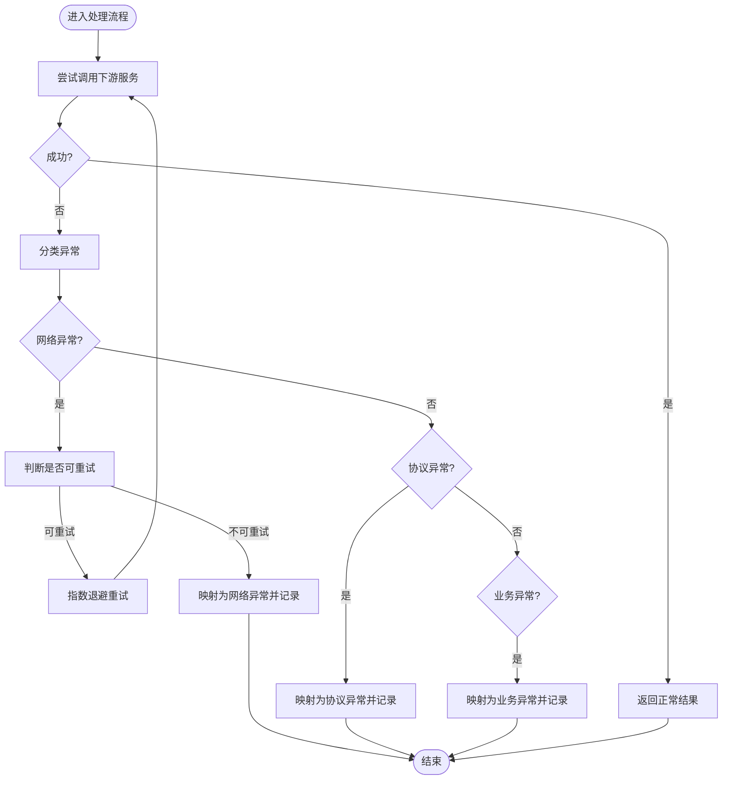
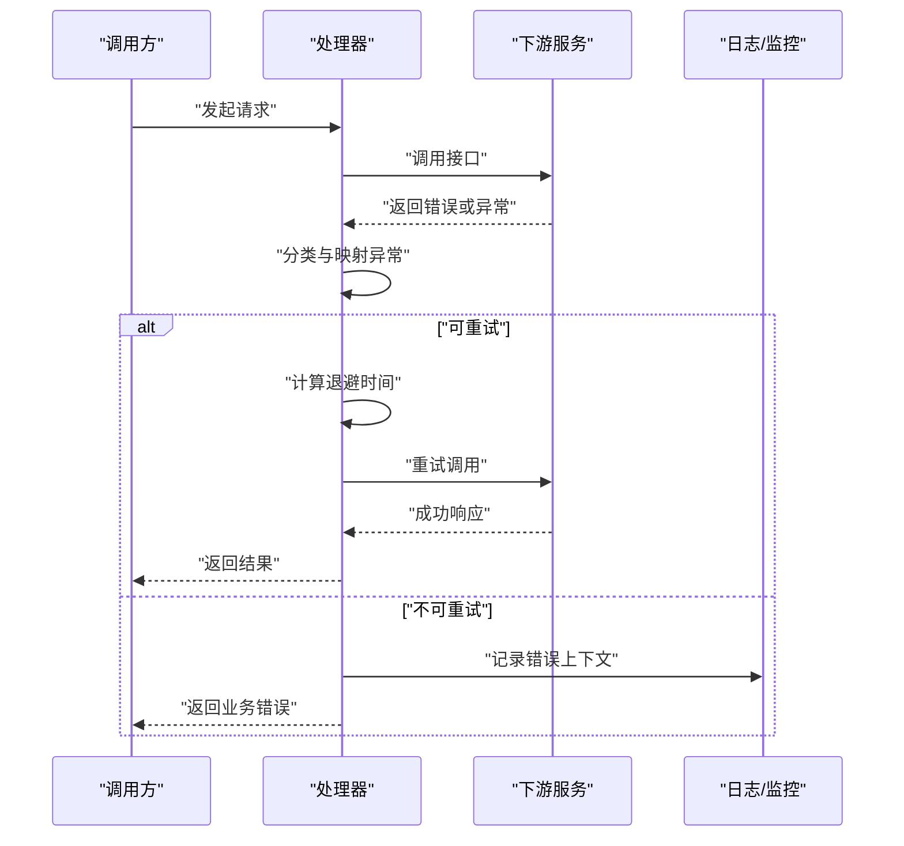
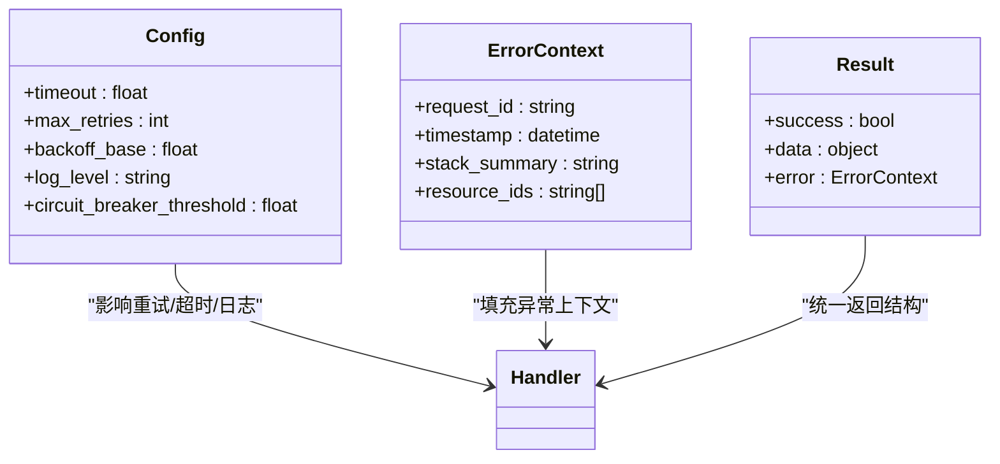
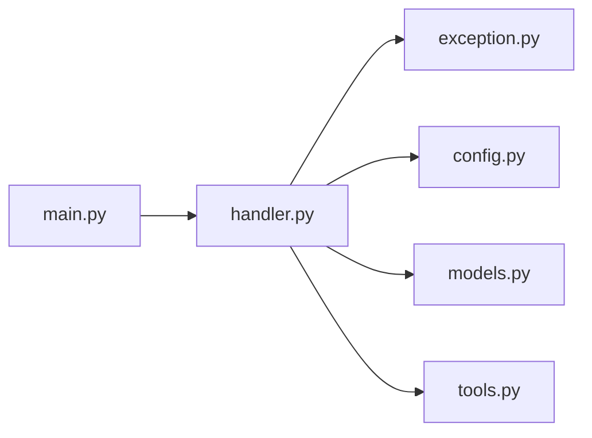

# 异常处理

<cite>
**本文档引用的文件**   
- [exception.py](file://live_streams/exception.py)
- [handler.py](file://live_streams/handler.py)
- [config.py](file://live_streams/config.py)
- [models.py](file://live_streams/models.py)
- [main.py](file://main.py)
- [tools.py](file://utils/tools.py)
</cite>

## 目录
1. [简介](#简介)
2. [项目结构](#项目结构)
3. [核心组件](#核心组件)
4. [架构总览](#架构总览)
5. [详细组件分析](#详细组件分析)
6. [依赖关系分析](#依赖关系分析)
7. [性能考虑](#性能考虑)
8. [故障排查指南](#故障排查指南)
9. [结论](#结论)
10. [附录](#附录)

## 简介
本文件为 Blive-Bot 的异常处理 API 文档，聚焦于 live_streams 模块中的自定义异常体系、触发条件、错误码约定与处理方法。内容覆盖：
- 异常层次结构与继承关系
- 网络异常、协议异常、业务异常的划分与处理模式
- 捕获最佳实践、错误恢复策略与调试技巧
- 关键流程的调用序列图与流程图

## 项目结构
本项目采用按功能域组织的方式，异常定义集中在 live_streams/exception.py，业务处理逻辑在 live_streams/handler.py，配置与数据模型分别在 config.py 与 models.py。主入口 main.py 负责启动与全局异常兜底。工具函数位于 utils/tools.py。

**图示来源** 
- [main.py:1-200](file://main.py#L1-L200)
- [handler.py:1-300](file://live_streams/handler.py#L1-L300)
- [exception.py:1-200](file://live_streams/exception.py#L1-L200)
- [config.py:1-200](file://live_streams/config.py#L1-L200)
- [models.py:1-200](file://live_streams/models.py#L1-L200)
- [tools.py:1-200](file://utils/tools.py#L1-L200)

**章节来源**
- [main.py:1-200](file://main.py#L1-L200)
- [handler.py:1-300](file://live_streams/handler.py#L1-L300)
- [exception.py:1-200](file://live_streams/exception.py#L1-L200)
- [config.py:1-200](file://live_streams/config.py#L1-L200)
- [models.py:1-200](file://live_streams/models.py#L1-L200)
- [tools.py:1-200](file://utils/tools.py#L1-L200)

## 核心组件
- 异常基类与分类
  - 基础异常：用于统一错误信息格式与上下文携带
  - 网络异常：封装连接、超时、DNS 解析等网络层问题
  - 协议异常：封装 HTTP/WebSocket/Bilibili 协议层面的错误码与消息
  - 业务异常：封装房间状态、鉴权失败、限流等业务规则错误
- 处理器（Handler）
  - 统一入口进行请求编排与响应处理
  - 将底层异常转换为上层业务异常或标准错误响应
- 配置与模型
  - 配置项影响重试、超时、日志级别等异常行为
  - 数据模型用于承载错误上下文与结果对象

**章节来源**
- [exception.py:1-200](file://live_streams/exception.py#L1-L200)
- [handler.py:1-300](file://live_streams/handler.py#L1-L300)
- [config.py:1-200](file://live_streams/config.py#L1-L200)
- [models.py:1-200](file://live_streams/models.py#L1-L200)

## 架构总览
下图展示了从主入口到处理器、再到异常体系的调用关系与职责边界。

**图示来源** 
- [exception.py:1-200](file://live_streams/exception.py#L1-L200)
- [handler.py:1-300](file://live_streams/handler.py#L1-L300)

## 详细组件分析

### 异常层次与类型说明
- 基础异常
  - 作用：提供统一的 code、message、context 字段，便于日志与监控聚合
  - 常见用法：作为所有自定义异常的根
- 网络异常
  - 触发条件：连接失败、超时、DNS 解析失败、TLS 握手失败、代理错误等
  - 建议：标记是否可重试；结合指数退避策略
- 协议异常
  - 触发条件：HTTP 非 2xx、WebSocket 关闭帧、B站接口返回错误码、签名失败等
  - 建议：保留原始响应体以便诊断；区分可重试与不可重试
- 业务异常
  - 触发条件：房间不存在、用户被禁言、权限不足、频率限制、参数校验失败等
  - 建议：提供 hint 提示前端或上游系统如何修正

**图示来源** 
- [handler.py:1-300](file://live_streams/handler.py#L1-L300)
- [exception.py:1-200](file://live_streams/exception.py#L1-L200)

**章节来源**
- [exception.py:1-200](file://live_streams/exception.py#L1-L200)
- [handler.py:1-300](file://live_streams/handler.py#L1-L300)

### 处理器（Handler）异常映射与重试策略
- 异常映射
  - 将底层库异常（如 requests、websocket、httpx）映射为自定义异常
  - 对协议错误码进行语义化解释，补充 context
- 重试策略
  - 基于可重试标志与错误码决定重试次数与间隔
  - 支持幂等性检查与去重键，避免重复提交
- 错误恢复
  - 降级路径：切换备用端点、使用缓存、返回友好提示
  - 熔断与限流：根据错误率动态调整

**图示来源** 
- [handler.py:1-300](file://live_streams/handler.py#L1-L300)

**章节来源**
- [handler.py:1-300](file://live_streams/handler.py#L1-L300)

### 配置与模型对异常行为的影响
- 配置项
  - 超时、重试次数、退避策略、日志级别、熔断阈值等
  - 不同环境（开发/测试/生产）差异化配置
- 数据模型
  - 错误上下文对象：包含请求 ID、时间戳、堆栈摘要、相关资源标识
  - 结果对象：成功/失败分支的统一结构

**图示来源** 
- [config.py:1-200](file://live_streams/config.py#L1-L200)
- [models.py:1-200](file://live_streams/models.py#L1-L200)
- [handler.py:1-300](file://live_streams/handler.py#L1-L300)

**章节来源**
- [config.py:1-200](file://live_streams/config.py#L1-L200)
- [models.py:1-200](file://live_streams/models.py#L1-L200)

### 工具函数与辅助能力
- 通用工具
  - 日志格式化、敏感信息脱敏、堆栈摘要生成
  - 重试与退避实现、幂等键生成
- 集成点
  - 与外部 SDK 的适配层，统一异常输出

**章节来源**
- [tools.py:1-200](file://utils/tools.py#L1-L200)

## 依赖关系分析
- 模块耦合
  - handler 依赖 exception、config、models 与 tools
  - main 仅依赖 handler 进行启动与全局异常兜底
- 外部依赖
  - 网络库（requests/httpx/websocket）异常需映射为本项目异常
  - 第三方 SDK 的错误码需映射为协议异常

**图示来源** 
- [main.py:1-200](file://main.py#L1-L200)
- [handler.py:1-300](file://live_streams/handler.py#L1-L300)
- [exception.py:1-200](file://live_streams/exception.py#L1-L200)
- [config.py:1-200](file://live_streams/config.py#L1-L200)
- [models.py:1-200](file://live_streams/models.py#L1-L200)
- [tools.py:1-200](file://utils/tools.py#L1-L200)

**章节来源**
- [main.py:1-200](file://main.py#L1-L200)
- [handler.py:1-300](file://live_streams/handler.py#L1-L300)

## 性能考虑
- 重试与退避
  - 合理设置最大重试次数与退避基数，避免雪崩
  - 对非幂等操作禁用自动重试
- 超时控制
  - 区分连接超时与读取超时，避免线程阻塞
- 日志与监控
  - 控制日志粒度，避免高频错误刷屏
  - 采样关键错误路径，减少 I/O 开销

[本节为通用指导，不直接分析具体文件]

## 故障排查指南
- 快速定位
  - 查看错误码与 message，确认异常类别（网络/协议/业务）
  - 检查 context 中的 request_id 与 resource_ids，关联上下游日志
- 常见问题
  - 频繁超时：检查网络质量、服务端负载、超时配置
  - 协议错误：核对签名、版本、参数格式与鉴权令牌
  - 业务限制：关注限流、封禁、房间状态变更
- 恢复策略
  - 可重试错误：启用指数退避与熔断
  - 不可重试错误：降级到缓存或返回友好提示
  - 持续失败：告警并人工介入

**章节来源**
- [exception.py:1-200](file://live_streams/exception.py#L1-L200)
- [handler.py:1-300](file://live_streams/handler.py#L1-L300)

## 结论
通过统一的异常层次与映射机制，Blive-Bot 实现了网络、协议与业务异常的清晰分离与一致化处理。配合合理的重试、超时与降级策略，可在复杂网络环境下保持稳定性与可观测性。建议在接入新服务时遵循本规范，确保错误可追踪、可恢复。

[本节为总结性内容，不直接分析具体文件]

## 附录
- 最佳实践清单
  - 始终捕获并分类异常，避免吞掉错误
  - 为每个异常提供可读的 message 与结构化 context
  - 对幂等操作才允许自动重试
  - 使用统一的结果对象返回成功与失败分支
  - 在生产环境开启关键错误告警
- 调试技巧
  - 打开调试日志，打印请求 ID 与关键参数（脱敏后）
  - 使用本地回放或 Mock 验证异常分支
  - 利用 trace 链路追踪跨模块调用

[本节为通用指导，不直接分析具体文件]