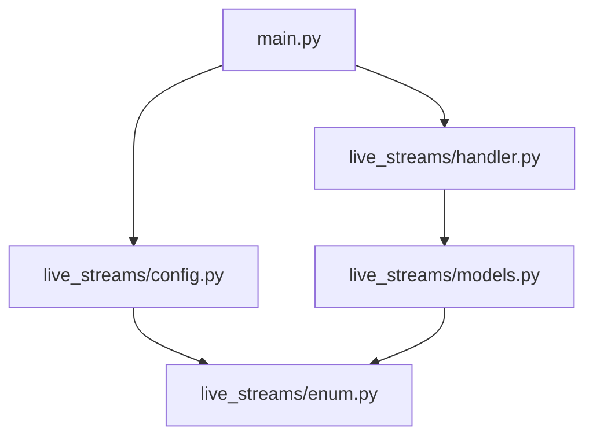
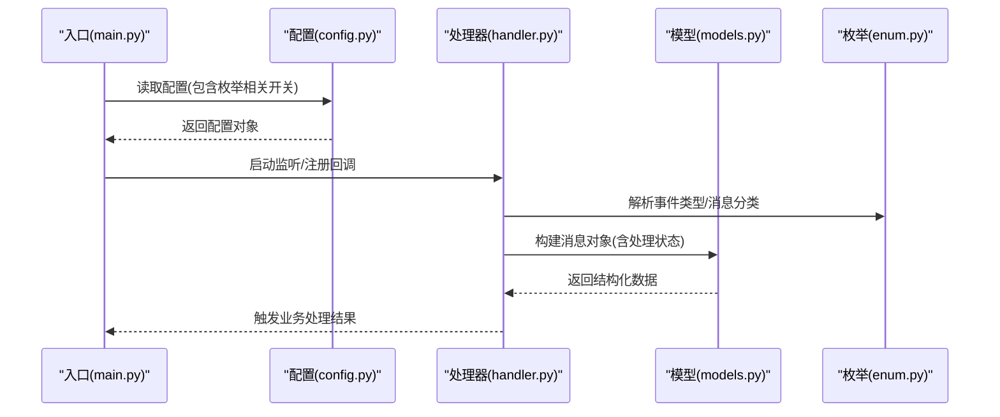
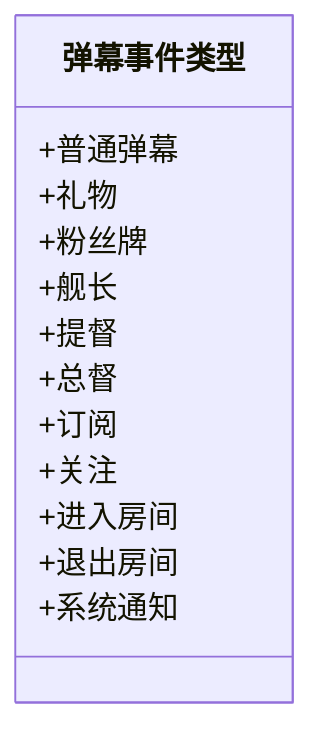
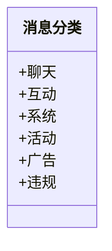
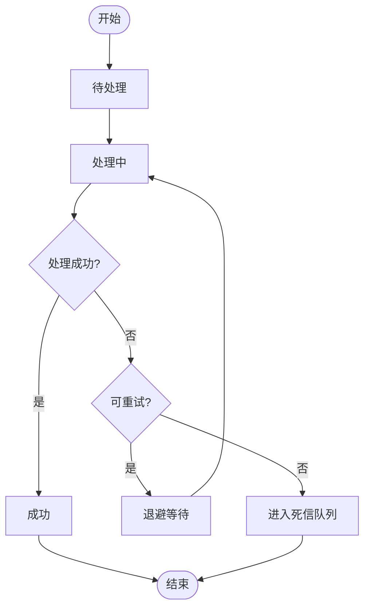
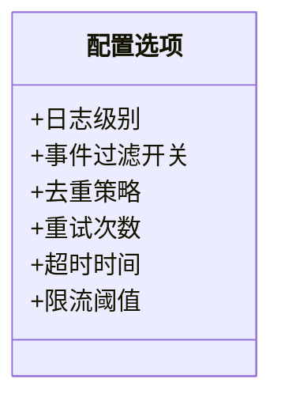
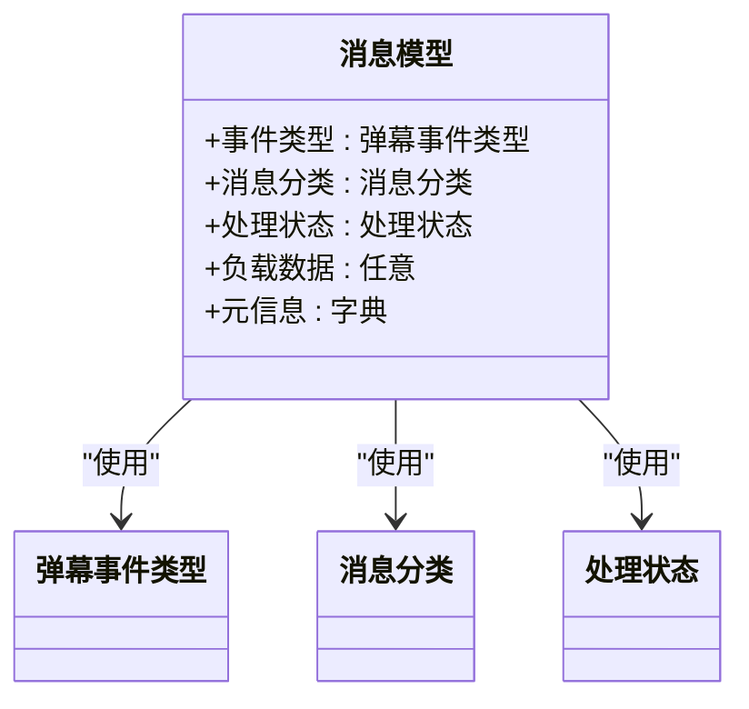
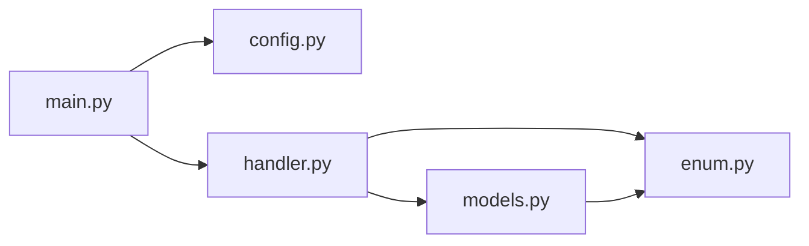

# 枚举类型

<cite>
**本文引用的文件**   
- [live_streams/enum.py](file://live_streams/enum.py)
- [live_streams/models.py](file://live_streams/models.py)
- [live_streams/handler.py](file://live_streams/handler.py)
- [live_streams/config.py](file://live_streams/config.py)
- [main.py](file://main.py)
</cite>

## 目录
1. [简介](#简介)
2. [项目结构](#项目结构)
3. [核心组件](#核心组件)
4. [架构总览](#架构总览)
5. [详细组件分析](#详细组件分析)
6. [依赖关系分析](#依赖关系分析)
7. [性能考虑](#性能考虑)
8. [故障排查指南](#故障排查指南)
9. [结论](#结论)
10. [附录](#附录)

## 简介
本文件为 Blive-Bot 的枚举类型 API 文档，聚焦弹幕事件类型、消息分类、处理状态与配置选项等枚举定义。内容涵盖：
- 各枚举值的含义与使用场景
- 枚举之间的关联关系与继承结构
- 完整的类型定义说明、验证规则与最佳实践
- 典型调用流程与错误处理建议

## 项目结构
本项目采用按功能模块组织的方式，枚举相关定义集中在 live_streams 包内，模型与处理器在 models.py 与 handler.py 中引用这些枚举；配置文件在 config.py 中提供与枚举相关的配置项；入口 main.py 负责初始化并加载配置。

**图示来源** 
- [main.py](file://main.py)
- [live_streams/config.py](file://live_streams/config.py)
- [live_streams/enum.py](file://live_streams/enum.py)
- [live_streams/handler.py](file://live_streams/handler.py)
- [live_streams/models.py](file://live_streams/models.py)

**章节来源**
- [live_streams/enum.py](file://live_streams/enum.py)
- [live_streams/models.py](file://live_streams/models.py)
- [live_streams/handler.py](file://live_streams/handler.py)
- [live_streams/config.py](file://live_streams/config.py)
- [main.py](file://main.py)

## 核心组件
- 弹幕事件类型：用于标识收到的弹幕消息类别（如普通弹幕、礼物、粉丝牌、舰长、提督等），便于路由到不同处理器。
- 消息分类：对消息进行更细粒度的归类（例如系统消息、互动消息、活动消息等），用于过滤与统计。
- 处理状态：描述消息在流水线中的处理阶段（如待处理、已处理、失败、重试等）。
- 配置选项：控制行为开关与阈值（如是否启用某类事件的日志、是否开启去重、最大重试次数等）。

上述枚举共同构成 Blive-Bot 的事件驱动核心，确保高内聚、低耦合的消息分发与处理。

**章节来源**
- [live_streams/enum.py](file://live_streams/enum.py)
- [live_streams/models.py](file://live_streams/models.py)
- [live_streams/handler.py](file://live_streams/handler.py)
- [live_streams/config.py](file://live_streams/config.py)

## 架构总览
下图展示了从入口到枚举使用的整体流程：入口加载配置，处理器根据事件类型与消息分类进行路由，模型层携带处理状态流转，最终由业务逻辑完成消费。

**图示来源** 
- [main.py](file://main.py)
- [live_streams/config.py](file://live_streams/config.py)
- [live_streams/handler.py](file://live_streams/handler.py)
- [live_streams/models.py](file://live_streams/models.py)
- [live_streams/enum.py](file://live_streams/enum.py)

## 详细组件分析

### 弹幕事件类型枚举
- 用途：识别弹幕流中的事件种类，决定后续处理分支。
- 常见值示例（以实际代码为准）：普通弹幕、礼物、粉丝牌、舰长、提督、总督、订阅、关注、进入房间、退出房间、系统通知等。
- 使用场景：
  - 路由分发：将不同事件分派给对应处理器。
  - 权限控制：某些事件仅允许特定用户或等级触发。
  - 统计上报：按事件类型聚合指标。
- 验证规则：
  - 未知事件应被拒绝或降级处理。
  - 事件值需来自枚举集合，禁止硬编码字符串匹配。
- 最佳实践：
  - 新增事件时同步更新处理器映射表与测试用例。
  - 对高频事件（如普通弹幕）做快速路径优化。

**图示来源** 
- [live_streams/enum.py](file://live_streams/enum.py)

**章节来源**
- [live_streams/enum.py](file://live_streams/enum.py)
- [live_streams/handler.py](file://live_streams/handler.py)

### 消息分类枚举
- 用途：对消息进行更细粒度分类，便于过滤、审计与策略执行。
- 常见值示例（以实际代码为准）：聊天、互动、系统、活动、广告、违规等。
- 使用场景：
  - 过滤规则：屏蔽广告或违规消息。
  - 策略引擎：对不同分类应用不同权重或延迟。
  - 报表维度：按分类统计流量与转化。
- 验证规则：
  - 分类必须属于预定义集合。
  - 未分类消息默认归入“聊天”或“系统”，并记录告警。
- 最佳实践：
  - 分类变更需保持向后兼容，避免破坏下游消费者。

**图示来源** 
- [live_streams/enum.py](file://live_streams/enum.py)

**章节来源**
- [live_streams/enum.py](file://live_streams/enum.py)
- [live_streams/handler.py](file://live_streams/handler.py)

### 处理状态枚举
- 用途：描述消息在流水线中的生命周期状态。
- 常见值示例（以实际代码为准）：待处理、处理中、成功、失败、重试、丢弃等。
- 使用场景：
  - 状态机推进：确保每个消息都有明确的状态转换。
  - 监控告警：失败与重试超过阈值触发告警。
  - 幂等性保障：基于状态避免重复处理。
- 验证规则：
  - 状态转换必须符合预设转移图。
  - 非法状态应抛出异常并记录上下文。
- 最佳实践：
  - 对失败状态实现退避重试与死信队列。
  - 关键状态变更写入审计日志。

**图示来源** 
- [live_streams/enum.py](file://live_streams/enum.py)
- [live_streams/models.py](file://live_streams/models.py)

**章节来源**
- [live_streams/enum.py](file://live_streams/enum.py)
- [live_streams/models.py](file://live_streams/models.py)

### 配置选项枚举
- 用途：集中管理行为开关与阈值，支持运行时或启动时加载。
- 常见值示例（以实际代码为准）：日志级别、事件过滤开关、去重策略、重试次数、超时时间、限流阈值等。
- 使用场景：
  - 环境差异化：开发/测试/生产环境的不同配置。
  - 动态调整：热更新部分开关而不重启服务。
  - 灰度发布：逐步放开新功能或事件类型。
- 验证规则：
  - 配置值需在合法范围内，越界则回退默认值或报错。
  - 必填项缺失时应阻止启动。
- 最佳实践：
  - 配置与代码解耦，使用外部化配置中心。
  - 对敏感配置进行加密与访问控制。

**图示来源** 
- [live_streams/config.py](file://live_streams/config.py)
- [live_streams/enum.py](file://live_streams/enum.py)

**章节来源**
- [live_streams/config.py](file://live_streams/config.py)
- [live_streams/enum.py](file://live_streams/enum.py)

### 模型与枚举的关联
- 模型层承载消息体，字段类型与校验规则依赖枚举约束。
- 处理器根据事件类型与消息分类选择具体处理逻辑。
- 处理状态贯穿模型生命周期，确保一致性。

**图示来源** 
- [live_streams/models.py](file://live_streams/models.py)
- [live_streams/enum.py](file://live_streams/enum.py)

**章节来源**
- [live_streams/models.py](file://live_streams/models.py)
- [live_streams/enum.py](file://live_streams/enum.py)

## 依赖关系分析
- 入口 main.py 加载配置并启动处理器。
- 处理器 handler.py 依赖 enum.py 的枚举进行解析与路由。
- 模型 models.py 使用枚举作为字段类型，保证数据结构一致性。
- 配置 config.py 提供枚举相关开关，影响处理器与模型行为。

**图示来源** 
- [main.py](file://main.py)
- [live_streams/config.py](file://live_streams/config.py)
- [live_streams/handler.py](file://live_streams/handler.py)
- [live_streams/models.py](file://live_streams/models.py)
- [live_streams/enum.py](file://live_streams/enum.py)

**章节来源**
- [main.py](file://main.py)
- [live_streams/config.py](file://live_streams/config.py)
- [live_streams/handler.py](file://live_streams/handler.py)
- [live_streams/models.py](file://live_streams/models.py)
- [live_streams/enum.py](file://live_streams/enum.py)

## 性能考虑
- 事件类型与消息分类的匹配应采用 O(1) 查找（如哈希表或枚举直接比较）。
- 对高频事件（如普通弹幕）启用快速路径，减少不必要的对象创建。
- 处理状态切换应避免锁竞争，必要时使用无锁队列或分区处理。
- 配置读取应缓存，避免频繁 I/O。

[本节为通用指导，不直接分析具体文件]

## 故障排查指南
- 常见错误：
  - 未知事件类型：检查枚举集合与上游协议版本。
  - 非法处理状态：核对状态转移图与并发安全。
  - 配置项缺失或越界：启动前校验并给出明确错误提示。
- 定位方法：
  - 启用调试日志，记录事件类型、消息分类与处理状态。
  - 使用断点或探针观察状态机流转。
  - 对失败消息进入死信队列，保留原始负载以便复现。
- 修复建议：
  - 补齐缺失的枚举值或修正映射表。
  - 增加输入校验与边界检查。
  - 对重试与超时设置合理上限，防止雪崩。

**章节来源**
- [live_streams/handler.py](file://live_streams/handler.py)
- [live_streams/models.py](file://live_streams/models.py)
- [live_streams/config.py](file://live_streams/config.py)

## 结论
Blive-Bot 通过清晰的枚举体系实现了弹幕事件的高内聚处理与可扩展架构。遵循本文的验证规则与最佳实践，可有效提升系统的稳定性、可维护性与性能表现。建议在新增事件或分类时同步更新文档与测试，确保契约一致。

[本节为总结性内容，不直接分析具体文件]

## 附录
- 类型定义参考：请查看以下文件的枚举定义与使用位置
  - [live_streams/enum.py](file://live_streams/enum.py)
  - [live_streams/models.py](file://live_streams/models.py)
  - [live_streams/handler.py](file://live_streams/handler.py)
  - [live_streams/config.py](file://live_streams/config.py)
- 使用示例参考：
  - 事件路由：在处理器中根据事件类型选择分支逻辑
  - 状态推进：在模型层按状态机推进处理状态
  - 配置加载：在入口处加载配置并注入到处理器与模型

[本节为补充信息，不直接分析具体文件]