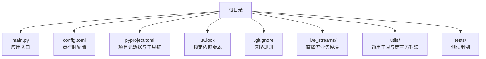
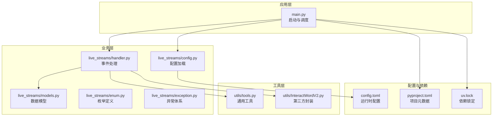
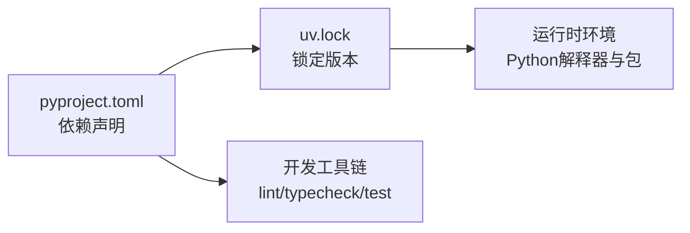

# 代码规范

<cite>
**本文引用的文件**   
- [main.py](file://main.py)
- [config.toml](file://config.toml)
- [pyproject.toml](file://pyproject.toml)
- [uv.lock](file://uv.lock)
- [live_streams/__init__.py](file://live_streams/__init__.py)
- [live_streams/config.py](file://live_streams/config.py)
- [live_streams/enum.py](file://live_streams/enum.py)
- [live_streams/exception.py](file://live_streams/exception.py)
- [live_streams/handler.py](file://live_streams/handler.py)
- [live_streams/models.py](file://live_streams/models.py)
- [utils/__init__.py](file://utils/__init__.py)
- [utils/tools.py](file://utils/tools.py)
- [utils/InteractWordV2.py](file://utils/InteractWordV2.py)
- [utils/InteractWordV2.pyi](file://utils/InteractWordV2.pyi)
- [tests/live_rooms.py](file://tests/live_rooms.py)
- [tests/test.py](file://tests/test.py)
- [.gitignore](file://.gitignore)
</cite>

## 目录
1. [简介](#简介)
2. [项目结构](#项目结构)
3. [核心组件](#核心组件)
4. [架构总览](#架构总览)
5. [详细组件分析](#详细组件分析)
6. [依赖关系分析](#依赖关系分析)
7. [性能考虑](#性能考虑)
8. [故障排查指南](#故障排查指南)
9. [结论](#结论)
10. [附录](#附录)

## 简介
本规范面向Blive-Bot项目的Python开发与维护，目标是统一代码风格、模块组织、配置管理、版本控制与质量保障流程。文档覆盖：
- Python代码风格（命名、注释、格式化）
- 模块组织与文件命名约定
- 配置文件编写规范与最佳实践
- Git提交信息格式、分支策略与版本控制流程
- 代码审查检查清单、静态分析与自动化检查
- 依赖管理与版本兼容性策略

## 项目结构
项目采用按功能域划分的模块化结构，根目录包含入口脚本、配置与构建元数据；业务逻辑集中在live_streams包；通用工具在utils包；测试用例在tests目录。

**图示来源** 
- [main.py:1-20](file://main.py#L1-L20)
- [config.toml:1-30](file://config.toml#L1-L30)
- [pyproject.toml:1-30](file://pyproject.toml#L1-L30)
- [uv.lock:1-30](file://uv.lock#L1-L30)
- [.gitignore:1-30](file://.gitignore#L1-L30)

**章节来源**
- [main.py:1-20](file://main.py#L1-L20)
- [config.toml:1-30](file://config.toml#L1-L30)
- [pyproject.toml:1-30](file://pyproject.toml#L1-L30)
- [uv.lock:1-30](file://uv.lock#L1-L30)
- [.gitignore:1-30](file://.gitignore#L1-L30)

## 核心组件
- live_streams：直播流相关的数据模型、枚举、异常、配置加载与事件处理等。
- utils：通用工具函数与第三方库的适配封装。
- tests：针对关键路径与工具的单元测试与集成测试。
- main.py：应用启动与生命周期管理。
- config.toml：集中式配置项，支持运行环境与部署差异。
- pyproject.toml：定义项目元数据、依赖与开发工具链。
- uv.lock：锁定依赖版本，确保可重复构建。

**章节来源**
- [live_streams/config.py:1-40](file://live_streams/config.py#L1-L40)
- [live_streams/models.py:1-40](file://live_streams/models.py#L1-L40)
- [live_streams/handler.py:1-40](file://live_streams/handler.py#L1-L40)
- [utils/tools.py:1-40](file://utils/tools.py#L1-L40)
- [main.py:1-40](file://main.py#L1-L40)

## 架构总览
系统以“配置驱动 + 事件处理”为核心：通过配置加载器读取运行时参数，由处理器协调直播流数据模型与外部交互，工具层提供通用能力与第三方适配。

**图示来源** 
- [main.py:1-40](file://main.py#L1-L40)
- [live_streams/config.py:1-40](file://live_streams/config.py#L1-L40)
- [live_streams/models.py:1-40](file://live_streams/models.py#L1-L40)
- [live_streams/handler.py:1-40](file://live_streams/handler.py#L1-L40)
- [live_streams/enum.py:1-40](file://live_streams/enum.py#L1-L40)
- [live_streams/exception.py:1-40](file://live_streams/exception.py#L1-L40)
- [utils/tools.py:1-40](file://utils/tools.py#L1-L40)
- [utils/InteractWordV2.py:1-40](file://utils/InteractWordV2.py#L1-L40)
- [config.toml:1-30](file://config.toml#L1-L30)
- [pyproject.toml:1-30](file://pyproject.toml#L1-L30)
- [uv.lock:1-30](file://uv.lock#L1-L30)

## 详细组件分析

### 配置加载与使用（live_streams/config.py）
- 职责：解析config.toml，提供类型安全的配置访问接口。
- 关键点：
  - 默认值与覆盖机制
  - 敏感字段的安全处理
  - 配置校验与错误提示
- 建议：
  - 所有新增配置项需声明默认值与类型
  - 对网络超时、重试次数等关键参数进行边界校验

**章节来源**
- [live_streams/config.py:1-40](file://live_streams/config.py#L1-L40)
- [config.toml:1-30](file://config.toml#L1-L30)

### 数据模型（live_streams/models.py）
- 职责：定义直播流相关数据结构与序列化/反序列化逻辑。
- 关键点：
  - 字段命名一致性（snake_case）
  - 可选字段与必填字段明确
  - 兼容旧版本的迁移策略
- 建议：
  - 使用数据类或Pydantic模型进行强类型约束
  - 对外暴露只读视图，避免内部状态被意外修改

**章节来源**
- [live_streams/models.py:1-40](file://live_streams/models.py#L1-L40)

### 事件处理（live_streams/handler.py）
- 职责：接收上游事件并调用相应处理器，协调模型与工具层。
- 关键点：
  - 事件路由与分发
  - 错误隔离与重试
  - 日志记录与指标上报
- 建议：
  - 每个处理器保持单一职责
  - 对第三方调用增加超时与熔断保护

**章节来源**
- [live_streams/handler.py:1-40](file://live_streams/handler.py#L1-L40)

### 枚举与异常（live_streams/enum.py, exception.py）
- 职责：统一定义业务枚举与异常层次。
- 关键点：
  - 枚举值语义清晰且不可变
  - 异常分类（输入错误、网络错误、业务错误）
- 建议：
  - 为每种异常提供明确的错误码与消息模板
  - 避免捕获过于宽泛的异常类型

**章节来源**
- [live_streams/enum.py:1-40](file://live_streams/enum.py#L1-L40)
- [live_streams/exception.py:1-40](file://live_streams/exception.py#L1-L40)

### 工具与第三方封装（utils/tools.py, utils/InteractWordV2.py）
- 职责：提供通用工具函数与第三方库的适配封装。
- 关键点：
  - 工具函数幂等性与线程安全
  - 第三方接口的错误映射与重试
- 建议：
  - 对I/O操作进行抽象，便于替换实现
  - 对外暴露稳定的API，内部实现可演进

**章节来源**
- [utils/tools.py:1-40](file://utils/tools.py#L1-L40)
- [utils/InteractWordV2.py:1-40](file://utils/InteractWordV2.py#L1-L40)
- [utils/InteractWordV2.pyi:1-40](file://utils/InteractWordV2.pyi#L1-L40)

### 应用入口（main.py）
- 职责：初始化配置、注册处理器、启动服务与优雅关闭。
- 关键点：
  - 启动顺序与依赖注入
  - 信号处理与资源清理
- 建议：
  - 将启动逻辑拆分为独立模块，便于测试
  - 使用进程内日志聚合与结构化输出

**章节来源**
- [main.py:1-40](file://main.py#L1-L40)

### 测试（tests/test.py, tests/live_rooms.py）
- 职责：覆盖核心路径与边界条件。
- 关键点：
  - 单测与集成测试分离
  - Mock外部依赖，保证测试稳定性
- 建议：
  - 测试覆盖率阈值纳入CI
  - 使用固定时间源与随机种子保证可重复性

**章节来源**
- [tests/test.py:1-40](file://tests/test.py#L1-L40)
- [tests/live_rooms.py:1-40](file://tests/live_rooms.py#L1-L40)

## 依赖关系分析
项目依赖通过pyproject.toml声明，使用uv进行锁定与安装，确保环境一致。

**图示来源** 
- [pyproject.toml:1-30](file://pyproject.toml#L1-L30)
- [uv.lock:1-30](file://uv.lock#L1-L30)

**章节来源**
- [pyproject.toml:1-30](file://pyproject.toml#L1-L30)
- [uv.lock:1-30](file://uv.lock#L1-L30)

## 性能考虑
- 配置加载：缓存已解析的配置对象，避免重复IO。
- 事件处理：批量处理与背压控制，防止突发流量导致阻塞。
- I/O优化：连接池、超时与重试策略，减少网络抖动影响。
- 内存管理：及时释放大对象引用，避免内存泄漏。
- 日志级别：生产环境降低日志量，关键路径保留结构化日志。

[本节为通用指导，不直接分析具体文件]

## 故障排查指南
- 常见问题定位：
  - 配置缺失或类型错误：检查config.toml与加载逻辑
  - 第三方接口异常：查看错误映射与重试日志
  - 事件丢失或重复：确认处理器幂等性与去重逻辑
- 调试建议：
  - 启用详细日志与追踪ID
  - 使用断点与交互式调试验证关键路径
  - 复现问题前准备最小化测试用例

**章节来源**
- [live_streams/exception.py:1-40](file://live_streams/exception.py#L1-L40)
- [live_streams/handler.py:1-40](file://live_streams/handler.py#L1-L40)

## 结论
本规范明确了Blive-Bot的代码风格、模块组织、配置管理、版本控制与质量保障流程。遵循这些标准有助于提升代码可读性、可维护性与交付质量。建议在团队内推广并持续完善。

[本节为总结性内容，不直接分析具体文件]

## 附录

### Python代码风格规范
- 命名约定
  - 模块与包：全小写，下划线分隔（如 live_streams）
  - 类名：大驼峰（如 EventHandler）
  - 函数与变量：小写下划线（如 load_config）
  - 常量：全大写加下划线（如 DEFAULT_TIMEOUT）
- 注释标准
  - 模块级docstring说明用途与依赖
  - 公共函数/类需提供参数、返回值与异常说明
  - 复杂逻辑行内注释解释意图而非语法
- 格式化规则
  - 使用统一缩进（4空格）
  - 每行不超过120字符
  - 导入分组与排序（标准库、第三方、本地）
  - 字符串使用单引号，必要时用f-string

[本节为通用指导，不直接分析具体文件]

### 模块组织与文件命名约定
- 模块划分
  - 按功能域分包（如 live_streams、utils）
  - 每个模块职责单一，避免跨层耦合
- 文件命名
  - 模块名小写下划线
  - 测试文件以test_前缀或放在tests目录
  - 类型存根使用.pyi后缀

[本节为通用指导，不直接分析具体文件]

### 配置文件编写规范与最佳实践
- 结构
  - 使用TOML/YAML等易读格式
  - 分节组织（如 database、api、logging）
- 内容
  - 提供默认值与示例
  - 敏感信息通过环境变量注入
  - 键名语义清晰且稳定
- 校验
  - 启动时校验必填项与取值范围
  - 失败时给出明确错误位置

**章节来源**
- [config.toml:1-30](file://config.toml#L1-L30)
- [live_streams/config.py:1-40](file://live_streams/config.py#L1-L40)

### Git提交信息格式、分支策略与版本控制流程
- 提交信息
  - 格式：<type>(<scope>): <subject>
  - type：feat、fix、docs、style、refactor、test、chore
  - subject简明扼要，动词开头
- 分支策略
  - main：稳定发布分支
  - develop：集成开发分支
  - feature/*：功能分支
  - hotfix/*：紧急修复分支
- 版本控制流程
  - 合并请求需通过审查与CI
  - 标签与发布说明用于版本追踪

[本节为通用指导，不直接分析具体文件]

### 代码审查检查清单
- 正确性：逻辑是否符合需求，边界条件是否覆盖
- 可读性：命名与结构是否清晰，注释是否充分
- 可维护性：模块耦合度低，变更影响面可控
- 安全性：无硬编码密钥，输入校验充分
- 性能：无不必要的循环与I/O，资源释放到位
- 测试：单测覆盖关键路径，Mock合理

[本节为通用指导，不直接分析具体文件]

### 静态代码分析工具与自动化检查配置
- 推荐工具
  - 格式化：black、isort
  - 类型检查：mypy
  - 代码质量：flake8、ruff
  - 安全扫描：bandit
- 自动化
  - 在pre-commit钩子中运行检查
  - CI流水线集成lint与测试
  - 报告生成与失败阻断

[本节为通用指导，不直接分析具体文件]

### 依赖管理与版本兼容性
- 声明与锁定
  - 使用pyproject.toml声明依赖
  - 使用uv.lock锁定版本，确保可重复构建
- 兼容性
  - 明确最低Python版本要求
  - 对第三方库升级进行回归测试
- 更新策略
  - 定期评估依赖安全漏洞
  - 小步快跑，逐步升级

**章节来源**
- [pyproject.toml:1-30](file://pyproject.toml#L1-L30)
- [uv.lock:1-30](file://uv.lock#L1-L30)