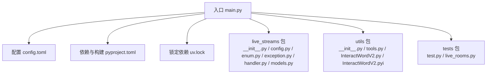
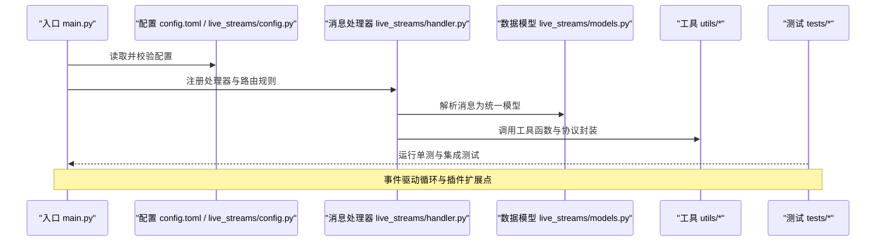
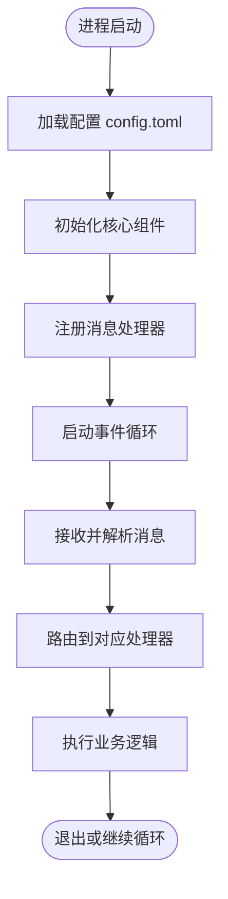
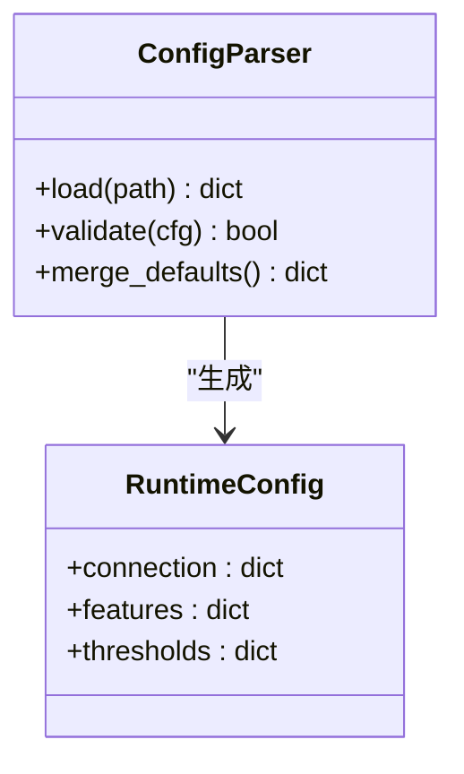
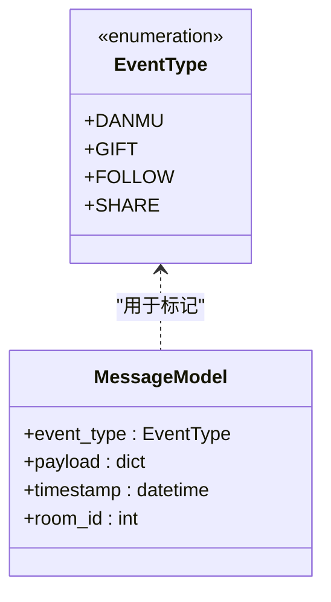
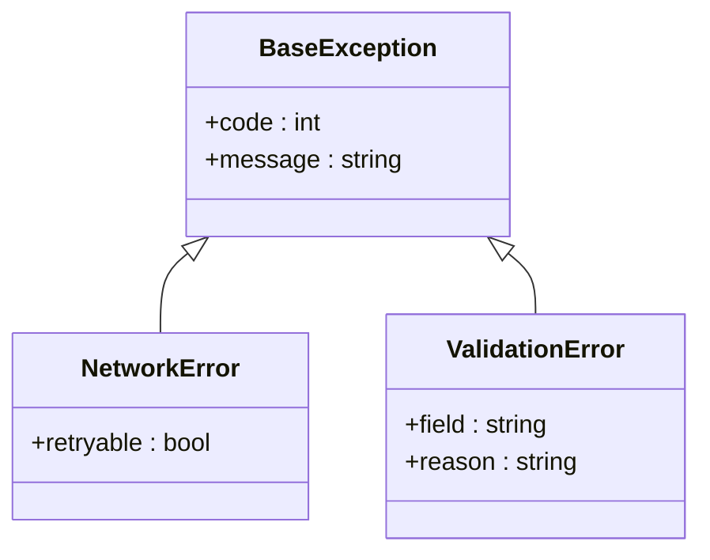
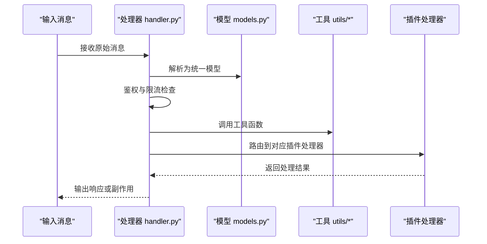
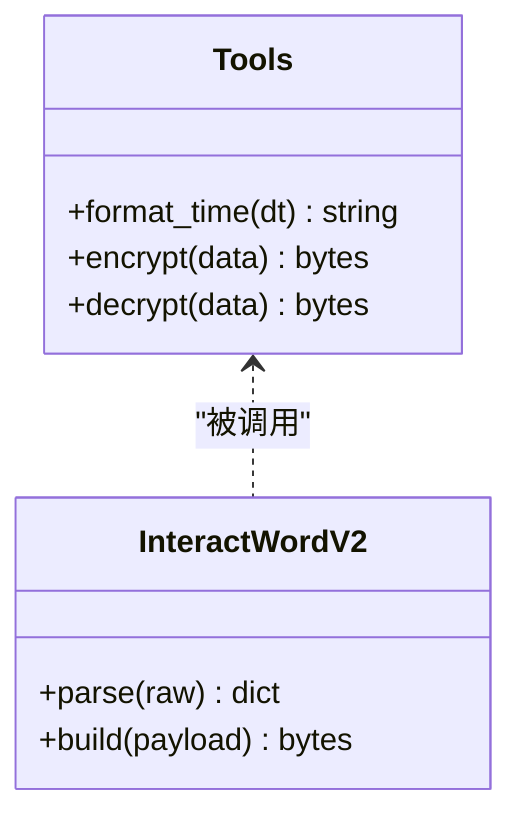
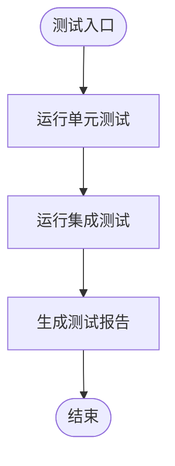
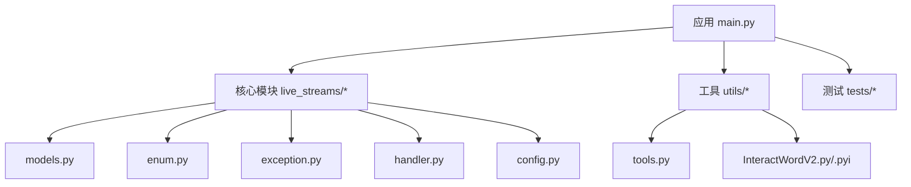

# 开发指南

<cite>
**本文档引用的文件**   
- [main.py](file://main.py)
- [config.toml](file://config.toml)
- [pyproject.toml](file://pyproject.toml)
- [uv.lock](file://uv.lock)
- [live_streams/__init__.py](file://live_streams/__init__.py)
- [live_streams/config.py](file://live_streams/config.py)
- [live_streams/enum.py](file://live_streams/enum.py)
- [live_streams/exception.py](file://live_streams/exception.py)
- [live_streams/handler.py](file://live_streams/handler.py)
- [live_streams/models.py](file://live_streams/models.py)
- [tests/live_rooms.py](file://tests/live_rooms.py)
- [tests/test.py](file://tests/test.py)
- [utils/__init__.py](file://utils/__init__.py)
- [utils/tools.py](file://utils/tools.py)
- [utils/InteractWordV2.py](file://utils/InteractWordV2.py)
- [utils/InteractWordV2.pyi](file://utils/InteractWordV2.pyi)
</cite>

## 目录
1. [简介](#简介)
2. [项目结构](#项目结构)
3. [核心组件](#核心组件)
4. [架构总览](#架构总览)
5. [详细组件分析](#详细组件分析)
6. [依赖关系分析](#依赖关系分析)
7. [性能考虑](#性能考虑)
8. [故障排查指南](#故障排查指南)
9. [结论](#结论)
10. [附录](#附录)

## 简介
本指南面向希望参与 Blive-Bot 开发与扩展的开发者，涵盖以下内容：
- 开发环境搭建与运行方式
- 代码结构与模块职责
- 测试框架使用方法（单元测试与集成测试）
- 插件化扩展指南（消息处理器、弹幕事件类型、自定义功能）
- 代码风格规范、提交要求与版本管理流程
- 调试技巧、性能分析与常见问题解决方案
- 贡献代码的流程与代码审查标准

Blive-Bot 是一个用于直播互动的机器人程序，围绕直播间事件处理、消息解析与业务逻辑扩展构建。通过清晰的模块化设计与插件机制，开发者可以便捷地扩展功能并快速迭代。

## 项目结构
项目采用按功能域划分的目录组织方式，核心模块集中在 live_streams，工具与辅助库在 utils，测试用例位于 tests，配置与依赖管理使用 pyproject.toml 与 uv.lock。

**图表来源**
- [main.py:1-200](file://main.py#L1-L200)
- [config.toml:1-200](file://config.toml#L1-L200)
- [pyproject.toml:1-200](file://pyproject.toml#L1-L200)
- [uv.lock:1-200](file://uv.lock#L1-L200)
- [live_streams/__init__.py:1-200](file://live_streams/__init__.py#L1-L200)
- [live_streams/config.py:1-200](file://live_streams/config.py#L1-L200)
- [live_streams/enum.py:1-200](file://live_streams/enum.py#L1-L200)
- [live_streams/exception.py:1-200](file://live_streams/exception.py#L1-L200)
- [live_streams/handler.py:1-200](file://live_streams/handler.py#L1-L200)
- [live_streams/models.py:1-200](file://live_streams/models.py#L1-L200)
- [tests/test.py:1-200](file://tests/test.py#L1-L200)
- [tests/live_rooms.py:1-200](file://tests/live_rooms.py#L1-L200)
- [utils/__init__.py:1-200](file://utils/__init__.py#L1-L200)
- [utils/tools.py:1-200](file://utils/tools.py#L1-L200)
- [utils/InteractWordV2.py:1-200](file://utils/InteractWordV2.py#L1-L200)
- [utils/InteractWordV2.pyi:1-200](file://utils/InteractWordV2.pyi#L1-L200)

**章节来源**
- [main.py:1-200](file://main.py#L1-L200)
- [pyproject.toml:1-200](file://pyproject.toml#L1-L200)
- [config.toml:1-200](file://config.toml#L1-L200)

## 核心组件
- 入口与启动流程：main.py 负责加载配置、初始化运行时环境与调度核心任务。
- 配置管理：config.toml 提供运行时参数；live_streams/config.py 负责解析与校验。
- 事件与模型：live_streams/enum.py 定义事件枚举；live_streams/models.py 定义数据模型。
- 异常体系：live_streams/exception.py 统一错误类型与处理策略。
- 消息处理：live_streams/handler.py 实现消息路由与业务处理逻辑。
- 工具库：utils/tools.py 提供通用工具函数；utils/InteractWordV2.* 封装互动词协议相关能力。
- 测试：tests/test.py 与 tests/live_rooms.py 分别覆盖通用用例与直播间场景。

**章节来源**
- [live_streams/config.py:1-200](file://live_streams/config.py#L1-L200)
- [live_streams/enum.py:1-200](file://live_streams/enum.py#L1-L200)
- [live_streams/models.py:1-200](file://live_streams/models.py#L1-L200)
- [live_streams/exception.py:1-200](file://live_streams/exception.py#L1-L200)
- [live_streams/handler.py:1-200](file://live_streams/handler.py#L1-L200)
- [utils/tools.py:1-200](file://utils/tools.py#L1-L200)
- [utils/InteractWordV2.py:1-200](file://utils/InteractWordV2.py#L1-L200)
- [utils/InteractWordV2.pyi:1-200](file://utils/InteractWordV2.pyi#L1-L200)

## 架构总览
系统以“事件驱动 + 插件化”为核心设计。入口加载配置后，启动事件监听器，将原始弹幕与互动消息解析为统一模型，交由消息处理器进行分发与执行。工具层提供协议封装与通用能力，测试层保障稳定性与回归质量。

**图表来源**
- [main.py:1-200](file://main.py#L1-L200)
- [live_streams/config.py:1-200](file://live_streams/config.py#L1-L200)
- [live_streams/handler.py:1-200](file://live_streams/handler.py#L1-L200)
- [live_streams/models.py:1-200](file://live_streams/models.py#L1-L200)
- [utils/tools.py:1-200](file://utils/tools.py#L1-L200)
- [tests/test.py:1-200](file://tests/test.py#L1-L200)
- [tests/live_rooms.py:1-200](file://tests/live_rooms.py#L1-L200)

## 详细组件分析

### 入口与启动流程（main.py）
- 负责加载配置文件、初始化日志与依赖注入
- 启动事件监听与消息处理循环
- 暴露插件注册接口，供外部扩展处理器

**图表来源**
- [main.py:1-200](file://main.py#L1-L200)
- [config.toml:1-200](file://config.toml#L1-L200)

**章节来源**
- [main.py:1-200](file://main.py#L1-L200)

### 配置管理（config.toml 与 live_streams/config.py）
- config.toml 集中存放运行时参数（如连接信息、开关、阈值等）
- live_streams/config.py 负责解析、校验与默认值合并
- 支持热更新与多环境切换（建议通过环境变量区分）

**图表来源**
- [config.toml:1-200](file://config.toml#L1-L200)
- [live_streams/config.py:1-200](file://live_streams/config.py#L1-L200)

**章节来源**
- [live_streams/config.py:1-200](file://live_streams/config.py#L1-L200)

### 事件与模型（live_streams/enum.py 与 live_streams/models.py）
- enum.py 定义弹幕与互动事件类型，便于路由与匹配
- models.py 定义统一的消息模型，屏蔽底层差异

**图表来源**
- [live_streams/enum.py:1-200](file://live_streams/enum.py#L1-L200)
- [live_streams/models.py:1-200](file://live_streams/models.py#L1-L200)

**章节来源**
- [live_streams/enum.py:1-200](file://live_streams/enum.py#L1-L200)
- [live_streams/models.py:1-200](file://live_streams/models.py#L1-L200)

### 异常体系（live_streams/exception.py）
- 定义业务异常基类与具体异常类型
- 提供统一的错误码与错误信息格式
- 建议在处理器中捕获并转换为响应

**图表来源**
- [live_streams/exception.py:1-200](file://live_streams/exception.py#L1-L200)

**章节来源**
- [live_streams/exception.py:1-200](file://live_streams/exception.py#L1-L200)

### 消息处理器（live_streams/handler.py）
- 实现消息路由、鉴权、限流与业务编排
- 支持插件式处理器注册，便于扩展新功能
- 与模型和工具层协作完成数据处理

**图表来源**
- [live_streams/handler.py:1-200](file://live_streams/handler.py#L1-L200)
- [live_streams/models.py:1-200](file://live_streams/models.py#L1-L200)
- [utils/tools.py:1-200](file://utils/tools.py#L1-L200)

**章节来源**
- [live_streams/handler.py:1-200](file://live_streams/handler.py#L1-L200)

### 工具与协议封装（utils/tools.py 与 utils/InteractWordV2.*）
- tools.py 提供字符串处理、时间格式化、加密解密等通用方法
- InteractWordV2.py/.pyi 封装互动词协议，提供类型提示与接口定义

**图表来源**
- [utils/tools.py:1-200](file://utils/tools.py#L1-L200)
- [utils/InteractWordV2.py:1-200](file://utils/InteractWordV2.py#L1-L200)
- [utils/InteractWordV2.pyi:1-200](file://utils/InteractWordV2.pyi#L1-L200)

**章节来源**
- [utils/tools.py:1-200](file://utils/tools.py#L1-L200)
- [utils/InteractWordV2.py:1-200](file://utils/InteractWordV2.py#L1-L200)
- [utils/InteractWordV2.pyi:1-200](file://utils/InteractWordV2.pyi#L1-L200)

### 测试框架（tests/test.py 与 tests/live_rooms.py）
- test.py 包含通用单元测试用例，验证工具函数与基础逻辑
- live_rooms.py 覆盖直播间场景的集成测试，模拟弹幕与互动事件

**图表来源**
- [tests/test.py:1-200](file://tests/test.py#L1-L200)
- [tests/live_rooms.py:1-200](file://tests/live_rooms.py#L1-L200)

**章节来源**
- [tests/test.py:1-200](file://tests/test.py#L1-L200)
- [tests/live_rooms.py:1-200](file://tests/live_rooms.py#L1-L200)

## 依赖关系分析
项目依赖由 pyproject.toml 声明，uv.lock 锁定版本以确保可重复构建。

**图表来源**
- [pyproject.toml:1-200](file://pyproject.toml#L1-L200)
- [uv.lock:1-200](file://uv.lock#L1-L200)
- [live_streams/models.py:1-200](file://live_streams/models.py#L1-L200)
- [live_streams/enum.py:1-200](file://live_streams/enum.py#L1-L200)
- [live_streams/exception.py:1-200](file://live_streams/exception.py#L1-L200)
- [live_streams/handler.py:1-200](file://live_streams/handler.py#L1-L200)
- [live_streams/config.py:1-200](file://live_streams/config.py#L1-L200)
- [utils/tools.py:1-200](file://utils/tools.py#L1-L200)
- [utils/InteractWordV2.py:1-200](file://utils/InteractWordV2.py#L1-L200)
- [utils/InteractWordV2.pyi:1-200](file://utils/InteractWordV2.pyi#L1-L200)

**章节来源**
- [pyproject.toml:1-200](file://pyproject.toml#L1-L200)
- [uv.lock:1-200](file://uv.lock#L1-L200)

## 性能考虑
- 事件循环优化：避免阻塞操作，使用异步 IO 提升吞吐
- 消息批处理：对高频弹幕进行聚合与去重
- 缓存策略：热点数据本地缓存，降低网络开销
- 资源限制：设置合理的超时与重试次数，防止雪崩
- 监控指标：记录关键路径耗时与错误率，便于定位瓶颈

[本节为通用指导，不直接分析具体文件]

## 故障排查指南
- 配置错误：检查 config.toml 字段是否完整且类型正确，必要时启用调试日志
- 网络异常：关注 NetworkError 类型，结合重试策略与退避算法
- 解析失败：确认模型字段与协议版本一致，必要时增加容错与降级逻辑
- 处理器未命中：检查事件枚举与路由规则是否正确注册
- 测试失败：优先复现单测，逐步扩大至集成测试范围

**章节来源**
- [live_streams/exception.py:1-200](file://live_streams/exception.py#L1-L200)
- [live_streams/config.py:1-200](file://live_streams/config.py#L1-L200)
- [live_streams/handler.py:1-200](file://live_streams/handler.py#L1-L200)

## 结论
Blive-Bot 通过清晰的分层与插件化设计，提供了良好的可扩展性与可维护性。遵循本指南的开发规范与最佳实践，能够快速上手并高效迭代。建议在新功能开发时同步补充测试用例，确保质量与稳定性。

[本节为总结性内容，不直接分析具体文件]

## 附录

### 开发环境搭建
- 安装 Python 与 uv（推荐最新版本）
- 克隆仓库并在根目录执行依赖安装
- 复制并编辑 config.toml，填写必要配置
- 运行入口脚本启动服务

**章节来源**
- [pyproject.toml:1-200](file://pyproject.toml#L1-L200)
- [config.toml:1-200](file://config.toml#L1-L200)
- [main.py:1-200](file://main.py#L1-L200)

### 代码结构与开发规范
- 模块职责单一，命名清晰，避免跨层耦合
- 使用类型注解与文档字符串，提升可读性
- 统一异常类型与错误码，便于追踪与处理
- 所有新增功能需配套单元测试与必要的集成测试

**章节来源**
- [live_streams/models.py:1-200](file://live_streams/models.py#L1-L200)
- [live_streams/exception.py:1-200](file://live_streams/exception.py#L1-L200)
- [tests/test.py:1-200](file://tests/test.py#L1-L200)

### 测试框架使用方法
- 单元测试：针对工具函数与纯逻辑编写断言
- 集成测试：模拟直播间事件，端到端验证处理链路
- 覆盖率：建议保持核心路径覆盖率不低于 80%

**章节来源**
- [tests/test.py:1-200](file://tests/test.py#L1-L200)
- [tests/live_rooms.py:1-200](file://tests/live_rooms.py#L1-L200)

### 插件开发步骤
- 扩展消息处理器：在处理器注册表中添加新处理器，实现统一接口
- 添加弹幕事件类型：在事件枚举中新增类型，并在模型中映射字段
- 实现自定义功能：通过工具层封装协议与通用能力，保证复用性

**章节来源**
- [live_streams/handler.py:1-200](file://live_streams/handler.py#L1-L200)
- [live_streams/enum.py:1-200](file://live_streams/enum.py#L1-L200)
- [live_streams/models.py:1-200](file://live_streams/models.py#L1-L200)
- [utils/tools.py:1-200](file://utils/tools.py#L1-L200)

### 代码风格规范与提交要求
- 使用一致的缩进与命名约定
- 提交信息简洁明确，描述变更目的与影响范围
- 分支策略：功能分支开发，合并前通过 CI 与代码审查

[本节为通用指导，不直接分析具体文件]

### 版本管理流程
- 使用语义化版本号（主.次.修订）
- 发布前更新依赖锁定文件与变更日志
- 打标签并归档发布产物

**章节来源**
- [pyproject.toml:1-200](file://pyproject.toml#L1-L200)
- [uv.lock:1-200](file://uv.lock#L1-L200)

### 调试技巧与性能分析
- 启用调试日志，记录关键路径输入输出
- 使用性能剖析工具定位热点函数
- 压测高并发场景，观察内存与 CPU 占用

[本节为通用指导，不直接分析具体文件]

### 常见问题解决方案
- 配置加载失败：检查路径与权限，打印解析错误详情
- 事件未触发：确认事件枚举与路由规则一致性
- 协议解析异常：核对版本与字段映射，增加容错与降级

**章节来源**
- [live_streams/config.py:1-200](file://live_streams/config.py#L1-L200)
- [live_streams/enum.py:1-200](file://live_streams/enum.py#L1-L200)
- [live_streams/handler.py:1-200](file://live_streams/handler.py#L1-L200)

### 贡献代码指南
- Fork 仓库并创建功能分支
- 提交前运行测试并通过静态检查
- 发起 Pull Request，附上变更说明与测试覆盖
- 代码审查关注：正确性、可读性、性能与安全性

[本节为通用指导，不直接分析具体文件]