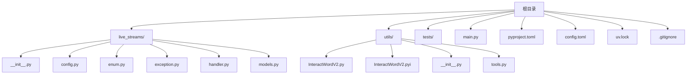
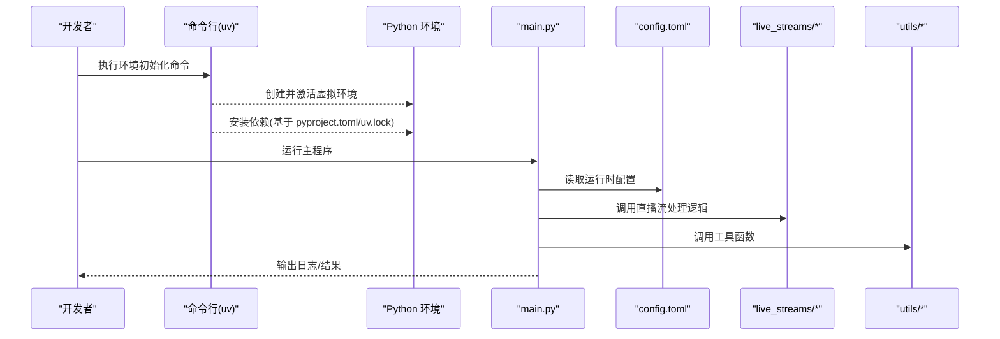
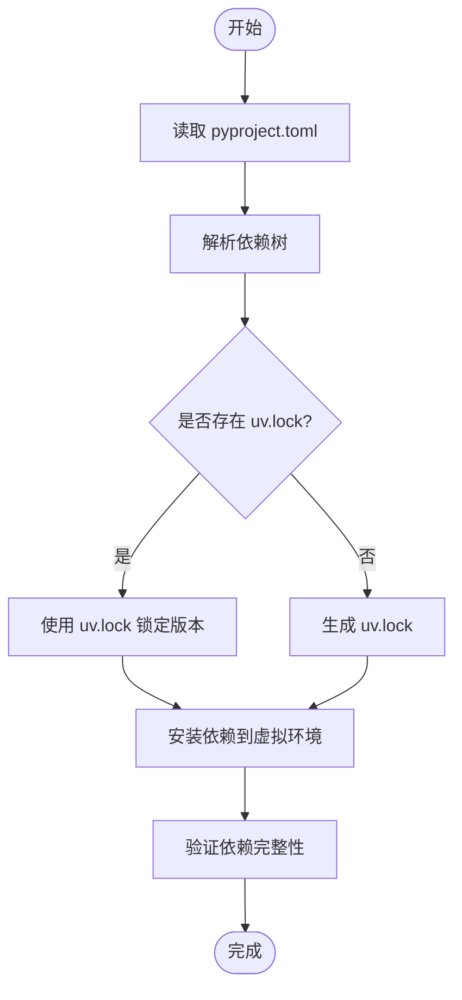

# 开发环境搭建

<cite>
**本文档引用的文件**   
- [pyproject.toml](file://pyproject.toml)
- [uv.lock](file://uv.lock)
- [.gitignore](file://.gitignore)
- [config.toml](file://config.toml)
- [main.py](file://main.py)
- [live_streams/config.py](file://live_streams/config.py)
- [utils/tools.py](file://utils/tools.py)
</cite>

## 更新摘要
**所做更改**   
- 新增 uv.lock 文件说明，强调依赖锁定机制的重要性
- 更新 uv 包管理器使用指南，包含依赖解析和锁定流程
- 标准化类型检查环境设置，明确虚拟环境路径配置
- 完善依赖分析章节，详细说明 uv.lock 的作用和工作原理

## 目录
1. [简介](#简介)
2. [项目结构](#项目结构)
3. [核心组件](#核心组件)
4. [架构总览](#架构总览)
5. [详细组件分析](#详细组件分析)
6. [依赖分析](#依赖分析)
7. [性能考虑](#性能考虑)
8. [故障排查指南](#故障排查指南)
9. [结论](#结论)
10. [附录](#附录)

## 简介
本指南面向首次接触 Blive-Bot 的开发者，目标是帮助你快速、稳定地搭建本地开发环境。内容涵盖：
- Python 版本要求与 uv 包管理工具的使用
- pyproject.toml 配置文件的作用与关键选项说明
- 完整的环境初始化步骤（虚拟环境创建、依赖安装、项目结构理解）
- .gitignore 配置与开发工作流中的文件管理最佳实践
- 常见环境问题的排查与解决方案

## 项目结构
Blive-Bot 采用模块化组织方式，核心模块按功能划分到不同目录：
- live_streams：直播流相关逻辑（配置、枚举、异常、模型、处理器等）
- utils：通用工具与辅助方法
- tests：测试用例
- 根目录：入口脚本 main.py、项目配置 pyproject.toml、运行时配置 config.toml、锁文件 uv.lock、忽略规则 .gitignore

**图表来源** 
- [pyproject.toml](file://pyproject.toml)
- [uv.lock](file://uv.lock)
- [.gitignore](file://.gitignore)
- [config.toml](file://config.toml)
- [main.py](file://main.py)
- [live_streams/config.py](file://live_streams/config.py)
- [utils/tools.py](file://utils/tools.py)

**章节来源**
- [pyproject.toml](file://pyproject.toml)
- [uv.lock](file://uv.lock)
- [.gitignore](file://.gitignore)
- [config.toml](file://config.toml)
- [main.py](file://main.py)
- [live_streams/config.py](file://live_streams/config.py)
- [utils/tools.py](file://utils/tools.py)

## 核心组件
- 入口脚本 main.py：程序启动与运行流程的入口点
- 配置系统：
  - pyproject.toml：项目元数据、依赖声明、构建与工具配置
  - config.toml：运行时配置项（如连接参数、开关等）
- 业务模块：
  - live_streams：直播流处理、模型定义、异常与枚举
  - utils：工具函数与第三方库封装

**章节来源**
- [main.py](file://main.py)
- [pyproject.toml](file://pyproject.toml)
- [config.toml](file://config.toml)
- [live_streams/config.py](file://live_streams/config.py)
- [utils/tools.py](file://utils/tools.py)

## 架构总览
下图展示了从入口到配置加载与业务模块调用的基本流程，便于理解环境与依赖的关系。

**图表来源** 
- [main.py](file://main.py)
- [config.toml](file://config.toml)
- [live_streams/config.py](file://live_streams/config.py)
- [utils/tools.py](file://utils/tools.py)

## 详细组件分析

### Python 版本与 uv 工具
- Python 版本要求：请根据 pyproject.toml 中指定的最小版本选择匹配的 Python 解释器，确保满足最低版本约束。
- uv 工具：
  - 作用：高性能的 Python 包管理与项目工具，支持依赖解析、锁定、虚拟环境管理等。
  - 常用操作：
    - 初始化/更新依赖：使用 uv sync 同步依赖，确保与 uv.lock 一致
    - 创建虚拟环境：使用 uv venv 创建隔离环境，避免冲突
    - 运行脚本：通过 uv run 直接执行入口脚本
    - 类型检查：使用 uv run mypy 进行静态类型检查

**章节来源**
- [pyproject.toml](file://pyproject.toml)
- [uv.lock](file://uv.lock)

### pyproject.toml 配置说明
pyproject.toml 是项目的核心配置文件，主要职责包括：
- 项目元数据：名称、版本、描述、作者、许可证等
- 依赖声明：运行时依赖与可选依赖
- 构建系统与工具配置：指定构建后端、代码格式化工具、测试框架等
- 环境变量与路径：可配置导入路径或资源路径

建议关注以下方面：
- 依赖版本范围：保持与 uv.lock 一致，避免非确定性安装
- 工具链配置：统一格式化、静态检查、测试命令
- 入口点：定义可执行脚本或模块入口

**章节来源**
- [pyproject.toml](file://pyproject.toml)

### 运行时配置 config.toml
config.toml 用于存放运行时配置项，例如：
- 服务连接参数（地址、端口、认证信息）
- 功能开关与调试级别
- 外部服务 API 密钥与超时设置

开发时建议：
- 将敏感信息放入环境变量或安全存储
- 为不同环境提供模板配置，避免泄露

**章节来源**
- [config.toml](file://config.toml)

### 入口脚本 main.py
main.py 作为程序入口，通常负责：
- 初始化日志与配置加载
- 启动核心服务或任务循环
- 处理信号与优雅退出

在本地调试时，可通过 uv 直接运行该脚本，观察控制台输出与错误堆栈。

**章节来源**
- [main.py](file://main.py)

### 直播流模块 live_streams
live_streams 模块包含：
- 配置加载与校验
- 枚举类型定义
- 自定义异常类
- 数据模型与处理器

开发时重点关注：
- 配置项的默认值与覆盖策略
- 异常分类与错误提示
- 模型字段与序列化/反序列化

**章节来源**
- [live_streams/config.py](file://live_streams/config.py)

### 工具模块 utils
utils 提供通用工具函数与第三方库封装，便于在各模块复用。常见用途：
- 网络请求封装
- 日志与调试辅助
- 数据处理与转换

**章节来源**
- [utils/tools.py](file://utils/tools.py)

## 依赖分析
- 依赖锁定：uv.lock 记录了精确的依赖版本与哈希，保证跨平台一致性
- 依赖来源：pyproject.toml 声明依赖，uv 解析并生成 uv.lock
- 依赖管理最佳实践：
  - 始终使用 uv sync 同步依赖，避免手动修改
  - 提交 uv.lock 到版本控制，确保团队环境一致
  - 新增依赖后重新生成锁文件并审查变更

**更新** 新增 uv.lock 文件说明，强调其在依赖锁定和环境重现中的重要作用

**图表来源** 
- [pyproject.toml](file://pyproject.toml)
- [uv.lock](file://uv.lock)

**章节来源**
- [pyproject.toml](file://pyproject.toml)
- [uv.lock](file://uv.lock)

## 性能考虑
- 使用 uv 替代传统 pip，提升依赖解析与安装速度
- 合理划分依赖：将开发期依赖与运行期依赖分离，减少生产环境体积
- 缓存机制：利用 uv 的缓存层加速重复安装
- 按需导入：避免在模块顶层引入重型依赖，降低启动开销

[本节为通用指导，不直接分析具体文件]

## 故障排查指南
常见问题与解决思路：
- Python 版本不匹配
  - 现象：导入错误或解释器报错
  - 解决：确认已安装符合 pyproject.toml 要求的 Python 版本，并使用对应解释器
- 依赖解析失败
  - 现象：安装时报错或版本冲突
  - 解决：清理缓存后重新使用 uv sync 同步依赖；检查 uv.lock 是否最新
- 虚拟环境问题
  - 现象：找不到模块或路径错误
  - 解决：重新创建虚拟环境并确保激活；检查项目根目录是否为当前工作目录
- 配置文件缺失或权限问题
  - 现象：运行时无法读取 config.toml
  - 解决：确认配置文件存在且可读；必要时以管理员权限运行或调整文件权限
- 网络访问受限
  - 现象：下载依赖失败
  - 解决：配置代理或使用国内镜像源；检查防火墙与 DNS 设置

**章节来源**
- [pyproject.toml](file://pyproject.toml)
- [uv.lock](file://uv.lock)
- [config.toml](file://config.toml)

## 结论
通过遵循本指南的步骤与最佳实践，你可以快速搭建稳定的 Blive-Bot 开发环境。重点在于：
- 使用 uv 进行依赖与环境管理
- 正确理解并维护 pyproject.toml 与 uv.lock
- 规范化管理配置文件与版本控制
- 遇到问题时按排查清单逐步定位与解决

[本节为总结性内容，不直接分析具体文件]

## 附录

### 环境初始化步骤（推荐流程）
- 安装 uv：参考官方文档安装最新版本
- 创建并激活虚拟环境：使用 uv venv 创建隔离环境
- 同步依赖：基于 pyproject.toml 与 uv.lock 安装依赖
- 准备运行时配置：复制或编辑 config.toml，填写必要参数
- 运行入口脚本：通过 uv run 执行 main.py 进行本地调试

**章节来源**
- [pyproject.toml](file://pyproject.toml)
- [uv.lock](file://uv.lock)
- [config.toml](file://config.toml)
- [main.py](file://main.py)

### .gitignore 配置与文件管理最佳实践
- 忽略目标：
  - 虚拟环境目录与缓存
  - 编译产物与临时文件
  - 用户本地配置与敏感信息
- 建议规则：
  - 忽略 Python 缓存与字节码
  - 忽略 IDE 与编辑器配置
  - 忽略操作系统生成的临时文件
- 最佳实践：
  - 仅提交必要的配置文件（如示例配置）
  - 使用环境变量或安全存储管理敏感信息
  - 定期审查 .gitignore，避免误提交

**章节来源**
- [.gitignore](file://.gitignore)

### uv.lock 文件详解
uv.lock 是 uv 包管理器生成的依赖锁定文件，具有以下特点：
- 精确版本锁定：记录每个依赖的确切版本号
- 哈希验证：包含依赖包的哈希值，确保下载完整性
- 平台无关：在不同操作系统间保持一致的依赖解析
- 团队协作：确保所有开发者使用相同版本的依赖

使用建议：
- 始终将 uv.lock 提交到版本控制系统
- 团队成员应使用相同的 uv 版本
- 修改依赖后必须重新生成并审查 uv.lock 变更

**章节来源**
- [uv.lock](file://uv.lock)

### 类型检查环境设置
标准化的类型检查环境配置：
- 使用 uv 管理类型检查工具（如 mypy、pyright）
- 在虚拟环境中独立安装类型检查依赖
- 配置统一的类型检查规则和忽略列表
- 集成到 CI/CD 流程中进行自动化检查

开发工作流：
- 本地开发时使用 uv run mypy 进行类型检查
- 提交前确保类型检查通过
- 在项目中维护完整的类型注解

**章节来源**
- [pyproject.toml](file://pyproject.toml)
- [uv.lock](file://uv.lock)