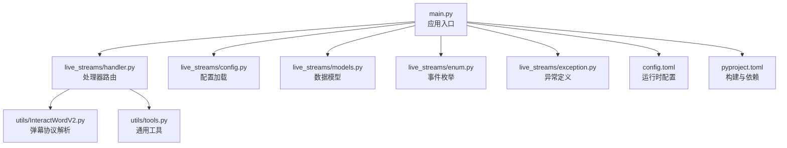
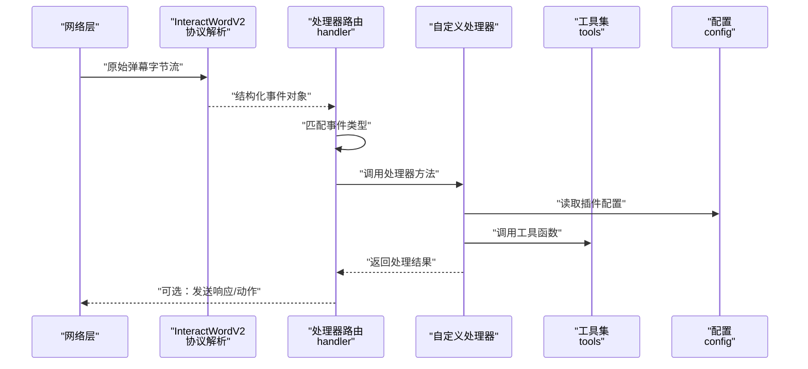
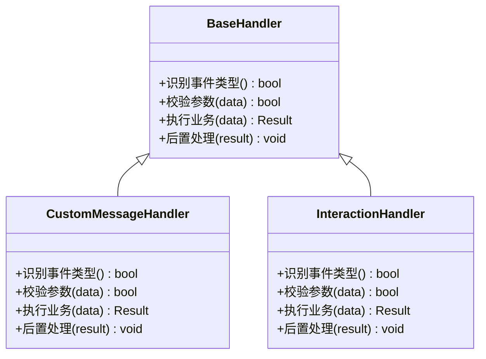
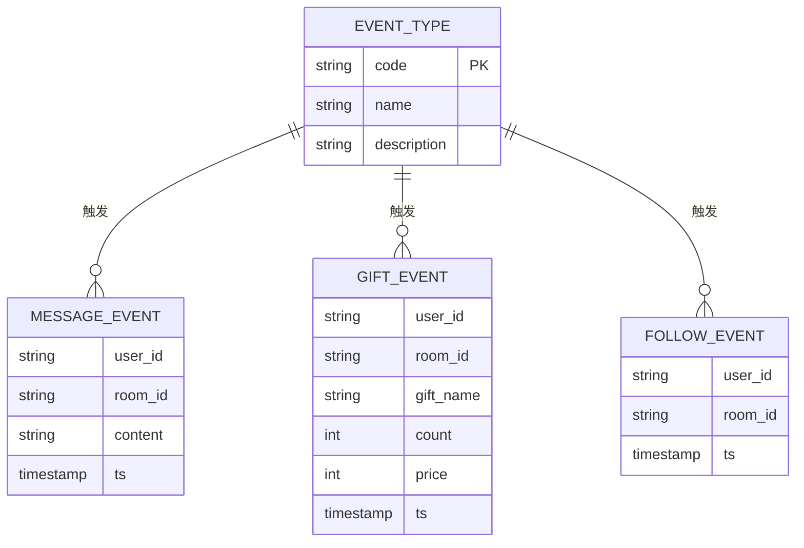
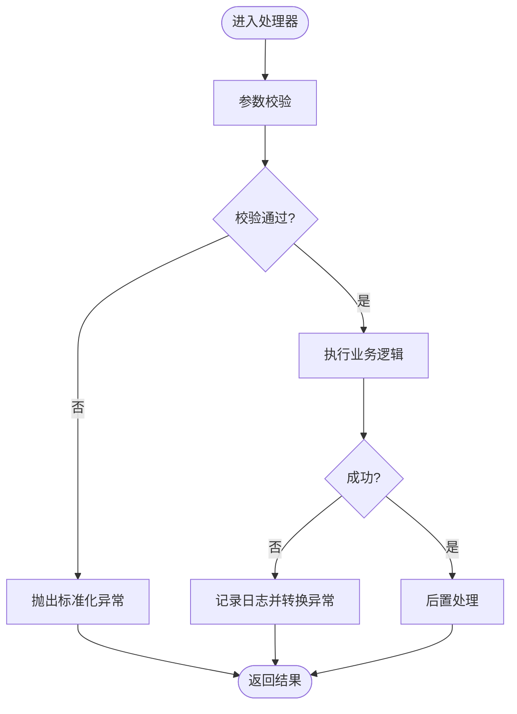
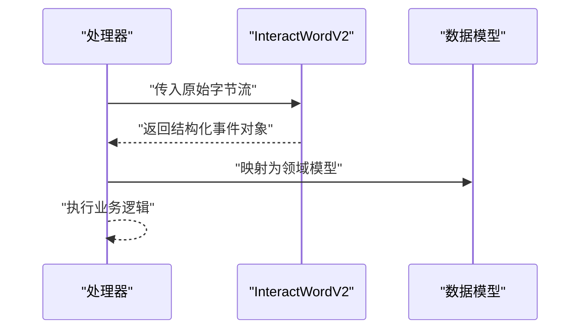
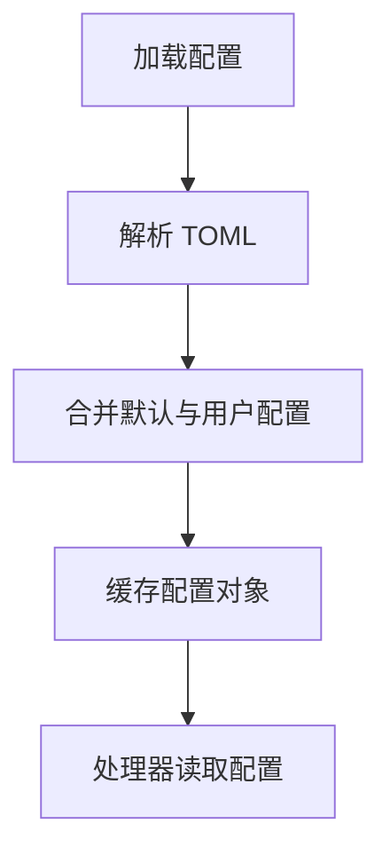
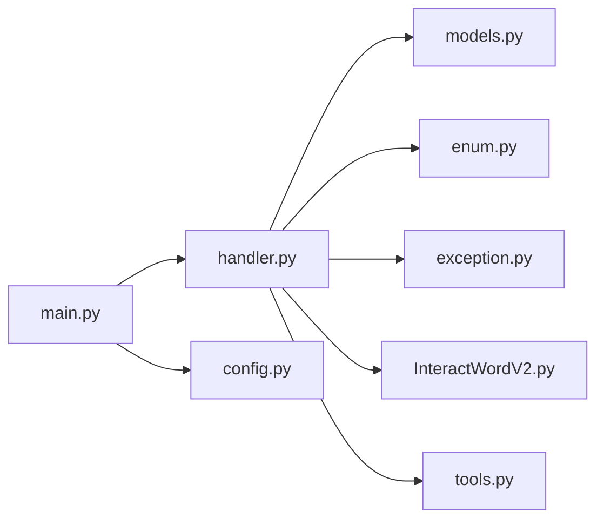

# 插件开发

<cite>
**本文引用的文件**   
- [main.py](file://main.py)
- [config.toml](file://config.toml)
- [pyproject.toml](file://pyproject.toml)
- [live_streams/handler.py](file://live_streams/handler.py)
- [live_streams/models.py](file://live_streams/models.py)
- [live_streams/config.py](file://live_streams/config.py)
- [live_streams/enum.py](file://live_streams/enum.py)
- [live_streams/exception.py](file://live_streams/exception.py)
- [utils/InteractWordV2.py](file://utils/InteractWordV2.py)
- [utils/tools.py](file://utils/tools.py)
</cite>

## 目录
1. [简介](#简介)
2. [项目结构](#项目结构)
3. [核心组件](#核心组件)
4. [架构总览](#架构总览)
5. [详细组件分析](#详细组件分析)
6. [依赖关系分析](#依赖关系分析)
7. [性能考虑](#性能考虑)
8. [故障排查指南](#故障排查指南)
9. [结论](#结论)
10. [附录](#附录)

## 简介
本指南面向希望为 Blive-Bot 开发插件的开发者，系统阐述插件架构与扩展机制，覆盖自定义消息处理器的继承与实现、事件类型扩展、InteractWordV2 工具类的使用与扩展点，并提供从简单响应到复杂业务逻辑的完整示例路径。同时给出插件打包、分发与版本管理的最佳实践，帮助你在保证稳定性的前提下快速迭代功能。

## 项目结构
Blive-Bot 采用分层与模块化组织方式：
- live_streams：直播流相关的数据模型、枚举、异常、配置与处理器入口
- utils：通用工具与弹幕交互协议解析（如 InteractWordV2）
- main：应用启动与装配
- 配置文件：config.toml（运行时配置）、pyproject.toml（构建与依赖管理）

图表来源 
- [main.py](file://main.py)
- [live_streams/handler.py](file://live_streams/handler.py)
- [live_streams/config.py](file://live_streams/config.py)
- [live_streams/models.py](file://live_streams/models.py)
- [live_streams/enum.py](file://live_streams/enum.py)
- [live_streams/exception.py](file://live_streams/exception.py)
- [utils/InteractWordV2.py](file://utils/InteractWordV2.py)
- [utils/tools.py](file://utils/tools.py)
- [config.toml](file://config.toml)
- [pyproject.toml](file://pyproject.toml)

章节来源
- [main.py](file://main.py)
- [live_streams/handler.py](file://live_streams/handler.py)
- [live_streams/config.py](file://live_streams/config.py)
- [live_streams/models.py](file://live_streams/models.py)
- [live_streams/enum.py](file://live_streams/enum.py)
- [live_streams/exception.py](file://live_streams/exception.py)
- [utils/InteractWordV2.py](file://utils/InteractWordV2.py)
- [utils/tools.py](file://utils/tools.py)
- [config.toml](file://config.toml)
- [pyproject.toml](file://pyproject.toml)

## 核心组件
- 处理器基类与路由：位于 live_streams/handler.py，提供统一的处理器接口与注册机制，便于扩展新的消息类型与业务逻辑。
- 数据模型：位于 live_streams/models.py，定义弹幕、礼物、关注等事件的结构化表示。
- 事件枚举：位于 live_streams/enum.py，集中声明事件类型，确保类型安全与可扩展性。
- 异常体系：位于 live_streams/exception.py，统一错误码与异常信息，便于上层捕获与用户提示。
- 配置系统：位于 live_streams/config.py，读取 config.toml，支持按房间或全局开关控制插件行为。
- 弹幕协议解析：位于 utils/InteractWordV2.py，负责将原始字节流解析为结构化对象，是插件处理的核心输入。
- 通用工具：位于 utils/tools.py，提供日志、序列化、网络请求等常用能力。

章节来源
- [live_streams/handler.py](file://live_streams/handler.py)
- [live_streams/models.py](file://live_streams/models.py)
- [live_streams/enum.py](file://live_streams/enum.py)
- [live_streams/exception.py](file://live_streams/exception.py)
- [live_streams/config.py](file://live_streams/config.py)
- [utils/InteractWordV2.py](file://utils/InteractWordV2.py)
- [utils/tools.py](file://utils/tools.py)

## 架构总览
Blive-Bot 的插件架构遵循“协议解析 -> 事件分发 -> 处理器执行”的分层设计：
- 协议层：InteractWordV2 将原始弹幕包解析为强类型对象
- 分发层：handler 根据事件枚举进行路由，调用对应处理器
- 业务层：各处理器实现具体业务逻辑，可访问 models 与 tools
- 配置层：通过 config 动态启用/禁用功能，支持多房间策略

图表来源 
- [utils/InteractWordV2.py](file://utils/InteractWordV2.py)
- [live_streams/handler.py](file://live_streams/handler.py)
- [live_streams/config.py](file://live_streams/config.py)
- [utils/tools.py](file://utils/tools.py)

## 详细组件分析

### 处理器基类与注册机制
- 处理器基类：在 live_streams/handler.py 中定义统一接口，包含事件识别、参数校验、业务执行与结果返回等生命周期方法。
- 注册机制：通过装饰器或显式注册表将自定义处理器绑定到事件类型，避免硬编码分支，提升可维护性。
- 扩展点：新增处理器时只需实现必要方法并注册到路由，无需修改核心分发逻辑。

图表来源 
- [live_streams/handler.py](file://live_streams/handler.py)

章节来源
- [live_streams/handler.py](file://live_streams/handler.py)

### 数据模型与事件枚举
- 数据模型：models.py 定义了弹幕、礼物、粉丝牌、关注等事件的字段结构，便于处理器直接消费。
- 事件枚举：enum.py 集中声明事件类型，作为路由分发的键值，确保类型一致性与可扩展性。

图表来源 
- [live_streams/models.py](file://live_streams/models.py)
- [live_streams/enum.py](file://live_streams/enum.py)

章节来源
- [live_streams/models.py](file://live_streams/models.py)
- [live_streams/enum.py](file://live_streams/enum.py)

### 异常体系与错误处理
- 异常定义：exception.py 统一错误码与消息模板，便于上层捕获与展示。
- 错误处理流程：处理器在执行过程中抛出异常，由路由层统一捕获并转换为标准响应，保障稳定性。

图表来源 
- [live_streams/exception.py](file://live_streams/exception.py)
- [live_streams/handler.py](file://live_streams/handler.py)

章节来源
- [live_streams/exception.py](file://live_streams/exception.py)
- [live_streams/handler.py](file://live_streams/handler.py)

### InteractWordV2 工具类使用与扩展
- 用途：将原始弹幕字节流解析为结构化对象，供处理器消费。
- 使用方法：在处理器初始化或事件回调中调用解析方法，获取事件对象后进入业务逻辑。
- 扩展点：如需支持新协议或字段，可在 InteractWordV2 中添加解析规则并在 models 中补充字段。

图表来源 
- [utils/InteractWordV2.py](file://utils/InteractWordV2.py)
- [live_streams/models.py](file://live_streams/models.py)

章节来源
- [utils/InteractWordV2.py](file://utils/InteractWordV2.py)
- [live_streams/models.py](file://live_streams/models.py)

### 配置系统与插件开关
- 配置加载：config.py 读取 config.toml，提供按房间或全局的配置项。
- 插件开关：通过配置项启用/禁用特定处理器或功能，支持热更新。

图表来源 
- [live_streams/config.py](file://live_streams/config.py)
- [config.toml](file://config.toml)

章节来源
- [live_streams/config.py](file://live_streams/config.py)
- [config.toml](file://config.toml)

### 工具集与通用能力
- 日志：统一输出格式与级别，便于问题定位。
- 序列化：JSON/XML 编解码，便于调试与持久化。
- 网络：封装 HTTP/WebSocket 请求，简化外部集成。

章节来源
- [utils/tools.py](file://utils/tools.py)

## 依赖关系分析
- 模块内聚：每个模块职责单一，处理器、模型、枚举、异常、配置相互解耦。
- 外部依赖：InteractWordV2 作为协议解析核心，被处理器广泛依赖；tools 提供通用能力。
- 潜在循环：应避免处理器反向依赖协议解析层，保持单向依赖。

图表来源 
- [main.py](file://main.py)
- [live_streams/handler.py](file://live_streams/handler.py)
- [live_streams/models.py](file://live_streams/models.py)
- [live_streams/enum.py](file://live_streams/enum.py)
- [live_streams/exception.py](file://live_streams/exception.py)
- [live_streams/config.py](file://live_streams/config.py)
- [utils/InteractWordV2.py](file://utils/InteractWordV2.py)
- [utils/tools.py](file://utils/tools.py)

章节来源
- [main.py](file://main.py)
- [live_streams/handler.py](file://live_streams/handler.py)
- [live_streams/models.py](file://live_streams/models.py)
- [live_streams/enum.py](file://live_streams/enum.py)
- [live_streams/exception.py](file://live_streams/exception.py)
- [live_streams/config.py](file://live_streams/config.py)
- [utils/InteractWordV2.py](file://utils/InteractWordV2.py)
- [utils/tools.py](file://utils/tools.py)

## 性能考虑
- 解析优化：InteractWordV2 应尽量避免重复分配内存，复用缓冲区。
- 异步处理：对耗时操作（网络请求、IO）采用异步或线程池，避免阻塞主循环。
- 配置缓存：配置对象应在进程内缓存，减少频繁读取磁盘。
- 日志级别：生产环境降低日志级别，避免 I/O 瓶颈。

[本节为通用指导，不直接分析具体文件]

## 故障排查指南
- 常见错误：
  - 事件类型未注册：检查 enum 与 handler 的映射是否完整。
  - 解析失败：确认 InteractWordV2 的版本与协议一致性。
  - 配置缺失：核对 config.toml 中的必填项。
- 定位步骤：
  - 开启调试日志，观察事件流转与异常堆栈。
  - 使用 tools 的序列化能力打印中间对象。
  - 隔离测试：最小化复现用例，逐步添加逻辑。

章节来源
- [live_streams/exception.py](file://live_streams/exception.py)
- [utils/tools.py](file://utils/tools.py)
- [live_streams/handler.py](file://live_streams/handler.py)

## 结论
Blive-Bot 的插件架构以清晰的层次与明确的扩展点为基础，通过 InteractWordV2 完成协议解析，handler 进行事件分发，处理器实现业务逻辑。遵循本指南的规范与最佳实践，你可以高效地开发、测试与发布插件，同时保证系统的稳定性与可维护性。

## 附录

### 插件开发步骤清单
- 定义事件类型：在 enum.py 中新增事件常量
- 扩展数据模型：在 models.py 中补充字段
- 实现处理器：继承 BaseHandler，实现必要方法
- 注册处理器：在 handler 中注册事件到处理器映射
- 配置开关：在 config.toml 中启用插件
- 单元测试：覆盖正常与异常路径
- 打包与发布：见下一节

章节来源
- [live_streams/enum.py](file://live_streams/enum.py)
- [live_streams/models.py](file://live_streams/models.py)
- [live_streams/handler.py](file://live_streams/handler.py)
- [config.toml](file://config.toml)

### 插件打包、分发与版本管理最佳实践
- 依赖声明：在 pyproject.toml 中明确依赖与版本范围
- 构建产物：生成 wheel 或 sdist，附带 README 与许可证
- 版本号策略：遵循语义化版本（主.次.修订），重大变更递增主版本
- 分发渠道：内部仓库或公共 PyPI，设置私有索引与访问控制
- 升级回滚：提供迁移脚本与兼容性说明，支持灰度发布

章节来源
- [pyproject.toml](file://pyproject.toml)

### 完整示例路径参考
- 简单消息响应：参考处理器基类与 InteractWordV2 的基本用法
- 复杂业务逻辑：结合 models、config 与 tools 实现条件判断、外部调用与状态管理

章节来源
- [live_streams/handler.py](file://live_streams/handler.py)
- [utils/InteractWordV2.py](file://utils/InteractWordV2.py)
- [live_streams/models.py](file://live_streams/models.py)
- [live_streams/config.py](file://live_streams/config.py)
- [utils/tools.py](file://utils/tools.py)