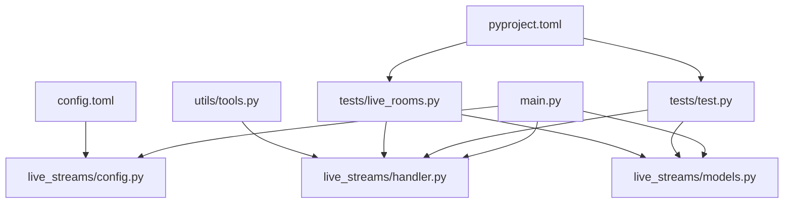
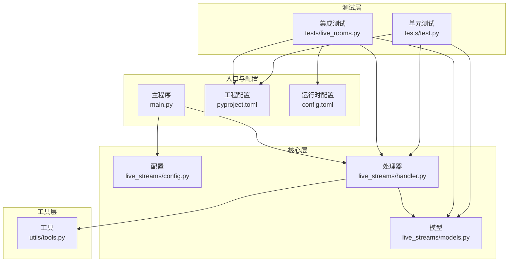
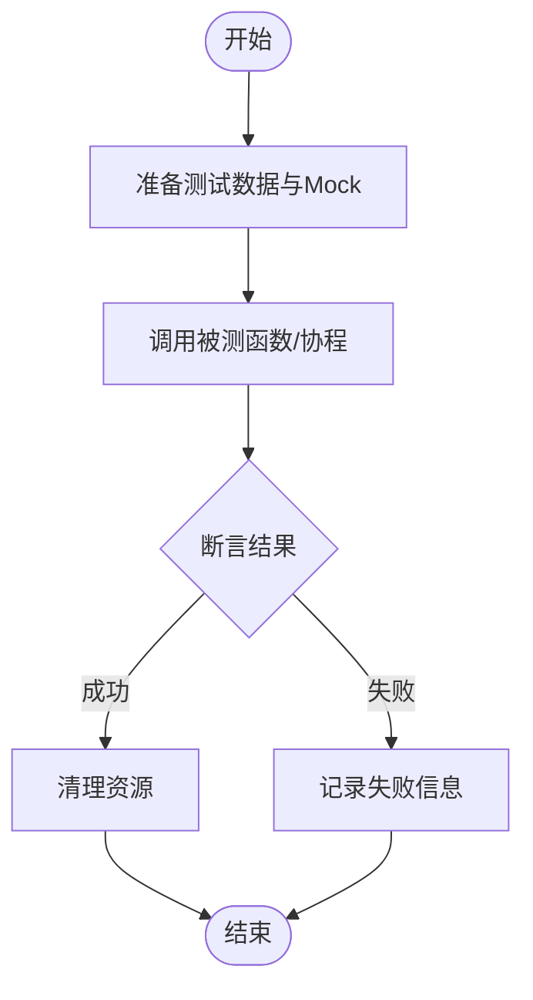
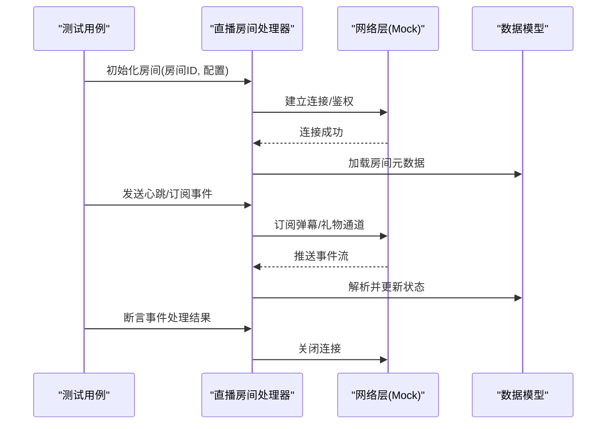
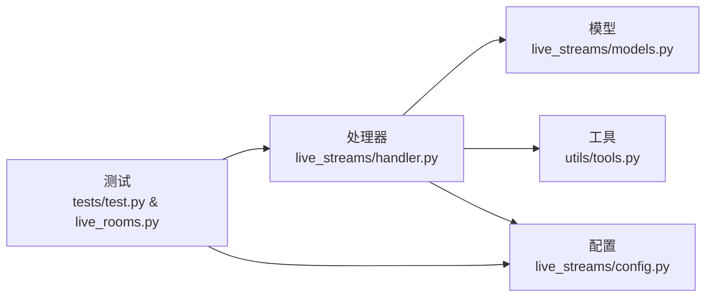

# 测试指南

<cite>
**本文引用的文件**   
- [tests/test.py](file://tests/test.py)
- [tests/live_rooms.py](file://tests/live_rooms.py)
- [main.py](file://main.py)
- [pyproject.toml](file://pyproject.toml)
- [config.toml](file://config.toml)
- [live_streams/config.py](file://live_streams/config.py)
- [live_streams/handler.py](file://live_streams/handler.py)
- [live_streams/models.py](file://live_streams/models.py)
- [utils/tools.py](file://utils/tools.py)
</cite>

## 目录
1. [简介](#简介)
2. [项目结构](#项目结构)
3. [核心组件](#核心组件)
4. [架构总览](#架构总览)
5. [详细组件分析](#详细组件分析)
6. [依赖分析](#依赖分析)
7. [性能考虑](#性能考虑)
8. [故障排查指南](#故障排查指南)
9. [结论](#结论)
10. [附录](#附录)

## 简介
本指南面向Blive-Bot项目的测试实践，聚焦于单元测试与集成测试的编写、运行与持续集成。内容涵盖：
- 测试结构与策略：如何组织测试用例、划分单元与集成边界
- 单元测试方法：基于tests/test.py的断言技巧与异步测试要点
- 集成测试用例：基于tests/live_rooms.py的直播房间功能验证
- 数据准备与Mock：构造测试数据、隔离外部依赖的最佳实践
- 运行与报告：本地执行、覆盖率统计、CI配置建议
- 性能测试：基准与负载测试思路与工具选择

## 项目结构
本项目采用“按功能模块+测试目录”的组织方式：
- live_streams：直播流相关模型、配置、处理器等核心逻辑
- tests：测试代码，包含单元测试与直播房间集成测试
- utils：通用工具函数
- main.py：应用入口
- pyproject.toml：Python工程与依赖管理（含测试与覆盖率配置）
- config.toml：运行时配置

图表来源
- [main.py:1-200](file://main.py#L1-L200)
- [live_streams/config.py:1-200](file://live_streams/config.py#L1-L200)
- [live_streams/handler.py:1-200](file://live_streams/handler.py#L1-L200)
- [live_streams/models.py:1-200](file://live_streams/models.py#L1-L200)
- [tests/test.py:1-200](file://tests/test.py#L1-L200)
- [tests/live_rooms.py:1-200](file://tests/live_rooms.py#L1-L200)
- [utils/tools.py:1-200](file://utils/tools.py#L1-L200)
- [pyproject.toml:1-200](file://pyproject.toml#L1-L200)
- [config.toml:1-200](file://config.toml#L1-L200)

章节来源
- [main.py:1-200](file://main.py#L1-L200)
- [pyproject.toml:1-200](file://pyproject.toml#L1-L200)

## 核心组件
- 单元测试（tests/test.py）
  - 使用标准测试框架组织用例，覆盖业务逻辑的关键路径
  - 针对异步调用提供专用断言与事件循环控制
  - 通过Mock隔离网络IO与第三方服务，保证测试稳定性
- 集成测试（tests/live_rooms.py）
  - 模拟真实直播房间场景，验证房间状态、消息流转与回调处理
  - 结合配置文件注入测试环境，避免对生产资源产生副作用
- 配置与模型（live_streams/*）
  - 配置项集中管理，便于在测试中切换不同环境
  - 数据模型定义清晰，利于构造一致的测试数据

章节来源
- [tests/test.py:1-200](file://tests/test.py#L1-L200)
- [tests/live_rooms.py:1-200](file://tests/live_rooms.py#L1-L200)
- [live_streams/config.py:1-200](file://live_streams/config.py#L1-L200)
- [live_streams/models.py:1-200](file://live_streams/models.py#L1-L200)

## 架构总览
下图展示测试套件与核心模块的交互关系，以及测试数据与Mock的使用位置。

图表来源
- [tests/test.py:1-200](file://tests/test.py#L1-L200)
- [tests/live_rooms.py:1-200](file://tests/live_rooms.py#L1-L200)
- [live_streams/config.py:1-200](file://live_streams/config.py#L1-L200)
- [live_streams/handler.py:1-200](file://live_streams/handler.py#L1-L200)
- [live_streams/models.py:1-200](file://live_streams/models.py#L1-L200)
- [utils/tools.py:1-200](file://utils/tools.py#L1-L200)
- [main.py:1-200](file://main.py#L1-L200)
- [pyproject.toml:1-200](file://pyproject.toml#L1-L200)
- [config.toml:1-200](file://config.toml#L1-L200)

## 详细组件分析

### 单元测试（tests/test.py）
- 目标与范围
  - 覆盖核心业务函数的输入输出、异常分支与边界条件
  - 验证异步流程的正确性与时序一致性
- 断言技巧
  - 使用相等性、集合比较、异常类型与消息匹配等断言
  - 对异步结果使用专用的等待与超时控制，确保稳定复现
- Mock与隔离
  - 对外部网络请求、数据库访问与第三方API进行Mock替换
  - 通过上下文管理器或装饰器快速注入Mock对象
- 最佳实践
  - 每个测试用例保持独立，不共享可变状态
  - 使用夹具（fixture）统一准备测试数据与环境变量
  - 为复杂逻辑拆分多个小用例，提升可读性与定位效率

图表来源
- [tests/test.py:1-200](file://tests/test.py#L1-L200)

章节来源
- [tests/test.py:1-200](file://tests/test.py#L1-L200)

### 集成测试（tests/live_rooms.py）
- 目标与范围
  - 验证直播房间生命周期：进入、心跳、弹幕接收、礼物事件、退出
  - 校验消息路由与回调触发顺序，确保端到端一致性
- 测试数据准备
  - 使用config.toml中的测试段或环境变量注入测试房间ID、鉴权信息等
  - 预置弹幕、礼物、关注等事件序列，用于回放验证
- Mock与隔离
  - 对网络层进行Mock，返回稳定的响应序列
  - 对时间敏感逻辑使用虚拟时钟或延迟控制
- 典型流程

图表来源
- [tests/live_rooms.py:1-200](file://tests/live_rooms.py#L1-L200)
- [live_streams/handler.py:1-200](file://live_streams/handler.py#L1-L200)
- [live_streams/models.py:1-200](file://live_streams/models.py#L1-L200)

章节来源
- [tests/live_rooms.py:1-200](file://tests/live_rooms.py#L1-L200)
- [live_streams/handler.py:1-200](file://live_streams/handler.py#L1-L200)
- [live_streams/models.py:1-200](file://live_streams/models.py#L1-L200)

### 配置与模型（live_streams/*）
- 配置管理
  - 将测试环境与生产环境分离，通过配置文件或环境变量注入
  - 在测试中优先使用最小权限与沙箱配置
- 数据模型
  - 明确字段类型与约束，便于构造一致且可验证的测试数据
  - 对枚举与状态机进行严格校验，避免非法状态进入

章节来源
- [live_streams/config.py:1-200](file://live_streams/config.py#L1-L200)
- [live_streams/models.py:1-200](file://live_streams/models.py#L1-L200)

## 依赖分析
- 模块耦合
  - 处理器依赖模型与工具函数，测试需同时Mock两者以隔离外部影响
  - 配置贯穿各层，测试应通过配置注入实现环境切换
- 外部依赖
  - 网络IO、第三方API与时间源是主要不稳定因素，必须Mock或虚拟化
- 潜在风险
  - 循环依赖应避免；若存在，需在测试中通过接口抽象解耦

图表来源
- [live_streams/handler.py:1-200](file://live_streams/handler.py#L1-L200)
- [live_streams/models.py:1-200](file://live_streams/models.py#L1-L200)
- [live_streams/config.py:1-200](file://live_streams/config.py#L1-L200)
- [utils/tools.py:1-200](file://utils/tools.py#L1-L200)
- [tests/test.py:1-200](file://tests/test.py#L1-L200)
- [tests/live_rooms.py:1-200](file://tests/live_rooms.py#L1-L200)

章节来源
- [live_streams/handler.py:1-200](file://live_streams/handler.py#L1-L200)
- [live_streams/models.py:1-200](file://live_streams/models.py#L1-L200)
- [live_streams/config.py:1-200](file://live_streams/config.py#L1-L200)
- [utils/tools.py:1-200](file://utils/tools.py#L1-L200)
- [tests/test.py:1-200](file://tests/test.py#L1-L200)
- [tests/live_rooms.py:1-200](file://tests/live_rooms.py#L1-L200)

## 性能考虑
- 基准测试
  - 对关键路径（如消息解析、状态更新）添加基准用例，监控回归
  - 使用轻量级计时工具，避免引入额外开销
- 负载测试
  - 模拟高并发弹幕与礼物事件，验证处理器吞吐与内存占用
  - 结合Mock网络层，生成可控的事件流
- 优化建议
  - 减少不必要的对象创建与拷贝
  - 对I/O密集操作进行批处理与缓存
  - 合理设置超时与重试策略，避免雪崩

[本节为通用指导，无需特定文件引用]

## 故障排查指南
- 常见问题
  - 异步超时：检查事件循环与等待策略，必要时增加超时阈值
  - Mock未生效：确认补丁位置与作用域，避免被其他导入覆盖
  - 配置错误：核对测试配置键名与类型，确保环境变量正确注入
- 调试技巧
  - 启用详细日志，定位失败用例的具体步骤
  - 使用交互式调试器逐步执行，观察中间状态
  - 将失败用例的最小化复现场景单独保存，便于回归

章节来源
- [tests/test.py:1-200](file://tests/test.py#L1-L200)
- [tests/live_rooms.py:1-200](file://tests/live_rooms.py#L1-L200)

## 结论
本指南系统梳理了Blive-Bot的测试框架与实践方法，涵盖单元测试与集成测试的设计、Mock与数据准备、运行与报告、覆盖率与性能测试。遵循本文建议，可有效提升测试质量与交付稳定性。

[本节为总结性内容，无需特定文件引用]

## 附录

### 运行测试套件
- 安装依赖
  - 使用工程配置文件中声明的依赖管理工具安装测试与覆盖率插件
- 执行命令
  - 运行全部测试：使用测试框架的默认命令执行tests目录下的用例
  - 指定用例：通过类名或方法名过滤，快速定位问题
- 生成报告
  - 启用覆盖率统计，输出HTML或XML格式报告
  - 将报告上传至CI平台，作为质量门禁

章节来源
- [pyproject.toml:1-200](file://pyproject.toml#L1-L200)

### 持续集成配置建议
- 构建阶段
  - 安装依赖、执行测试、生成覆盖率报告
- 质量门禁
  - 覆盖率低于阈值则失败
  - 新增或失败的用例阻止合并
- 并行执行
  - 按模块并行运行测试，缩短反馈周期

[本节为通用指导，无需特定文件引用]

### 测试覆盖率分析
- 指标说明
  - 行覆盖率、分支覆盖率、函数覆盖率
- 阈值设定
  - 根据项目成熟度设定合理阈值，逐步提升
- 报告解读
  - 重点关注新增与修改文件的覆盖率变化

[本节为通用指导，无需特定文件引用]

### 性能测试方法
- 基准测试
  - 对热点函数添加基准用例，对比历史数据
- 负载测试
  - 使用压测工具生成事件流，评估系统瓶颈
- 监控与优化
  - 采集CPU、内存、I/O指标，定位优化点

[本节为通用指导，无需特定文件引用]