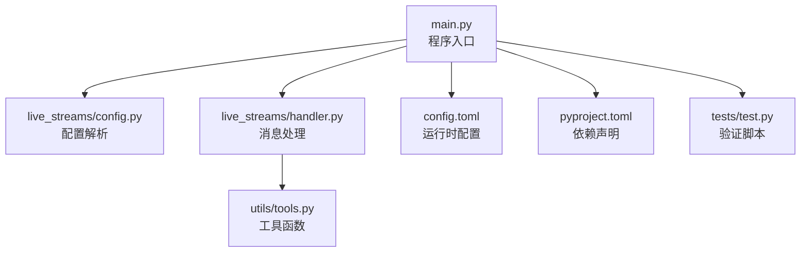
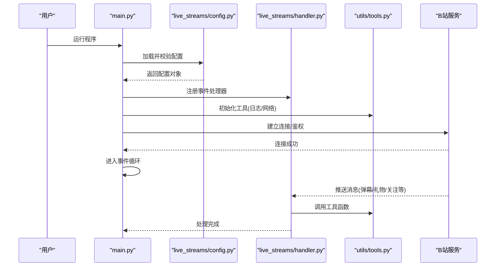
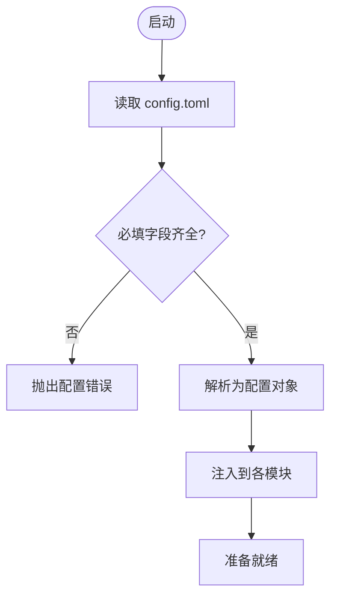
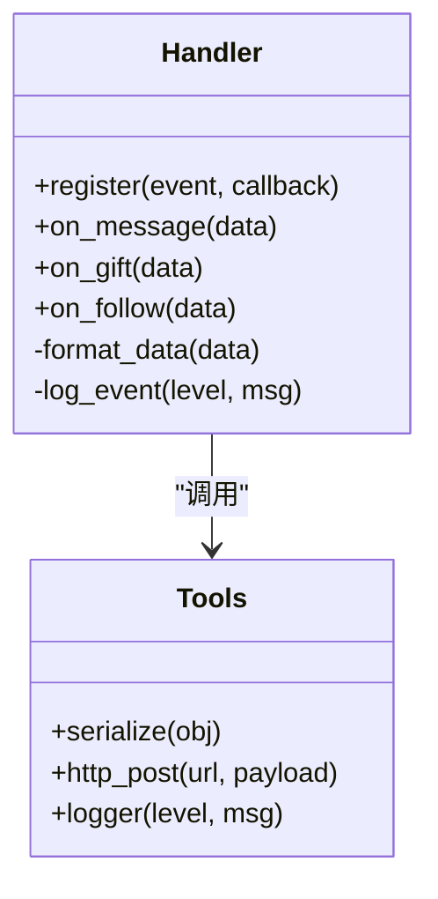
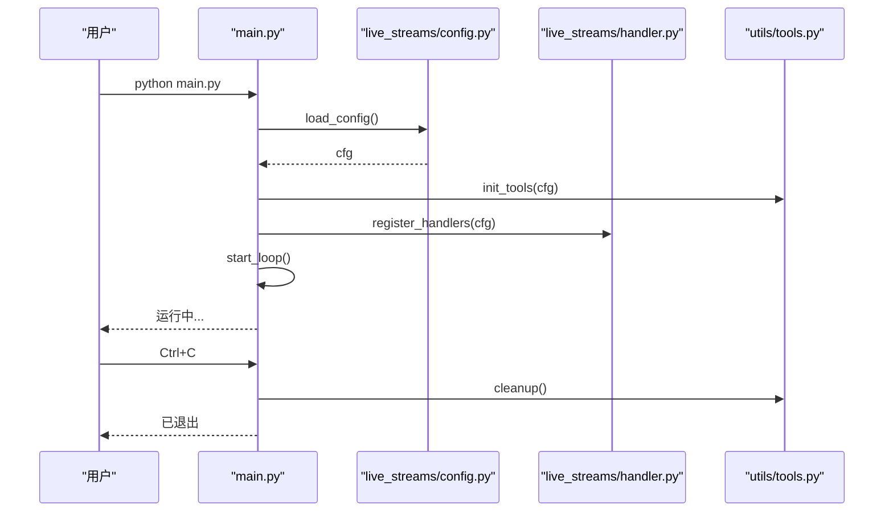
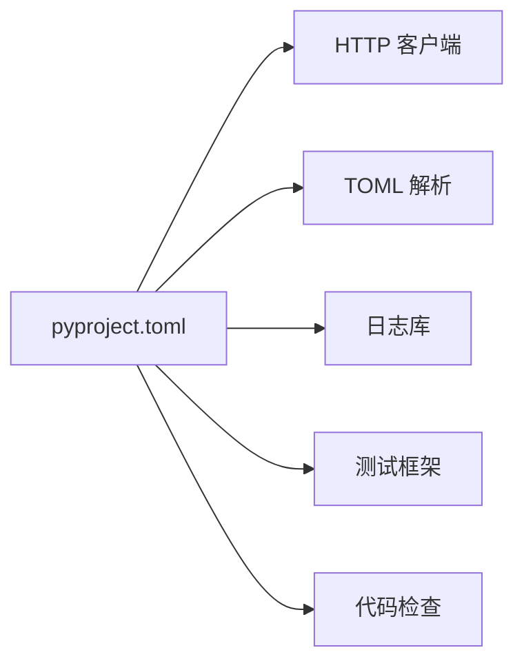

# 快速开始

<cite>
**本文引用的文件**   
- [main.py](file://main.py)
- [config.toml](file://config.toml)
- [pyproject.toml](file://pyproject.toml)
- [live_streams/config.py](file://live_streams/config.py)
- [live_streams/handler.py](file://live_streams/handler.py)
- [utils/tools.py](file://utils/tools.py)
- [tests/test.py](file://tests/test.py)
</cite>

## 目录
1. [简介](#简介)
2. [项目结构](#项目结构)
3. [核心组件](#核心组件)
4. [架构总览](#架构总览)
5. [详细组件分析](#详细组件分析)
6. [依赖关系分析](#依赖关系分析)
7. [性能注意事项](#性能注意事项)
8. [故障排除指南](#故障排除指南)
9. [结论](#结论)
10. [附录](#附录)

## 简介
本快速开始指南帮助你从零搭建并运行 Blive-Bot。内容涵盖：
- Python 环境要求与依赖安装
- 克隆项目与初始化
- 配置文件 config.toml 的完整设置（B站 API 密钥、房间号、基础参数）
- 启动示例与常见配置场景
- 验证安装成功的测试方法
- 常见问题排查

## 项目结构
Blive-Bot 采用模块化组织，核心入口在根目录，业务逻辑集中在 live_streams 子模块，工具函数位于 utils，测试用例位于 tests。关键文件说明如下：
- main.py：程序入口，负责加载配置、初始化服务并启动主循环
- config.toml：运行时配置（B站 Cookie/SESSDATA、房间号、日志级别等）
- pyproject.toml：Python 工程元数据与依赖声明
- live_streams/config.py：配置解析与校验
- live_streams/handler.py：消息处理与事件回调
- utils/tools.py：通用工具函数
- tests/test.py：基础功能验证脚本

图表来源
- [main.py:1-20](file://main.py#L1-L20)
- [live_streams/config.py:1-30](file://live_streams/config.py#L1-L30)
- [live_streams/handler.py:1-30](file://live_streams/handler.py#L1-L30)
- [config.toml:1-20](file://config.toml#L1-L20)
- [pyproject.toml:1-20](file://pyproject.toml#L1-L20)
- [utils/tools.py:1-20](file://utils/tools.py#L1-L20)
- [tests/test.py:1-20](file://tests/test.py#L1-L20)

章节来源
- [main.py:1-20](file://main.py#L1-L20)
- [config.toml:1-20](file://config.toml#L1-L20)
- [pyproject.toml:1-20](file://pyproject.toml#L1-L20)

## 核心组件
- 配置系统：读取并校验 config.toml，提供统一配置访问接口
- 消息处理器：订阅 B站直播相关事件，执行用户定义的处理逻辑
- 工具库：封装常用操作（如网络请求、序列化、日志辅助等）
- 入口与生命周期：初始化依赖、加载配置、启动事件循环、优雅退出

章节来源
- [live_streams/config.py:1-30](file://live_streams/config.py#L1-L30)
- [live_streams/handler.py:1-30](file://live_streams/handler.py#L1-L30)
- [utils/tools.py:1-30](file://utils/tools.py#L1-L30)
- [main.py:1-30](file://main.py#L1-L30)

## 架构总览
下图展示了从启动到处理消息的关键流程：入口加载配置，建立与 B站服务的连接，注册事件处理器，进入事件循环；收到消息后由处理器执行业务逻辑。

图表来源
- [main.py:1-40](file://main.py#L1-L40)
- [live_streams/config.py:1-40](file://live_streams/config.py#L1-L40)
- [live_streams/handler.py:1-40](file://live_streams/handler.py#L1-L40)
- [utils/tools.py:1-40](file://utils/tools.py#L1-L40)

## 详细组件分析

### 配置系统（config.toml 与配置解析）
- 配置文件位置：项目根目录 config.toml
- 关键字段建议：
  - B站鉴权信息：Cookie/SESSDATA（用于登录态）
  - 房间号：需要监听的直播间 ID
  - 日志级别：debug/info/warning/error
  - 重试与超时：网络请求的重试次数与超时时间
  - 其他开关：是否启用调试输出、是否自动重连等
- 配置解析流程：
  - 程序启动时读取 config.toml
  - 校验必填字段（如房间号、鉴权信息）
  - 将配置注入到各模块使用

图表来源
- [config.toml:1-30](file://config.toml#L1-L30)
- [live_streams/config.py:1-40](file://live_streams/config.py#L1-L40)

章节来源
- [config.toml:1-30](file://config.toml#L1-L30)
- [live_streams/config.py:1-40](file://live_streams/config.py#L1-L40)

### 消息处理器（handler）
- 职责：订阅 B站直播事件（弹幕、礼物、关注、开播通知等），执行用户自定义逻辑
- 典型流程：
  - 注册回调函数
  - 接收事件数据
  - 调用工具函数进行格式化或持久化
  - 根据配置决定是否上报或转发

图表来源
- [live_streams/handler.py:1-60](file://live_streams/handler.py#L1-L60)
- [utils/tools.py:1-60](file://utils/tools.py#L1-L60)

章节来源
- [live_streams/handler.py:1-60](file://live_streams/handler.py#L1-L60)
- [utils/tools.py:1-60](file://utils/tools.py#L1-L60)

### 入口与生命周期（main）
- 职责：加载配置、初始化工具、注册处理器、建立连接、启动事件循环、处理退出信号
- 关键点：
  - 确保 config.toml 存在且有效
  - 捕获异常并记录日志
  - 支持优雅关闭（清理资源）

图表来源
- [main.py:1-60](file://main.py#L1-L60)
- [live_streams/config.py:1-40](file://live_streams/config.py#L1-L40)
- [live_streams/handler.py:1-40](file://live_streams/handler.py#L1-L40)
- [utils/tools.py:1-40](file://utils/tools.py#L1-L40)

章节来源
- [main.py:1-60](file://main.py#L1-L60)

## 依赖关系分析
- 工程依赖由 pyproject.toml 管理，包含运行时库与开发工具
- 运行时依赖通常包括：HTTP 客户端、JSON/TOML 解析、日志库等
- 开发依赖通常包括：测试框架、代码检查工具等

图表来源
- [pyproject.toml:1-40](file://pyproject.toml#L1-L40)

章节来源
- [pyproject.toml:1-40](file://pyproject.toml#L1-L40)

## 性能注意事项
- 合理设置日志级别，避免在生产环境输出过多 debug 信息
- 控制并发与重试策略，防止对 B站服务造成压力
- 对频繁处理的弹幕数据进行去重或限流
- 使用异步 I/O（若实现支持）提升吞吐

[本节为通用指导，不直接分析具体文件]

## 故障排除指南
- 无法启动或报错“找不到配置文件”
  - 确认项目根目录存在 config.toml
  - 检查 TOML 语法是否正确
- 鉴权失败或无权限访问
  - 确认 Cookie/SESSDATA 有效且未过期
  - 检查是否需要开启相关权限
- 无法连接 B站服务
  - 检查网络连通性与代理设置
  - 调整超时与重试参数
- 消息处理异常
  - 查看日志定位错误堆栈
  - 检查 handler 中的数据处理逻辑
- 如何验证安装成功
  - 运行基础测试脚本，观察是否通过
  - 启动程序后查看日志是否显示“连接成功”和“监听房间”

章节来源
- [tests/test.py:1-40](file://tests/test.py#L1-L40)
- [utils/tools.py:1-40](file://utils/tools.py#L1-L40)
- [live_streams/handler.py:1-40](file://live_streams/handler.py#L1-L40)

## 结论
按照本指南完成环境准备、配置与启动后，即可稳定运行 Blive-Bot。建议在生产环境中完善日志与监控，并根据实际业务扩展处理器逻辑。

[本节为总结性内容，不直接分析具体文件]

## 附录

### 环境与安装步骤
- 环境要求
  - Python 版本：建议使用 3.10+（以 pyproject.toml 为准）
  - 包管理器：可使用内置 venv 或 uv（项目包含 uv.lock）
- 克隆与初始化
  - 克隆仓库到本地
  - 创建虚拟环境并激活
  - 安装依赖（参考 pyproject.toml）
- 启动命令
  - 在项目根目录运行入口脚本

章节来源
- [pyproject.toml:1-40](file://pyproject.toml#L1-L40)
- [main.py:1-20](file://main.py#L1-L20)

### 配置文件 config.toml 设置要点
- B站 API 密钥/鉴权
  - 填写 Cookie/SESSDATA 等鉴权字段
  - 确保账号具备所需权限
- 房间号配置
  - 填写目标直播间 room_id
  - 可配置多个房间（按格式要求）
- 基础参数
  - 日志级别：info/debug
  - 超时与重试：根据网络情况调整
  - 功能开关：按需启用/禁用

章节来源
- [config.toml:1-40](file://config.toml#L1-L40)
- [live_streams/config.py:1-40](file://live_streams/config.py#L1-L40)

### 启动示例与常见场景
- 最小可用配置
  - 仅配置鉴权与一个房间号
  - 日志级别设为 info
- 多房间监听
  - 配置多个房间号
  - 为不同房间设置差异化处理
- 调试模式
  - 日志级别设为 debug
  - 启用详细网络请求日志

章节来源
- [config.toml:1-40](file://config.toml#L1-L40)
- [live_streams/handler.py:1-40](file://live_streams/handler.py#L1-L40)

### 验证安装成功的测试方法
- 运行测试脚本
  - 执行 tests/test.py，观察输出与结果
- 手动验证
  - 启动程序后查看日志是否出现“连接成功”“监听房间”等信息
  - 向直播间发送弹幕或礼物，确认处理器被触发

章节来源
- [tests/test.py:1-40](file://tests/test.py#L1-L40)
- [main.py:1-40](file://main.py#L1-L40)