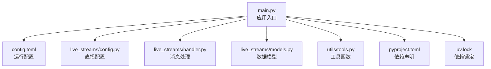
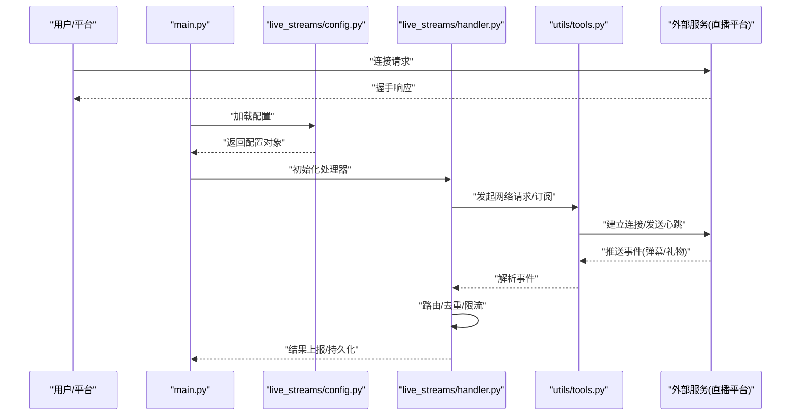
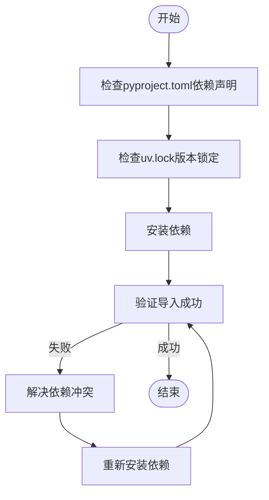

# 故障排除

<cite>
**本文引用的文件**   
- [main.py](file://main.py)
- [config.toml](file://config.toml)
- [pyproject.toml](file://pyproject.toml)
- [uv.lock](file://uv.lock)
- [live_streams/config.py](file://live_streams/config.py)
- [live_streams/exception.py](file://live_streams/exception.py)
- [live_streams/handler.py](file://live_streams/handler.py)
- [live_streams/models.py](file://live_streams/models.py)
- [utils/tools.py](file://utils/tools.py)
- [tests/live_rooms.py](file://tests/live_rooms.py)
- [tests/test.py](file://tests/test.py)
</cite>

## 目录
1. [简介](#简介)
2. [项目结构](#项目结构)
3. [核心组件](#核心组件)
4. [架构总览](#架构总览)
5. [详细组件分析](#详细组件分析)
6. [依赖分析](#依赖分析)
7. [性能考虑](#性能考虑)
8. [故障排除指南](#故障排除指南)
9. [结论](#结论)
10. [附录](#附录)

## 简介
本指南面向Blive-Bot的开发者与运维人员，聚焦常见问题的诊断与修复，包括连接失败、认证错误、消息处理异常、网络问题、权限配置、依赖冲突等。文档提供系统化的排查步骤、日志分析方法、性能优化建议，以及自动化诊断与监控告警的配置思路，帮助快速定位并解决问题。

## 项目结构
- 入口与配置
  - main.py：应用启动与生命周期管理（进程初始化、配置加载、任务调度、信号处理）。
  - config.toml：运行时配置（如房间列表、鉴权信息、网络参数、日志级别等）。
  - pyproject.toml：Python工程元数据与依赖声明。
  - uv.lock：锁定依赖版本，确保可重复构建。
- 直播流模块
  - live_streams/config.py：直播相关配置解析与校验。
  - live_streams/exception.py：自定义异常类型定义。
  - live_streams/handler.py：消息处理、事件回调、业务逻辑编排。
  - live_streams/models.py：数据模型定义（房间、弹幕、礼物等）。
- 工具与测试
  - utils/tools.py：通用工具函数（网络请求封装、重试、序列化等）。
  - tests/live_rooms.py、tests/test.py：功能与集成测试用例。

**图表来源** 
- [main.py:1-200](file://main.py#L1-L200)
- [config.toml:1-200](file://config.toml#L1-L200)
- [live_streams/config.py:1-200](file://live_streams/config.py#L1-L200)
- [live_streams/handler.py:1-200](file://live_streams/handler.py#L1-L200)
- [live_streams/models.py:1-200](file://live_streams/models.py#L1-L200)
- [utils/tools.py:1-200](file://utils/tools.py#L1-L200)
- [pyproject.toml:1-200](file://pyproject.toml#L1-L200)
- [uv.lock:1-200](file://uv.lock#L1-L200)

**章节来源**
- [main.py:1-200](file://main.py#L1-L200)
- [config.toml:1-200](file://config.toml#L1-L200)
- [pyproject.toml:1-200](file://pyproject.toml#L1-L200)
- [uv.lock:1-200](file://uv.lock#L1-L200)

## 核心组件
- 应用入口（main.py）
  - 负责读取配置、初始化日志、启动直播监听与消息处理流程、优雅退出。
- 直播配置（live_streams/config.py）
  - 解析并校验房间ID、鉴权令牌、网络超时、重试策略等关键参数。
- 消息处理器（live_streams/handler.py）
  - 接收平台推送事件（弹幕、礼物、关注），进行路由、去重、限流与持久化。
- 数据模型（live_streams/models.py）
  - 定义房间、用户、消息、礼物等数据结构，保证序列化一致性。
- 工具库（utils/tools.py）
  - 封装HTTP/WebSocket调用、重试退避、JSON编解码、时间戳转换等。

**章节来源**
- [main.py:1-200](file://main.py#L1-L200)
- [live_streams/config.py:1-200](file://live_streams/config.py#L1-L200)
- [live_streams/handler.py:1-200](file://live_streams/handler.py#L1-L200)
- [live_streams/models.py:1-200](file://live_streams/models.py#L1-L200)
- [utils/tools.py:1-200](file://utils/tools.py#L1-L200)

## 架构总览
Blive-Bot采用“入口+配置+处理器+模型+工具”的分层架构。入口统一协调各模块，配置集中管理，处理器专注事件驱动的业务逻辑，模型保障数据结构一致，工具库提供通用能力。

**图表来源** 
- [main.py:1-200](file://main.py#L1-L200)
- [live_streams/config.py:1-200](file://live_streams/config.py#L1-L200)
- [live_streams/handler.py:1-200](file://live_streams/handler.py#L1-L200)
- [utils/tools.py:1-200](file://utils/tools.py#L1-L200)

## 详细组件分析

### 应用入口（main.py）
- 职责
  - 解析命令行参数与环境变量。
  - 加载配置文件并校验必填项。
  - 初始化日志与监控指标。
  - 启动直播监听与消息处理循环。
  - 处理信号量实现优雅关闭。
- 常见问题
  - 配置缺失或格式错误导致启动失败。
  - 未捕获异常导致进程崩溃。
  - 信号处理不当导致资源泄漏。
- 排查要点
  - 检查配置文件路径与权限。
  - 查看启动日志中的配置校验错误。
  - 确认依赖安装与版本锁定是否一致。

**章节来源**
- [main.py:1-200](file://main.py#L1-L200)

### 直播配置（live_streams/config.py）
- 职责
  - 解析房间列表、鉴权令牌、网络超时、重试次数等。
  - 对敏感字段进行脱敏与校验。
  - 提供默认值与覆盖规则。
- 常见问题
  - 房间ID无效或权限不足。
  - 鉴权令牌过期或签名错误。
  - 超时设置过小导致频繁断连。
- 排查要点
  - 验证房间ID是否在白名单内。
  - 检查令牌有效期与刷新机制。
  - 调整超时与重试策略以匹配网络环境。

**章节来源**
- [live_streams/config.py:1-200](file://live_streams/config.py#L1-L200)

### 消息处理器（live_streams/handler.py）
- 职责
  - 接收并解析平台事件。
  - 执行路由、去重、限流、缓存与持久化。
  - 触发下游动作（如积分、公告、统计）。
- 常见问题
  - 事件解析失败导致丢消息。
  - 去重键冲突造成重复处理。
  - 限流阈值过低引发阻塞。
- 排查要点
  - 检查事件Schema与字段映射。
  - 审查去重策略与存储后端状态。
  - 调整限流参数与队列容量。

**章节来源**
- [live_streams/handler.py:1-200](file://live_streams/handler.py#L1-L200)

### 数据模型（live_streams/models.py）
- 职责
  - 定义房间、用户、消息、礼物等数据结构。
  - 提供序列化/反序列化工具。
  - 约束字段类型与取值范围。
- 常见问题
  - 字段缺失或类型不匹配导致解析失败。
  - 序列化开销过大影响吞吐。
- 排查要点
  - 核对上游事件字段与模型定义。
  - 使用批量序列化与懒加载优化性能。

**章节来源**
- [live_streams/models.py:1-200](file://live_streams/models.py#L1-L200)

### 工具库（utils/tools.py）
- 职责
  - 封装HTTP/WebSocket客户端、重试退避、JSON编解码。
  - 提供时间戳、哈希、随机数等通用方法。
- 常见问题
  - 重试策略不当导致雪崩。
  - JSON解析失败引发级联错误。
- 排查要点
  - 检查重试次数与退避算法。
  - 增加输入校验与错误分类。

**章节来源**
- [utils/tools.py:1-200](file://utils/tools.py#L1-L200)

## 依赖分析
- 构建与依赖
  - pyproject.toml声明运行时依赖与开发依赖。
  - uv.lock锁定具体版本，确保可重现环境。
- 常见问题
  - 依赖版本冲突导致导入失败。
  - 缺少系统级依赖（如编译头文件）。
- 排查要点
  - 使用依赖检查命令验证完整性。
  - 清理虚拟环境后重新安装。
  - 对比uv.lock与本地环境差异。

**图表来源** 
- [pyproject.toml:1-200](file://pyproject.toml#L1-L200)
- [uv.lock:1-200](file://uv.lock#L1-L200)

**章节来源**
- [pyproject.toml:1-200](file://pyproject.toml#L1-L200)
- [uv.lock:1-200](file://uv.lock#L1-L200)

## 性能考虑
- 网络I/O
  - 合理设置超时与重试，避免频繁重连。
  - 使用连接池与异步IO提升吞吐。
- 数据处理
  - 批量写入与延迟落盘减少磁盘压力。
  - 去重与采样降低内存占用。
- 监控与告警
  - 采集QPS、延迟、错误率等关键指标。
  - 设置阈值告警与自动恢复策略。

[本节为通用指导，无需特定文件引用]

## 故障排除指南

### 连接失败
- 可能原因
  - 网络不可达、DNS解析失败、防火墙拦截。
  - 证书校验失败或TLS版本不兼容。
  - 服务端限流或IP黑名单。
- 排查步骤
  - 检查主机网络连通性与代理设置。
  - 验证域名解析与证书有效性。
  - 查看工具库的重试与退避配置。
  - 抓取握手阶段日志与错误码。
- 解决方案
  - 调整超时与重试参数。
  - 更新CA证书或禁用严格校验（仅测试环境）。
  - 联系平台方确认限流策略。

**章节来源**
- [utils/tools.py:1-200](file://utils/tools.py#L1-L200)
- [live_streams/config.py:1-200](file://live_streams/config.py#L1-L200)

### 认证错误
- 可能原因
  - 鉴权令牌过期、签名错误或权限不足。
  - 时间同步偏差导致签名失效。
  - 多账号并发访问冲突。
- 排查步骤
  - 校验令牌有效期与刷新逻辑。
  - 检查服务器时间与NTP同步。
  - 查看认证接口返回的错误码与描述。
- 解决方案
  - 实现令牌自动刷新与缓存。
  - 修正时间同步与签名算法。
  - 隔离账号会话避免冲突。

**章节来源**
- [live_streams/config.py:1-200](file://live_streams/config.py#L1-L200)
- [utils/tools.py:1-200](file://utils/tools.py#L1-L200)

### 消息处理异常
- 可能原因
  - 事件Schema变更导致解析失败。
  - 去重键冲突或存储后端异常。
  - 业务逻辑抛出未捕获异常。
- 排查步骤
  - 比对事件字段与模型定义。
  - 检查去重存储状态与索引。
  - 定位异常堆栈与上下文信息。
- 解决方案
  - 升级模型定义与兼容性处理。
  - 修复去重键生成策略。
  - 增加异常捕获与降级逻辑。

**章节来源**
- [live_streams/handler.py:1-200](file://live_streams/handler.py#L1-L200)
- [live_streams/models.py:1-200](file://live_streams/models.py#L1-L200)
- [live_streams/exception.py:1-200](file://live_streams/exception.py#L1-L200)

### 网络问题
- 可能原因
  - DNS解析缓慢或失败。
  - 中间代理或负载均衡器限制。
  - 带宽不足或拥塞。
- 排查步骤
  - 使用ping/traceroute检测链路质量。
  - 检查代理配置与端口开放。
  - 监控带宽利用率与丢包率。
- 解决方案
  - 配置备用DNS与缓存。
  - 调整代理策略与超时。
  - 扩容带宽或启用CDN。

**章节来源**
- [utils/tools.py:1-200](file://utils/tools.py#L1-L200)

### 权限配置
- 可能原因
  - 房间未授权或权限等级不足。
  - 账号被限制或封禁。
  - 安全组或ACL规则拦截。
- 排查步骤
  - 验证房间ID与权限矩阵。
  - 检查账号状态与安全策略。
  - 审查网络ACL与防火墙规则。
- 解决方案
  - 申请必要权限或升级账号。
  - 调整安全组与ACL放行。
  - 定期审计权限配置。

**章节来源**
- [live_streams/config.py:1-200](file://live_streams/config.py#L1-L200)

### 依赖冲突
- 可能原因
  - 不同包版本不兼容。
  - 系统依赖缺失或版本过旧。
  - 虚拟环境污染。
- 排查步骤
  - 列出依赖树查找冲突点。
  - 检查系统库版本与头文件。
  - 重建虚拟环境并重新安装。
- 解决方案
  - 锁定兼容版本或升级依赖。
  - 安装缺失的系统依赖。
  - 使用容器化部署隔离环境。

**章节来源**
- [pyproject.toml:1-200](file://pyproject.toml#L1-L200)
- [uv.lock:1-200](file://uv.lock#L1-L200)

### 日志分析方法
- 收集日志
  - 启用详细日志级别并输出到文件。
  - 包含时间戳、线程ID、请求ID。
- 分析技巧
  - 按错误码与模块过滤关键日志。
  - 关联上下游调用链追踪问题。
  - 使用正则表达式提取关键字段。
- 工具推荐
  - 使用grep/awk进行文本处理。
  - 借助ELK或Prometheus+Grafana可视化。

**章节来源**
- [main.py:1-200](file://main.py#L1-L200)

### 自动化诊断脚本
- 功能建议
  - 检查网络连通性与DNS解析。
  - 验证配置文件语法与必填项。
  - 探测依赖安装状态与版本一致性。
  - 采集系统资源使用情况。
- 实现思路
  - 使用子进程调用系统命令。
  - 输出结构化JSON便于后续处理。
  - 支持定时任务与告警联动。

**章节来源**
- [utils/tools.py:1-200](file://utils/tools.py#L1-L200)

### 监控告警配置
- 指标采集
  - QPS、延迟、错误率、内存/CPU使用率。
  - 连接池大小与队列长度。
- 告警规则
  - 错误率超过阈值持续一定时间。
  - 延迟P99超过SLA要求。
  - 资源使用率接近上限。
- 通知渠道
  - 邮件、短信、企业微信、Slack。
  - 与工单系统集成自动派单。

**章节来源**
- [main.py:1-200](file://main.py#L1-L200)

### 社区支持与求助渠道
- 官方文档与FAQ
  - 查阅最新文档与已知问题列表。
- 问题报告模板
  - 环境信息（操作系统、Python版本、依赖版本）。
  - 复现步骤与期望行为。
  - 相关日志片段与错误码。
- 求助渠道
  - GitHub Issues提交问题。
  - 加入社区群组讨论。
  - 参与贡献代码与文档。

**章节来源**
- [tests/test.py:1-200](file://tests/test.py#L1-L200)
- [tests/live_rooms.py:1-200](file://tests/live_rooms.py#L1-L200)

## 结论
通过系统化的故障排除流程、日志分析方法与性能优化建议，开发者可以快速定位并解决Blive-Bot在连接、认证、消息处理等方面的常见问题。结合自动化诊断与监控告警，进一步提升系统的稳定性与可维护性。

## 附录
- 常用命令参考
  - 检查依赖：pip list / uv sync
  - 验证配置：python -m json.tool config.toml
  - 抓取日志：tail -f logs/app.log
- 最佳实践
  - 使用环境变量管理敏感配置。
  - 实施灰度发布与回滚策略。
  - 定期进行压测与容量规划。

[本节为补充信息，无需特定文件引用]