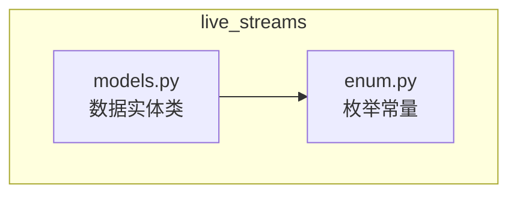
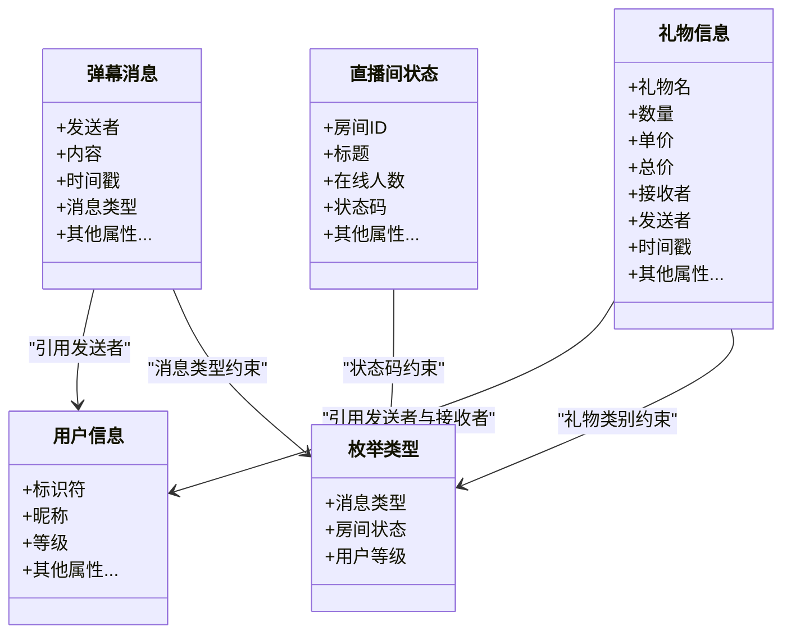
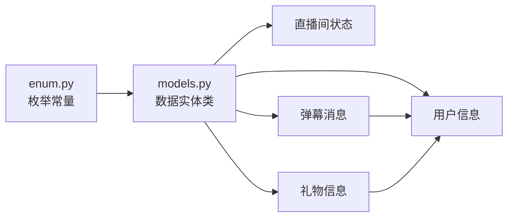

# 数据模型

<cite>
**本文引用的文件**   
- [live_streams/models.py](file://live_streams/models.py)
- [live_streams/enum.py](file://live_streams/enum.py)
</cite>

## 目录
1. [简介](#简介)
2. [项目结构](#项目结构)
3. [核心组件](#核心组件)
4. [架构总览](#架构总览)
5. [详细组件分析](#详细组件分析)
6. [依赖关系分析](#依赖关系分析)
7. [性能考虑](#性能考虑)
8. [故障排查指南](#故障排查指南)
9. [结论](#结论)
10. [附录](#附录)

## 简介
本技术文档聚焦于 Blive-Bot 的数据模型层，系统性梳理 live_streams/models.py 中定义的核心数据实体（用户信息、直播间状态、弹幕消息、礼物信息等），以及 live_streams/enum.py 中的枚举类型（消息类型、房间状态、用户等级等）。文档将解释字段含义、数据类型与验证规则、序列化/反序列化处理方式、类型安全保证，并提供使用示例与最佳实践，帮助开发者在业务逻辑中正确、高效地使用这些模型。

## 项目结构
数据模型相关代码位于 live_streams 包内：
- models.py：定义数据实体类与数据结构
- enum.py：定义枚举常量，如消息类型、房间状态、用户等级等

图表来源
- [live_streams/models.py](file://live_streams/models.py)
- [live_streams/enum.py](file://live_streams/enum.py)

章节来源
- [live_streams/models.py](file://live_streams/models.py)
- [live_streams/enum.py](file://live_streams/enum.py)

## 核心组件
- 用户信息模型：用于表示直播间观众或管理员的身份信息与基础属性
- 直播间状态模型：描述直播间的当前状态、配置与关键指标
- 弹幕消息模型：封装弹幕事件的结构化数据，包含发送者、内容、时间戳等
- 礼物信息模型：记录礼物事件的详细信息，包括礼物名称、数量、价值与接收方等
- 枚举类型：统一消息类型、房间状态、用户等级等常量，确保跨模块一致性

章节来源
- [live_streams/models.py](file://live_streams/models.py)
- [live_streams/enum.py](file://live_streams/enum.py)

## 架构总览
数据模型层以 models.py 为核心，通过 enum.py 提供的枚举进行约束与校验，形成强类型的数据契约。上层业务（如 handler.py）消费这些模型，保证输入输出的一致性与可预测性。

图表来源
- [live_streams/models.py](file://live_streams/models.py)
- [live_streams/enum.py](file://live_streams/enum.py)

## 详细组件分析

### 用户信息模型
- 字段说明
  - 标识符：唯一标识用户，通常为非空字符串或整数
  - 昵称：显示名称，长度与字符集受限制
  - 等级：对应枚举的用户等级，确保取值合法
  - 其他属性：根据业务扩展的可选字段（如头像URL、UID等）
- 数据类型与验证
  - 使用强类型字段，结合枚举约束等级取值
  - 非空字段在构造时进行必填校验
  - 字符串字段支持长度与格式校验（如正则匹配）
- 序列化/反序列化
  - 提供 to_dict/from_dict 方法，便于 JSON 传输与存储
  - 反序列化时对缺失字段设置默认值或抛出明确错误
- 使用示例
  - 构造用户对象并赋值后，调用 to_dict 生成字典
  - 从外部数据源读取字典，使用 from_dict 构建用户对象
- 最佳实践
  - 优先使用 from_dict 进行外部数据入参校验
  - 对敏感字段（如 UID）进行只读访问控制

章节来源
- [live_streams/models.py](file://live_streams/models.py)
- [live_streams/enum.py](file://live_streams/enum.py)

### 直播间状态模型
- 字段说明
  - 房间ID：唯一标识直播间
  - 标题：直播标题，长度受限
  - 在线人数：当前在线观众数，非负整数
  - 状态码：对应枚举的房间状态，如开播、下播、暂停等
  - 其他属性：封面图、分类、标签等
- 数据类型与验证
  - 状态码必须为枚举允许的值
  - 数值型字段需满足范围约束（如在线人数≥0）
- 序列化/反序列化
  - 提供 to_dict/from_dict，支持增量更新与全量替换
  - 反序列化时校验必填字段与枚举值合法性
- 使用示例
  - 拉取直播间信息后，使用 from_dict 构建状态对象
  - 定时刷新状态，比较差异并触发业务逻辑
- 最佳实践
  - 使用幂等更新策略，避免重复状态变更
  - 对状态变化进行审计日志记录

章节来源
- [live_streams/models.py](file://live_streams/models.py)
- [live_streams/enum.py](file://live_streams/enum.py)

### 弹幕消息模型
- 字段说明
  - 发送者：用户信息对象
  - 内容：弹幕文本，长度与编码受限
  - 时间戳：事件发生时间，ISO 格式或时间戳
  - 消息类型：对应枚举的消息类型，如普通弹幕、系统提示等
  - 其他属性：是否匿名、是否高亮等
- 数据类型与验证
  - 发送者必须为用户信息对象
  - 内容需过滤非法字符与过长文本
  - 时间戳需符合时间格式规范
- 序列化/反序列化
  - to_dict 输出扁平化结构，便于网络传输
  - from_dict 支持部分字段缺失时的默认填充
- 使用示例
  - 解析上游弹幕流，转换为模型对象后进入处理管道
  - 按消息类型路由到不同处理器（如聊天、系统通知）
- 最佳实践
  - 对高频弹幕进行采样与限流
  - 使用不可变对象或冻结副本防止并发修改

章节来源
- [live_streams/models.py](file://live_streams/models.py)
- [live_streams/enum.py](file://live_streams/enum.py)

### 礼物信息模型
- 字段说明
  - 礼物名：礼物名称，长度受限
  - 数量：赠送数量，正整数
  - 单价与总价：金额计算，精度与舍入规则明确
  - 发送者与接收者：用户信息对象
  - 时间戳：事件发生时间
  - 其他属性：特效、备注、是否匿名等
- 数据类型与验证
  - 数量与金额需满足业务规则（如最小单位、最大限额）
  - 发送者与接收者不能为空且有效
- 序列化/反序列化
  - to_dict 输出结构化数据，便于计费与统计
  - from_dict 支持批量导入与历史回放
- 使用示例
  - 监听礼物事件，构建礼物信息对象并触发奖励逻辑
  - 导出礼物报表，聚合统计与可视化展示
- 最佳实践
  - 对大额礼物进行风控校验与人工复核
  - 使用事务保证礼物发放与账户扣款的一致性

章节来源
- [live_streams/models.py](file://live_streams/models.py)
- [live_streams/enum.py](file://live_streams/enum.py)

### 枚举类型
- 消息类型
  - 定义弹幕、系统提示、关注、粉丝牌等事件类型
  - 用于路由与差异化处理
- 房间状态
  - 定义开播、下播、暂停、封禁等状态
  - 驱动直播间生命周期管理
- 用户等级
  - 定义普通观众、会员、管理员、主播等角色
  - 影响权限与功能可见性
- 使用建议
  - 所有涉及类型的地方统一引用枚举，禁止硬编码字符串
  - 新增类型时需同步更新校验与文档

章节来源
- [live_streams/enum.py](file://live_streams/enum.py)

## 依赖关系分析
- models.py 依赖 enum.py 提供的枚举常量，确保类型一致
- 各模型之间通过引用关系建立关联（如弹幕消息引用用户信息）
- 无循环依赖，耦合度低，易于扩展与维护

图表来源
- [live_streams/models.py](file://live_streams/models.py)
- [live_streams/enum.py](file://live_streams/enum.py)

章节来源
- [live_streams/models.py](file://live_streams/models.py)
- [live_streams/enum.py](file://live_streams/enum.py)

## 性能考虑
- 序列化开销：频繁转换 to_dict/from_dict 可能带来 CPU 压力，建议在批量处理时使用缓存或批量化接口
- 内存占用：高并发弹幕场景下，及时释放临时对象，避免长生命周期引用
- 校验成本：复杂正则与深度嵌套校验应谨慎使用，必要时降级为快速路径
- 并发安全：模型对象设计为不可变或线程安全，减少锁竞争

[本节为通用指导，不直接分析具体文件]

## 故障排查指南
- 常见错误
  - 缺少必填字段：检查 from_dict 入参完整性
  - 枚举值非法：确认外部数据来源与枚举定义一致
  - 类型不匹配：核对字段类型与转换逻辑
- 定位方法
  - 打印模型对象的 to_dict 结果，对比期望结构
  - 捕获异常堆栈，定位具体字段与校验点
- 修复建议
  - 增加默认值与容错逻辑
  - 对外部输入进行前置清洗与校验

章节来源
- [live_streams/models.py](file://live_streams/models.py)
- [live_streams/enum.py](file://live_streams/enum.py)

## 结论
Blive-Bot 的数据模型层通过 models.py 与 enum.py 构建了清晰、强类型的数据契约。用户信息、直播间状态、弹幕消息、礼物信息等核心实体具备完善的字段定义、验证规则与序列化能力，配合枚举常量确保类型一致性与可扩展性。遵循本文的最佳实践，可在保证类型安全的前提下提升系统的稳定性与可维护性。

[本节为总结性内容，不直接分析具体文件]

## 附录
- 使用示例（步骤式）
  - 构造用户信息：使用 from_dict 加载外部数据，校验通过后创建对象
  - 更新直播间状态：拉取最新状态，比较差异并触发回调
  - 处理弹幕消息：解析上游事件，转换为模型对象后路由至处理器
  - 记录礼物信息：构建礼物对象，执行奖励与审计流程
- 最佳实践清单
  - 始终使用枚举替代硬编码字符串
  - 对外部输入进行严格校验与清洗
  - 对高频数据进行采样与限流
  - 保持模型对象的不可变性以提升并发安全性

[本节为概念性内容，不直接分析具体文件]