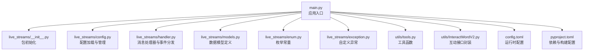
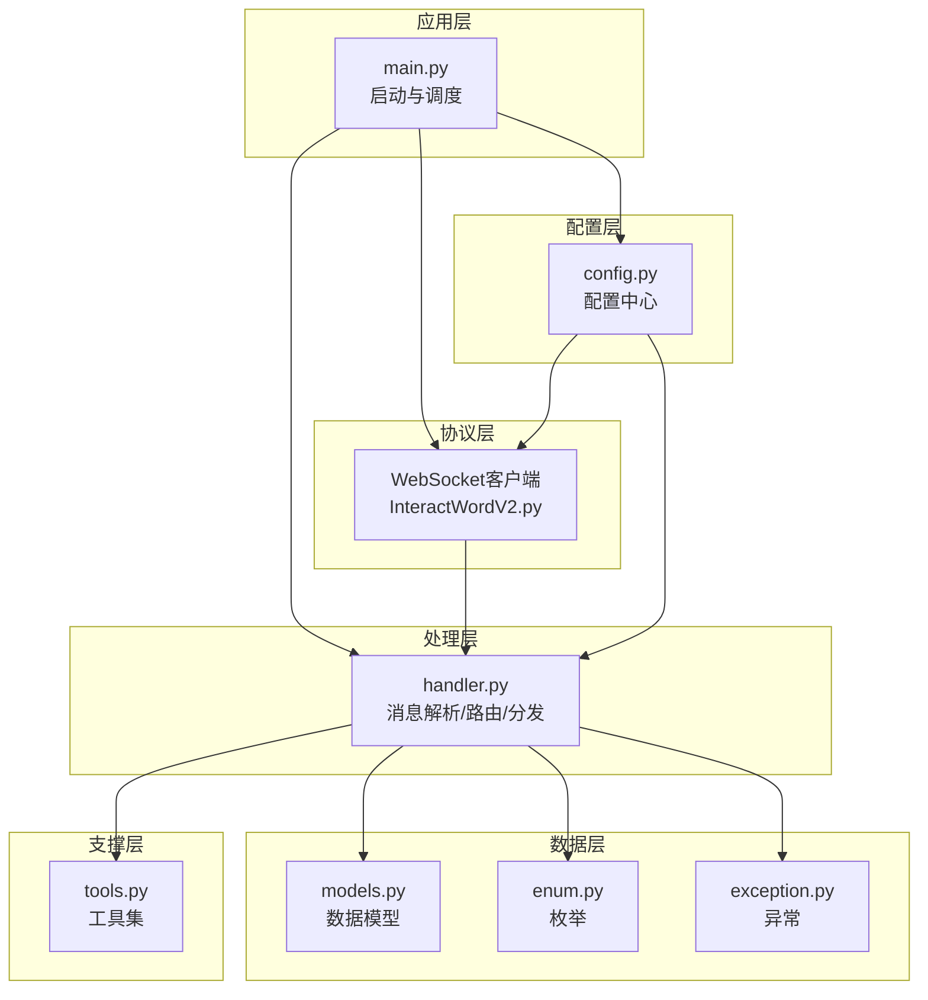
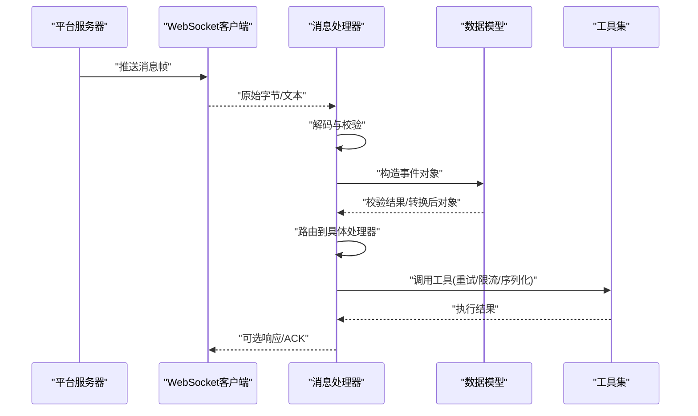
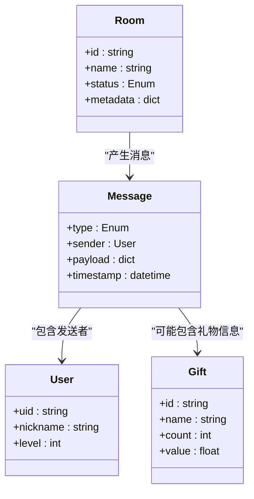
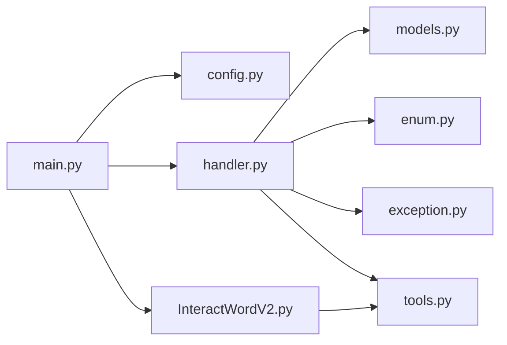

# 核心架构

<cite>
**本文引用的文件**   
- [main.py](file://main.py)
- [config.toml](file://config.toml)
- [pyproject.toml](file://pyproject.toml)
- [live_streams/__init__.py](file://live_streams/__init__.py)
- [live_streams/config.py](file://live_streams/config.py)
- [live_streams/enum.py](file://live_streams/enum.py)
- [live_streams/exception.py](file://live_streams/exception.py)
- [live_streams/handler.py](file://live_streams/handler.py)
- [live_streams/models.py](file://live_streams/models.py)
- [utils/tools.py](file://utils/tools.py)
- [utils/InteractWordV2.py](file://utils/InteractWordV2.py)
- [tests/live_rooms.py](file://tests/live_rooms.py)
- [tests/test.py](file://tests/test.py)
</cite>

## 目录
1. [简介](#简介)
2. [项目结构](#项目结构)
3. [核心组件](#核心组件)
4. [架构总览](#架构总览)
5. [详细组件分析](#详细组件分析)
6. [依赖关系分析](#依赖关系分析)
7. [性能考量](#性能考量)
8. [故障排查指南](#故障排查指南)
9. [结论](#结论)
10. [附录](#附录)

## 简介
本技术文档面向Blive-Bot的核心架构，聚焦直播流处理的整体设计：WebSocket连接管理、消息路由机制与事件处理流程。文档将深入解析各核心模块的职责分工，包括handler.py的消息处理器、models.py的数据模型定义、config.py的配置管理等；同时阐述异步编程模式的应用、错误处理策略与连接池管理机制，并给出架构图表说明组件间的交互关系和数据流向。文末提供扩展点说明、性能优化建议与最佳实践，帮助开发者快速理解与扩展系统能力。

## 项目结构
仓库采用按功能域划分的模块化组织方式：
- live_streams：直播流相关核心逻辑（配置、枚举、异常、数据模型、消息处理器）
- utils：通用工具与第三方交互封装
- tests：测试用例与示例脚本
- 根目录：应用入口、配置文件与依赖声明

图表来源
- [main.py](file://main.py)
- [live_streams/__init__.py](file://live_streams/__init__.py)
- [live_streams/config.py](file://live_streams/config.py)
- [live_streams/handler.py](file://live_streams/handler.py)
- [live_streams/models.py](file://live_streams/models.py)
- [live_streams/enum.py](file://live_streams/enum.py)
- [live_streams/exception.py](file://live_streams/exception.py)
- [utils/tools.py](file://utils/tools.py)
- [utils/InteractWordV2.py](file://utils/InteractWordV2.py)
- [config.toml](file://config.toml)
- [pyproject.toml](file://pyproject.toml)

章节来源
- [main.py](file://main.py)
- [config.toml](file://config.toml)
- [pyproject.toml](file://pyproject.toml)

## 核心组件
- 应用入口 main.py：负责启动生命周期、加载配置、初始化日志与调度器、注册任务与钩子、优雅关闭。
- 配置管理 live_streams/config.py：集中管理运行时参数（如平台接入、鉴权、重试策略、并发限制等），支持热更新或按需重载。
- 数据模型 live_streams/models.py：定义房间、弹幕、礼物、用户、会话等实体结构与校验规则。
- 枚举与异常 live_streams/enum.py、live_streams/exception.py：统一状态码、事件类型与业务异常类型，便于错误分类与恢复。
- 消息处理器 live_streams/handler.py：实现WebSocket消息的接收、解析、路由与事件分发，协调下游服务与回调。
- 工具与外部交互 utils/tools.py、utils/InteractWordV2.py：提供网络请求、序列化、加解密、重试、限流等通用能力，以及互动协议封装。

章节来源
- [live_streams/config.py](file://live_streams/config.py)
- [live_streams/models.py](file://live_streams/models.py)
- [live_streams/enum.py](file://live_streams/enum.py)
- [live_streams/exception.py](file://live_streams/exception.py)
- [live_streams/handler.py](file://live_streams/handler.py)
- [utils/tools.py](file://utils/tools.py)
- [utils/InteractWordV2.py](file://utils/InteractWordV2.py)

## 架构总览
整体架构围绕“事件驱动 + 异步I/O”展开：
- 入口层：main.py负责进程级生命周期管理与任务编排。
- 配置层：config.py提供统一的配置访问与校验。
- 数据层：models.py定义强类型数据结构，贯穿全链路。
- 协议层：通过InteractWordV2与平台WebSocket建立连接，进行心跳、鉴权与消息收发。
- 处理层：handler.py对消息进行解析、路由与事件分发，调用工具层完成具体业务。
- 支撑层：tools.py提供通用能力（重试、限流、序列化、加密等）。

图表来源
- [main.py](file://main.py)
- [live_streams/config.py](file://live_streams/config.py)
- [live_streams/handler.py](file://live_streams/handler.py)
- [live_streams/models.py](file://live_streams/models.py)
- [live_streams/enum.py](file://live_streams/enum.py)
- [live_streams/exception.py](file://live_streams/exception.py)
- [utils/InteractWordV2.py](file://utils/InteractWordV2.py)
- [utils/tools.py](file://utils/tools.py)

## 详细组件分析

### 消息处理器 handler.py
职责概述：
- WebSocket消息接收与反序列化为统一事件对象
- 基于事件类型的路由分发到对应处理分支
- 调用数据模型进行校验与转换
- 触发业务回调或写入持久化/缓存
- 错误捕获与降级策略（重试、告警、丢弃）

关键流程（消息处理时序）：

图表来源
- [live_streams/handler.py](file://live_streams/handler.py)
- [live_streams/models.py](file://live_streams/models.py)
- [utils/tools.py](file://utils/tools.py)

章节来源
- [live_streams/handler.py](file://live_streams/handler.py)

### 数据模型 models.py
职责概述：
- 定义房间、弹幕、礼物、用户、会话等实体结构
- 提供字段校验、默认值与类型转换
- 为序列化/反序列化提供统一接口

类关系示意：

图表来源
- [live_streams/models.py](file://live_streams/models.py)

章节来源
- [live_streams/models.py](file://live_streams/models.py)

### 配置管理 config.py
职责概述：
- 集中读取与校验配置项（如平台地址、鉴权令牌、超时、重试次数、并发限制）
- 提供默认值与覆盖机制（环境变量、配置文件优先级）
- 暴露只读视图供其他模块使用

章节来源
- [live_streams/config.py](file://live_streams/config.py)
- [config.toml](file://config.toml)

### 枚举与异常 enum.py、exception.py
职责概述：
- 统一定义事件类型、状态码、错误码
- 定义业务异常层次结构，便于分类处理与恢复

章节来源
- [live_streams/enum.py](file://live_streams/enum.py)
- [live_streams/exception.py](file://live_streams/exception.py)

### 工具与外部交互 tools.py、InteractWordV2.py
职责概述：
- tools.py：提供网络请求、序列化、加解密、重试、限流、日志等通用能力
- InteractWordV2.py：封装平台WebSocket握手、鉴权、心跳、消息编解码与重连策略

章节来源
- [utils/tools.py](file://utils/tools.py)
- [utils/InteractWordV2.py](file://utils/InteractWordV2.py)

### 应用入口 main.py
职责概述：
- 加载配置、初始化日志、创建事件循环
- 启动WebSocket客户端与消息处理器
- 注册任务、定时任务与信号处理（优雅关闭）
- 监控与指标上报（可选）

章节来源
- [main.py](file://main.py)

## 依赖关系分析
模块间依赖遵循分层与单向依赖原则：
- main.py依赖配置、处理器、工具与外部协议封装
- handler.py依赖数据模型、枚举、异常与工具
- InteractWordV2依赖工具集进行网络与序列化
- 配置模块被多处消费，作为单一事实源

图表来源
- [main.py](file://main.py)
- [live_streams/config.py](file://live_streams/config.py)
- [live_streams/handler.py](file://live_streams/handler.py)
- [live_streams/models.py](file://live_streams/models.py)
- [live_streams/enum.py](file://live_streams/enum.py)
- [live_streams/exception.py](file://live_streams/exception.py)
- [utils/InteractWordV2.py](file://utils/InteractWordV2.py)
- [utils/tools.py](file://utils/tools.py)

章节来源
- [main.py](file://main.py)
- [live_streams/config.py](file://live_streams/config.py)
- [live_streams/handler.py](file://live_streams/handler.py)
- [live_streams/models.py](file://live_streams/models.py)
- [live_streams/enum.py](file://live_streams/enum.py)
- [live_streams/exception.py](file://live_streams/exception.py)
- [utils/InteractWordV2.py](file://utils/InteractWordV2.py)
- [utils/tools.py](file://utils/tools.py)

## 性能考量
- 异步I/O优先：所有网络操作与阻塞IO应置于协程中，避免阻塞事件循环
- 连接池与复用：WebSocket长连接复用，减少握手开销；合理设置心跳间隔
- 背压与限流：在消息入队前进行速率控制，防止突发流量导致内存暴涨
- 批量处理：对可聚合的事件进行批处理，降低下游压力
- 资源清理：确保连接关闭、句柄释放与定时器取消，避免资源泄漏
- 监控与度量：记录关键指标（延迟、吞吐、错误率、队列长度）以便定位瓶颈

[本节为通用指导，不直接分析具体文件]

## 故障排查指南
常见问题与定位思路：
- 连接失败：检查鉴权配置、网络连通性、证书与代理设置；查看握手日志与重连策略
- 消息解析失败：核对协议版本与字段映射；启用更详细的解码日志
- 事件丢失：检查队列容量与丢弃策略；确认消费者是否及时处理
- 内存增长：定位未释放的连接或大对象引用；检查是否有循环引用
- 高CPU占用：排查密集计算是否在事件循环中执行；考虑放入线程池或后台任务

章节来源
- [live_streams/exception.py](file://live_streams/exception.py)
- [utils/tools.py](file://utils/tools.py)

## 结论
Blive-Bot以事件驱动与异步I/O为核心，通过清晰的模块分层与统一的数据模型，实现了可扩展、可维护的直播流处理能力。handler.py承担消息路由与事件分发的关键角色，config.py提供集中式配置管理，models.py保障数据结构一致性。配合工具层的通用能力与健壮的错误处理策略，系统具备良好的扩展性与稳定性。建议在生产环境中完善监控与告警，持续优化性能与可靠性。

[本节为总结性内容，不直接分析具体文件]

## 附录

### 扩展点说明
- 新增事件类型：在枚举中定义新事件，并在处理器中添加路由分支与处理逻辑
- 新增数据模型：在模型文件中定义实体与校验规则，并在处理器中进行转换
- 新增外部集成：在工具层封装新的API或协议，保持与现有风格一致
- 配置扩展：在配置模块增加新键，并提供默认值与校验

章节来源
- [live_streams/enum.py](file://live_streams/enum.py)
- [live_streams/handler.py](file://live_streams/handler.py)
- [live_streams/models.py](file://live_streams/models.py)
- [live_streams/config.py](file://live_streams/config.py)
- [utils/tools.py](file://utils/tools.py)

### 测试与示例
- tests/live_rooms.py：房间相关测试与示例
- tests/test.py：基础测试用例

章节来源
- [tests/live_rooms.py](file://tests/live_rooms.py)
- [tests/test.py](file://tests/test.py)