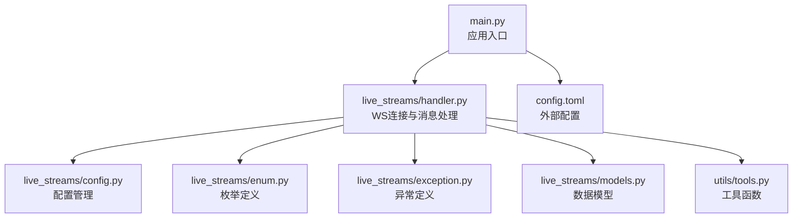
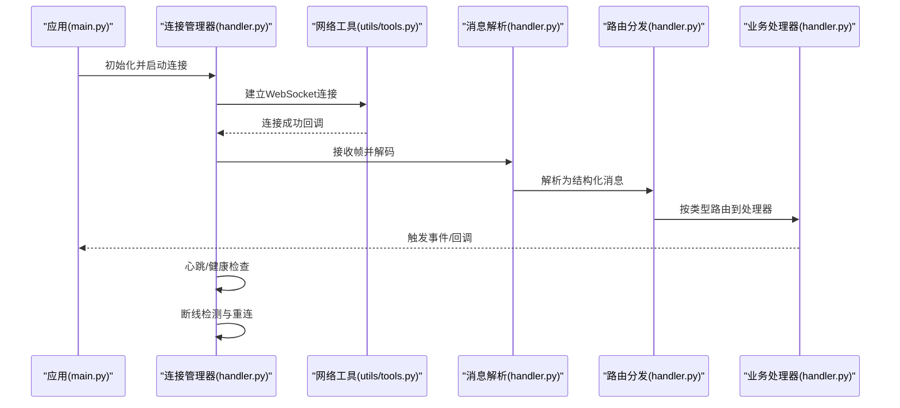
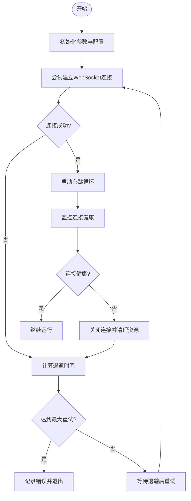
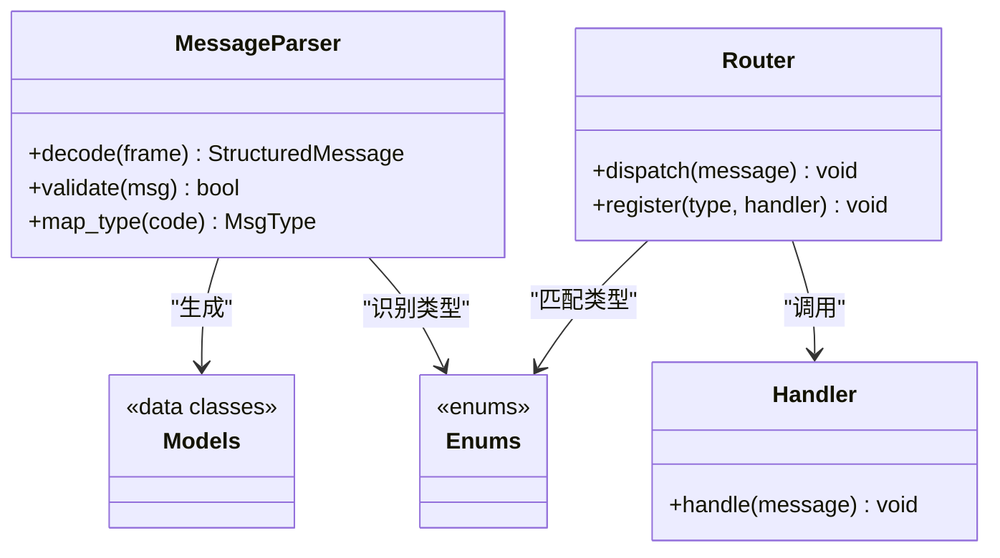
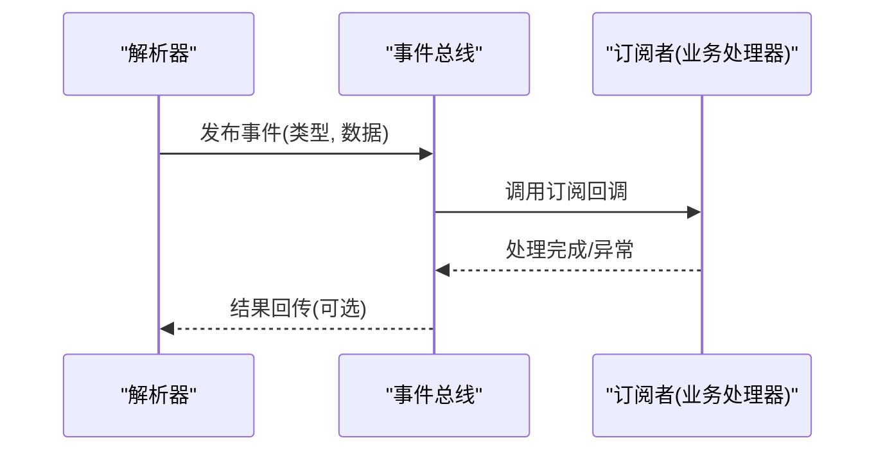
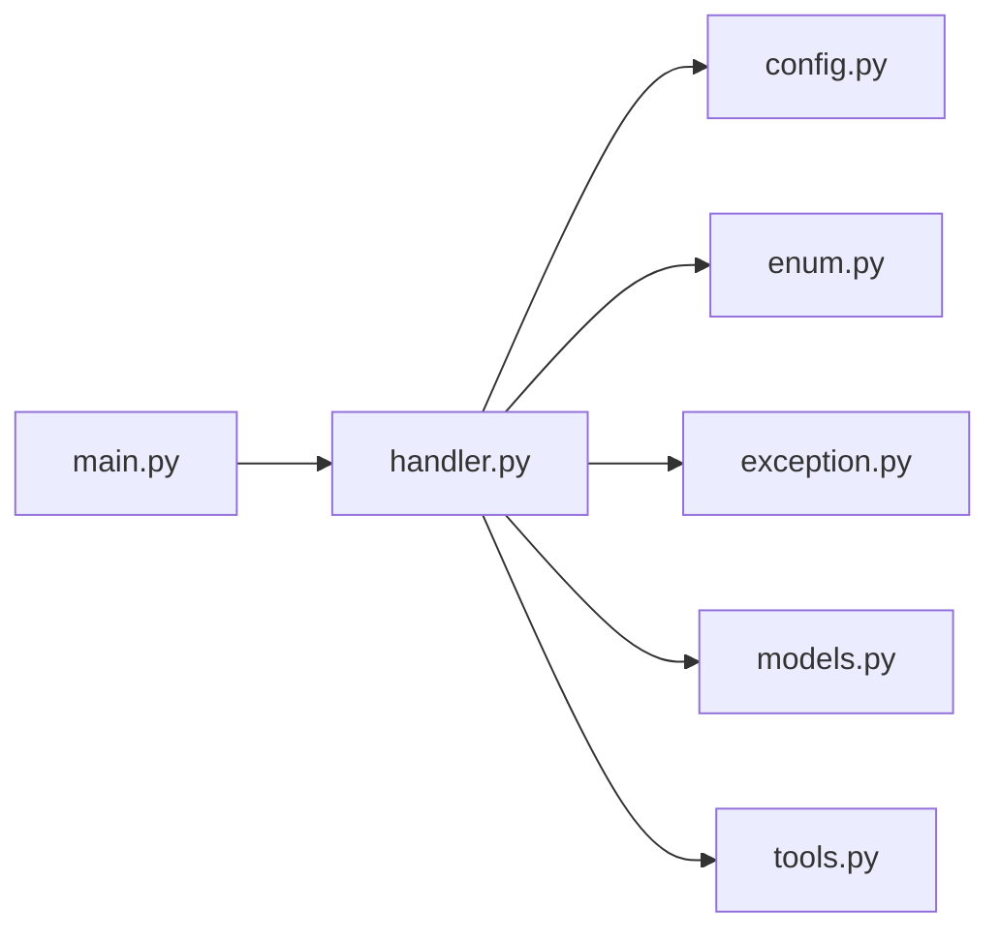

# 直播流处理

<cite>
**本文引用的文件**   
- [main.py](file://main.py)
- [live_streams/handler.py](file://live_streams/handler.py)
- [live_streams/config.py](file://live_streams/config.py)
- [live_streams/enum.py](file://live_streams/enum.py)
- [live_streams/exception.py](file://live_streams/exception.py)
- [live_streams/models.py](file://live_streams/models.py)
- [utils/tools.py](file://utils/tools.py)
- [config.toml](file://config.toml)
</cite>

## 更新摘要
**所做更改**   
- 更新了消息处理机制，从字符串字面量迁移到MsgType枚举
- 增强了类型安全性和IDE支持
- 改进了消息路由和分发逻辑
- 优化了错误处理和异常恢复机制

## 目录
1. [简介](#简介)
2. [项目结构](#项目结构)
3. [核心组件](#核心组件)
4. [架构总览](#架构总览)
5. [详细组件分析](#详细组件分析)
6. [依赖关系分析](#依赖关系分析)
7. [性能考量](#性能考量)
8. [故障排查指南](#故障排查指南)
9. [结论](#结论)
10. [附录](#附录)

## 简介
本技术文档聚焦于Blive-Bot的直播流处理模块，围绕WebSocket连接管理、消息接收与发送机制、连接状态维护与重连策略展开。重点解析handler.py中的核心处理器逻辑，包括消息解析、路由分发与事件触发机制；阐述异步I/O处理模式、连接池管理与资源清理策略；覆盖连接建立的生命周期、错误处理与异常恢复；并提供扩展新消息类型与处理逻辑的实践指引。

**最新更新**：系统已进行核心重构，消息处理机制现在使用MsgType枚举替代字符串字面量，显著提升了类型安全性和IDE支持能力。

## 项目结构
- live_streams：直播流处理核心模块
  - handler.py：WebSocket连接与消息处理的核心实现
  - config.py：配置加载与默认值管理
  - enum.py：枚举定义（如消息类型、事件等）
  - exception.py：自定义异常类型
  - models.py：数据模型与协议结构
- utils：通用工具与辅助方法
  - tools.py：网络、序列化、重试等工具函数
- 根目录
  - main.py：应用入口，负责初始化与启动
  - config.toml：外部配置文件
  - pyproject.toml、uv.lock：依赖与锁定文件

**图表来源** 
- [main.py](file://main.py)
- [live_streams/handler.py](file://live_streams/handler.py)
- [live_streams/config.py](file://live_streams/config.py)
- [live_streams/enum.py](file://live_streams/enum.py)
- [live_streams/exception.py](file://live_streams/exception.py)
- [live_streams/models.py](file://live_streams/models.py)
- [utils/tools.py](file://utils/tools.py)
- [config.toml](file://config.toml)

## 核心组件
- WebSocket连接管理器：负责连接的建立、心跳保活、断线检测、自动重连与连接池管理
- 消息处理器：负责二进制/文本帧的解码、协议解析、路由分发到具体业务处理器
- 事件总线：将解析后的结构化事件分发给订阅者（如弹幕、礼物、关注等）
- 配置与模型：集中管理配置项与数据结构，确保一致性与可测试性
- 工具库：封装网络请求、序列化、重试、日志等通用能力

**章节来源**
- [live_streams/handler.py](file://live_streams/handler.py)
- [live_streams/config.py](file://live_streams/config.py)
- [live_streams/enum.py](file://live_streams/enum.py)
- [live_streams/exception.py](file://live_streams/exception.py)
- [live_streams/models.py](file://live_streams/models.py)
- [utils/tools.py](file://utils/tools.py)

## 架构总览
直播流处理采用"连接层 + 解析层 + 路由层 + 业务层"的分层架构。连接层负责WebSocket生命周期与重连；解析层负责协议解码与校验；路由层根据消息类型分派到对应处理器；业务层执行具体动作并触发事件。

**图表来源** 
- [main.py](file://main.py)
- [live_streams/handler.py](file://live_streams/handler.py)
- [utils/tools.py](file://utils/tools.py)

## 详细组件分析

### WebSocket连接管理器
- 连接建立：支持TLS与非TLS，握手失败时进行指数退避重连
- 心跳保活：周期性ping/pong或应用层心跳，超时判定断线
- 断线检测：基于网络异常、服务端关闭、心跳超时等信号
- 重连策略：指数退避+抖动，最大重试次数与退避上限可配置
- 连接池：多房间或多实例场景下复用连接，限制并发与资源占用
- 资源清理：优雅关闭、取消任务、释放socket与缓冲区

**图表来源** 
- [live_streams/handler.py](file://live_streams/handler.py)
- [live_streams/config.py](file://live_streams/config.py)
- [utils/tools.py](file://utils/tools.py)

**章节来源**
- [live_streams/handler.py](file://live_streams/handler.py)
- [live_streams/config.py](file://live_streams/config.py)
- [utils/tools.py](file://utils/tools.py)

### 消息解析与路由分发
- 帧接收：区分文本与二进制帧，统一转换为字节流
- 协议解码：依据协议版本与头部字段进行解包，校验长度与签名
- 结构化建模：映射到models.py中的数据类，便于后续处理
- 路由分发：基于enum.py中的MsgType枚举，分派到对应处理器
- 事件触发：解析完成后发布事件，供上层订阅消费

**更新**：消息路由机制现已完全迁移到MsgType枚举系统，提供了更好的类型安全和IDE支持。

**图表来源** 
- [live_streams/handler.py](file://live_streams/handler.py)
- [live_streams/models.py](file://live_streams/models.py)
- [live_streams/enum.py](file://live_streams/enum.py)

**章节来源**
- [live_streams/handler.py](file://live_streams/handler.py)
- [live_streams/models.py](file://live_streams/models.py)
- [live_streams/enum.py](file://live_streams/enum.py)

### 事件触发与业务处理
- 事件总线：提供注册、发布、订阅接口，支持同步与异步回调
- 处理器：针对弹幕、礼物、关注、系统通知等类型实现具体逻辑
- 幂等与去重：对重复事件进行过滤，避免重复处理
- 背压与限流：在高吞吐场景下控制处理速率，防止阻塞

**图表来源** 
- [live_streams/handler.py](file://live_streams/handler.py)

**章节来源**
- [live_streams/handler.py](file://live_streams/handler.py)

### 异步I/O与连接池管理
- 异步框架：使用asyncio进行非阻塞I/O，提升并发处理能力
- 协程调度：合理拆分耗时操作，避免阻塞事件循环
- 连接池：按房间或实例维度管理连接，限制最大连接数与空闲回收
- 资源清理：在任务取消或异常退出时确保资源释放

**章节来源**
- [live_streams/handler.py](file://live_streams/handler.py)
- [utils/tools.py](file://utils/tools.py)

### 错误处理与异常恢复
- 异常分类：网络异常、协议错误、业务异常等
- 捕获与上报：统一异常捕获，记录上下文信息并上报
- 恢复策略：重试、降级、熔断与告警
- 安全边界：输入校验、长度限制、白名单过滤

**章节来源**
- [live_streams/exception.py](file://live_streams/exception.py)
- [live_streams/handler.py](file://live_streams/handler.py)

### 配置与环境
- 配置来源：config.toml与代码默认值合并
- 动态更新：支持运行时热更新关键参数（如重连间隔、心跳周期）
- 敏感信息：密钥与鉴权信息通过环境变量注入

**章节来源**
- [live_streams/config.py](file://live_streams/config.py)
- [config.toml](file://config.toml)

## 依赖关系分析
- handler.py依赖config.py、enum.py、exception.py、models.py与utils/tools.py
- main.py作为入口，初始化配置并启动连接管理器
- 各模块间通过清晰的接口交互，降低耦合度

**图表来源** 
- [main.py](file://main.py)
- [live_streams/handler.py](file://live_streams/handler.py)
- [live_streams/config.py](file://live_streams/config.py)
- [live_streams/enum.py](file://live_streams/enum.py)
- [live_streams/exception.py](file://live_streams/exception.py)
- [live_streams/models.py](file://live_streams/models.py)
- [utils/tools.py](file://utils/tools.py)

**章节来源**
- [main.py](file://main.py)
- [live_streams/handler.py](file://live_streams/handler.py)
- [live_streams/config.py](file://live_streams/config.py)
- [live_streams/enum.py](file://live_streams/enum.py)
- [live_streams/exception.py](file://live_streams/exception.py)
- [live_streams/models.py](file://live_streams/models.py)
- [utils/tools.py](file://utils/tools.py)

## 性能考量
- 减少对象分配：复用缓冲与消息对象，避免频繁GC
- 批处理：批量解析与发送，降低系统调用开销
- 背压控制：下游处理慢时主动限速，防止内存膨胀
- 连接复用：多房间共享连接池，减少握手成本
- 监控指标：暴露连接数、消息吞吐、延迟与错误率

## 故障排查指南
- 连接失败：检查网络连通性、证书与鉴权参数，查看重连日志
- 消息解析失败：核对协议版本与字段顺序，打印原始帧进行比对
- 事件未触发：确认路由表是否注册，检查事件类型枚举是否匹配
- 资源泄漏：监控句柄与内存增长，确保关闭与清理路径被执行
- 性能瓶颈：定位热点协程与锁竞争，优化I/O与CPU密集型任务

**章节来源**
- [live_streams/handler.py](file://live_streams/handler.py)
- [live_streams/exception.py](file://live_streams/exception.py)
- [utils/tools.py](file://utils/tools.py)

## 结论
直播流处理模块以清晰的分层设计与完善的连接管理为核心，结合异步I/O与事件驱动架构，实现了高吞吐、低延迟与强鲁棒性的直播数据处理能力。通过可扩展的消息路由与处理器机制，能够便捷地新增消息类型与业务逻辑，满足多样化直播互动需求。

**最新更新**：通过引入MsgType枚举系统，系统的类型安全性和IDE支持得到了显著提升，为未来的功能扩展奠定了坚实基础。

## 附录
- 扩展新消息类型的步骤
  - 在enum.py中新增MsgType枚举值
  - 在models.py中定义对应的数据模型
  - 在handler.py的解析器中添加解码与校验逻辑
  - 在路由表中注册新的处理器
  - 编写单元测试验证解析与路由正确性
- 最佳实践
  - 保持处理器无副作用，必要时使用事件总线通信
  - 对输入数据进行严格校验与长度限制
  - 使用统一的日志格式与错误码
  - 对关键路径添加监控与告警
- 枚举迁移指南
  - 将所有字符串字面量替换为对应的MsgType枚举值
  - 利用IDE的类型检查功能确保迁移完整性
  - 更新相关测试用例以适配新的枚举系统

**章节来源**
- [live_streams/enum.py](file://live_streams/enum.py)
- [live_streams/handler.py](file://live_streams/handler.py)
- [live_streams/models.py](file://live_streams/models.py)