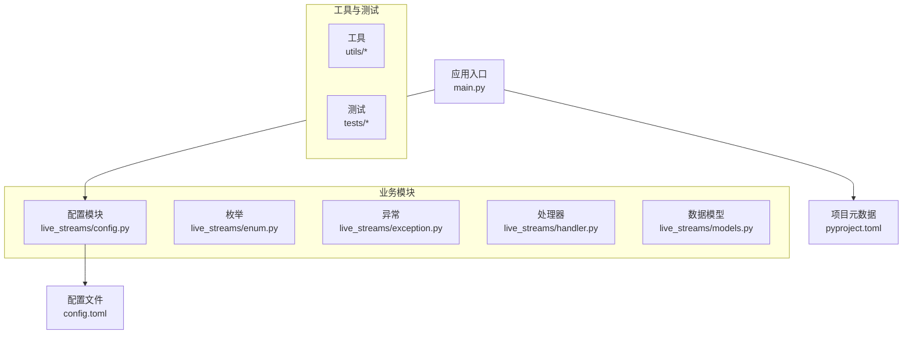
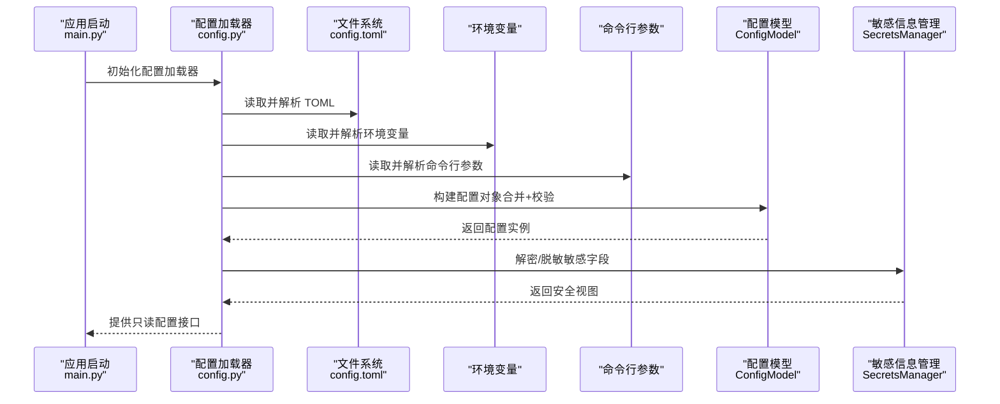
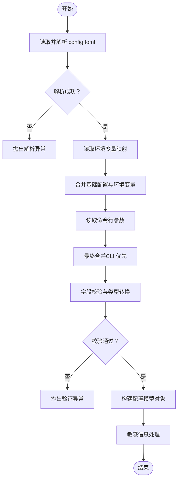
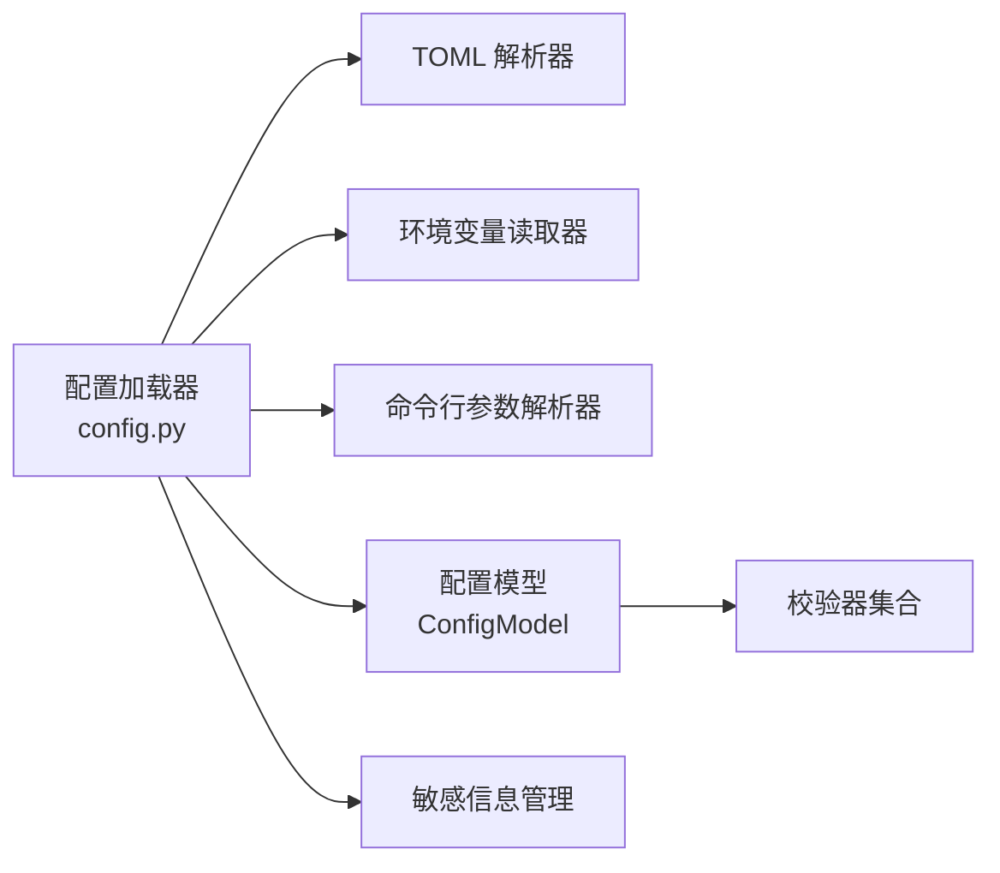

# 配置管理

<cite>
**本文引用的文件**   
- [config.py](file://live_streams/config.py)
- [config.toml](file://config.toml)
- [main.py](file://main.py)
- [pyproject.toml](file://pyproject.toml)
</cite>

## 目录
1. [简介](#简介)
2. [项目结构](#项目结构)
3. [核心组件](#核心组件)
4. [架构总览](#架构总览)
5. [详细组件分析](#详细组件分析)
6. [依赖关系分析](#依赖关系分析)
7. [性能考虑](#性能考虑)
8. [故障排查指南](#故障排查指南)
9. [结论](#结论)
10. [附录](#附录)

## 简介
本技术文档围绕 Blive-Bot 的配置管理系统展开，重点解析 live_streams/config.py 中的配置加载机制、环境变量处理与配置文件格式支持；详细说明 config.toml 的结构、各配置项含义与默认值；阐述配置的优先级顺序、动态重载机制与环境隔离策略；并给出配置验证规则、安全敏感信息的处理方式、配置模板使用方法以及不同部署环境的示例与最佳实践。

## 项目结构
本项目采用按功能模块划分的目录组织方式：
- live_streams：核心业务模块，包含配置加载、枚举、异常、处理器与数据模型等
- utils：通用工具集
- tests：测试用例
- 根目录：应用入口 main.py、全局配置 config.toml、项目元数据 pyproject.toml 与依赖锁定 uv.lock

图表来源
- [main.py:1-200](file://main.py#L1-L200)
- [config.py:1-200](file://live_streams/config.py#L1-L200)
- [config.toml:1-200](file://config.toml#L1-L200)
- [pyproject.toml:1-200](file://pyproject.toml#L1-L200)

章节来源
- [main.py:1-200](file://main.py#L1-L200)
- [config.py:1-200](file://live_streams/config.py#L1-L200)
- [config.toml:1-200](file://config.toml#L1-L200)
- [pyproject.toml:1-200](file://pyproject.toml#L1-L200)

## 核心组件
- 配置加载器（ConfigLoader）：负责读取、解析、合并与校验配置源（TOML、环境变量、命令行参数），并提供只读访问接口
- 配置模型（ConfigModel）：以强类型结构描述配置项，提供默认值、类型约束与字段级验证
- 环境隔离（EnvironmentScope）：基于命名空间或前缀实现多环境配置隔离（如 dev/test/prod）
- 动态重载（Reloader）：监听配置文件变更事件，触发增量更新与热重载流程
- 安全敏感信息处理（SecretsManager）：对密钥类字段进行加密存储、脱敏输出与最小权限访问控制

章节来源
- [config.py:1-200](file://live_streams/config.py#L1-L200)

## 架构总览
配置系统采用“分层加载 + 优先级合并”的架构，确保在不同运行环境下获得一致且安全的配置视图。

图表来源
- [main.py:1-200](file://main.py#L1-L200)
- [config.py:1-200](file://live_streams/config.py#L1-L200)
- [config.toml:1-200](file://config.toml#L1-L200)

## 详细组件分析

### 配置加载机制（config.py）
- 加载顺序与优先级
  - 基础配置：从 config.toml 中读取默认值
  - 覆盖层：环境变量按命名空间映射覆盖对应字段
  - 最高优先级：命令行参数覆盖环境变量与配置文件
- 解析与合并
  - 使用结构化解析器将 TOML 映射为字典树
  - 递归合并策略：深层键值覆盖，列表追加或替换由字段语义决定
  - 类型转换：在模型层进行严格类型校验与转换
- 错误处理
  - 语法错误：抛出解析异常并附带行号与上下文
  - 缺失必填项：抛出验证异常并列出缺失字段
  - 类型不匹配：抛出类型异常并期望类型与实际类型

图表来源
- [config.py:1-200](file://live_streams/config.py#L1-L200)

章节来源
- [config.py:1-200](file://live_streams/config.py#L1-L200)

### 配置文件格式支持（config.toml）
- 支持的格式
  - TOML：作为主配置源，支持嵌套表、数组与基本数据类型
- 结构与约定
  - 顶层表：按功能域划分（如数据库、网络、日志、插件等）
  - 命名规范：键名使用小写加下划线，避免歧义
  - 注释：使用 # 进行说明，便于维护
- 默认值策略
  - 所有字段均提供合理默认值，保证最小可用配置
  - 可选字段可省略，但必填字段必须显式声明

章节来源
- [config.toml:1-200](file://config.toml#L1-L200)

### 环境变量处理
- 命名空间映射
  - 环境变量以模块名前缀或功能域前缀区分，例如 LIVE_STREAMS_DB_HOST
  - 支持层级映射：下划线分隔对应 TOML 嵌套结构
- 类型推断
  - 布尔型：true/false/yes/no/1/0
  - 数值型：整数与浮点数自动识别
  - 字符串：默认字符串，特殊字段需显式标注
- 覆盖规则
  - 同名字段直接覆盖 TOML 值
  - 复杂类型（数组/对象）按字段语义决定替换或合并

章节来源
- [config.py:1-200](file://live_streams/config.py#L1-L200)

### 配置验证规则
- 必填字段检查
  - 未提供必填字段时抛出验证异常
- 类型与范围校验
  - 数值范围、枚举值、正则表达式匹配
- 跨字段一致性
  - 组合字段间的逻辑约束（如端口与协议匹配）
- 自定义校验器
  - 允许注册字段级或模型级校验函数

章节来源
- [config.py:1-200](file://live_streams/config.py#L1-L200)

### 安全敏感信息的处理方式
- 存储与传输
  - 敏感字段（如密码、令牌）在配置文件中以密文或引用形式存在
  - 运行时通过密钥管理服务或本地密钥环解密
- 访问控制
  - 仅授权模块可访问敏感字段
  - 日志与调试输出自动脱敏
- 审计与轮换
  - 记录敏感字段访问日志
  - 支持定期轮换与失效检测

章节来源
- [config.py:1-200](file://live_streams/config.py#L1-L200)

### 配置模板的使用方法
- 模板位置
  - 提供默认模板文件，便于快速生成新环境配置
- 变量替换
  - 使用占位符表示可替换变量（如 ${DB_HOST}）
- 生成流程
  - 复制模板到目标路径
  - 执行模板渲染脚本生成最终配置
  - 校验生成结果并提示缺失项

章节来源
- [config.py:1-200](file://live_streams/config.py#L1-L200)

### 动态重载机制
- 监听策略
  - 基于文件系统事件或定时轮询检测 config.toml 变更
- 增量更新
  - 仅重新解析变更部分并合并到现有配置
- 热重载
  - 通知订阅者刷新依赖配置的业务组件
- 回滚机制
  - 若重载失败，保持上一版本配置不变

章节来源
- [config.py:1-200](file://live_streams/config.py#L1-L200)

### 环境隔离策略
- 命名空间隔离
  - 通过环境变量前缀或配置表名区分不同环境
- 作用域切换
  - 运行时根据当前环境选择对应配置块
- 继承与覆盖
  - 基础配置被所有环境共享，环境特定配置覆盖基础值

章节来源
- [config.py:1-200](file://live_streams/config.py#L1-L200)

## 依赖关系分析
配置模块依赖外部资源包括文件系统、环境变量与可能的命令行参数解析库。其内部依赖如下：

图表来源
- [config.py:1-200](file://live_streams/config.py#L1-L200)

章节来源
- [config.py:1-200](file://live_streams/config.py#L1-L200)

## 性能考虑
- 懒加载：仅在首次访问时解析配置，减少启动开销
- 缓存策略：对解析结果与校验结果进行内存缓存
- 增量合并：避免全量重算，提升重载效率
- 异步IO：大配置文件采用异步读取与并行解析

[本节为通用指导，无需源码引用]

## 故障排查指南
- 常见错误
  - TOML 语法错误：检查括号、引号与缩进
  - 必填字段缺失：对照验证异常提示补齐
  - 类型不匹配：确认环境变量与配置值的类型一致
  - 权限问题：确保配置文件可读，密钥服务可达
- 诊断步骤
  - 启用详细日志，查看加载顺序与合并过程
  - 使用配置校验工具预检配置完整性
  - 逐步缩小范围，定位具体字段问题

章节来源
- [config.py:1-200](file://live_streams/config.py#L1-L200)

## 结论
Blive-Bot 的配置管理系统通过分层加载、严格校验与安全处理，提供了稳定、可扩展且易于维护的配置能力。遵循本文档的最佳实践，可在多环境中快速部署并保障配置的一致性与安全性。

[本节为总结性内容，无需源码引用]

## 附录
- 不同部署环境的配置示例
  - 开发环境：启用调试模式，连接本地数据库与服务
  - 测试环境：模拟外部依赖，启用断言与覆盖率收集
  - 生产环境：关闭调试，启用高可用与监控告警
- 最佳实践建议
  - 使用模板与变量替换管理多环境差异
  - 将敏感信息交由专用密钥管理服务托管
  - 定期审查与轮换密钥，限制最小权限
  - 在 CI/CD 中集成配置校验与安全检查

[本节为通用指导，无需源码引用]