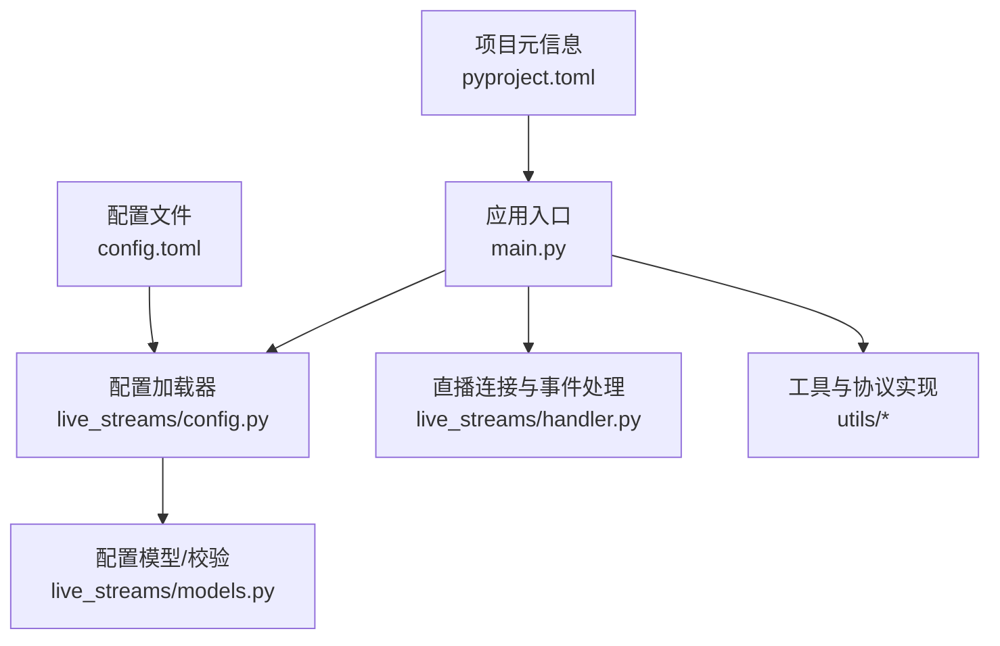
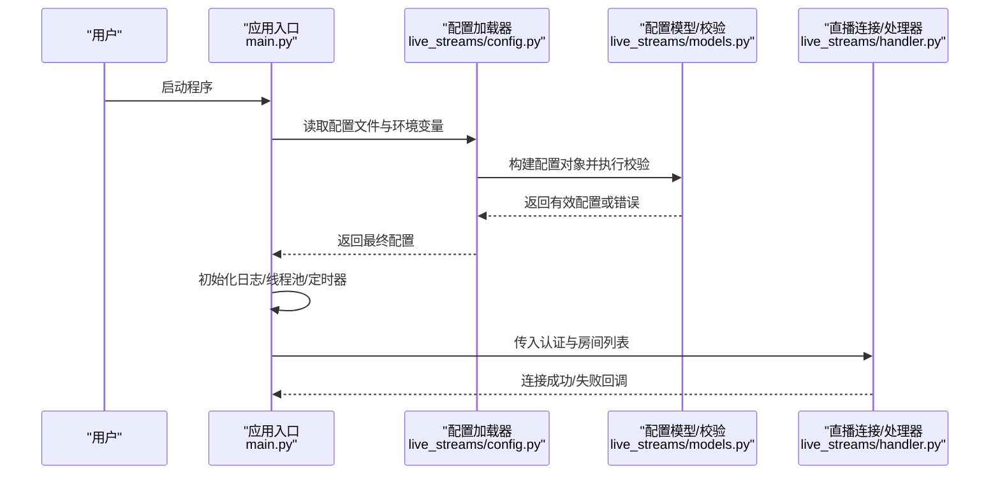
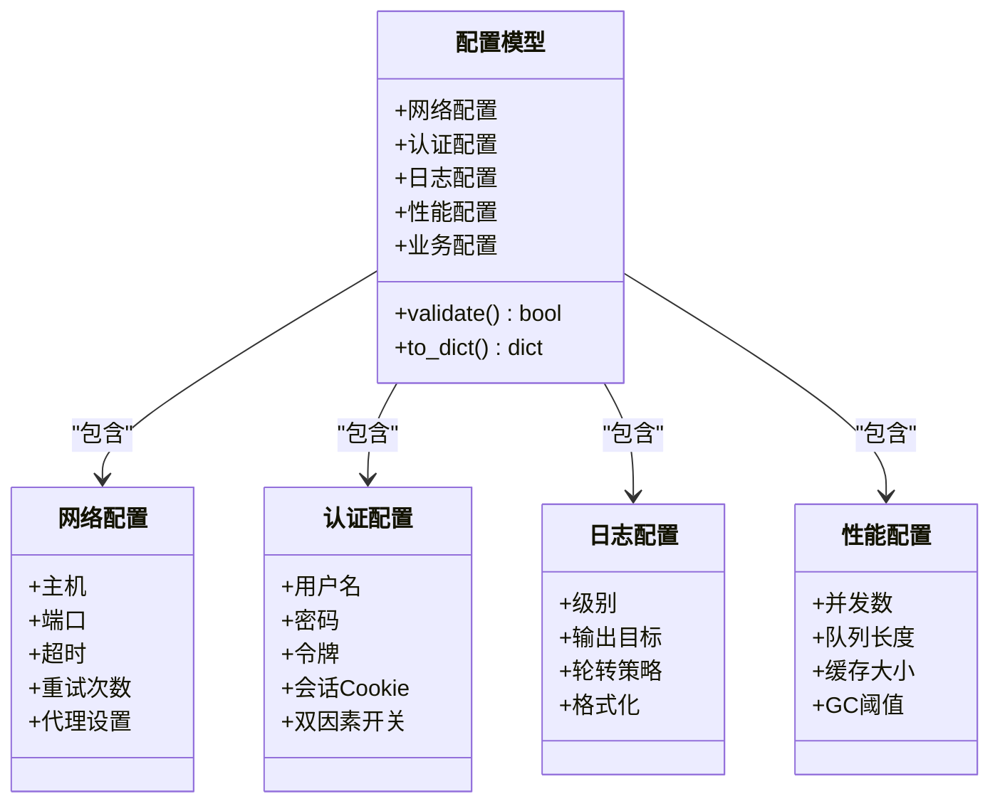
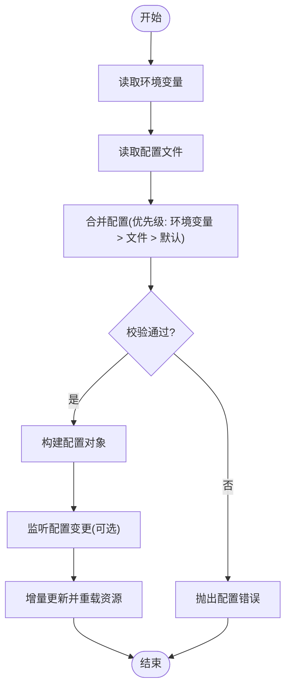
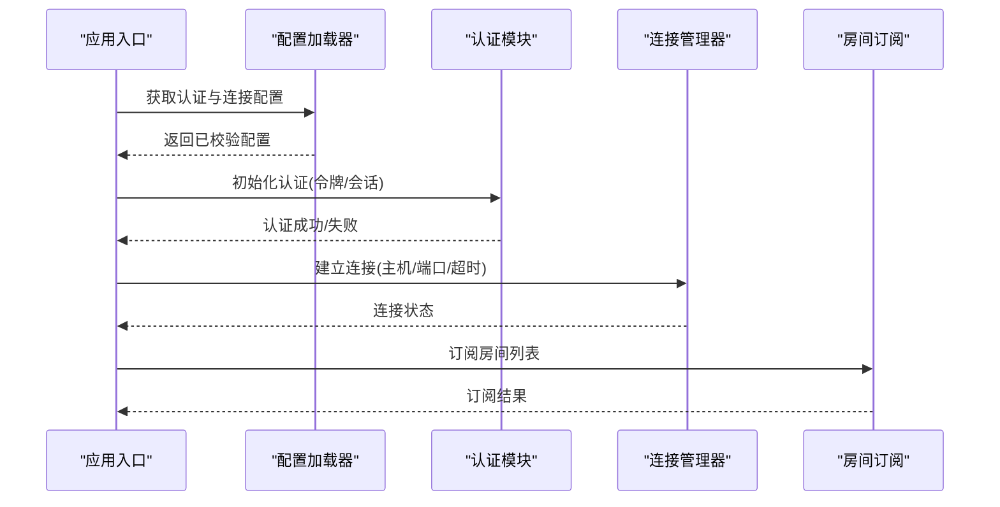
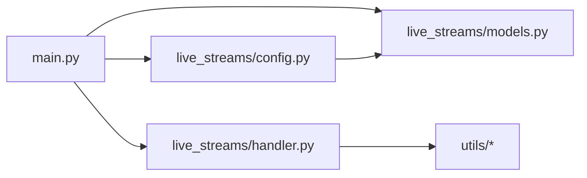

# 配置指南

<cite>
**本文档引用的文件**   
- [config.toml](file://config.toml)
- [main.py](file://main.py)
- [live_streams/config.py](file://live_streams/config.py)
- [live_streams/models.py](file://live_streams/models.py)
- [pyproject.toml](file://pyproject.toml)
</cite>

## 目录
1. [简介](#简介)
2. [项目结构](#项目结构)
3. [核心组件](#核心组件)
4. [架构总览](#架构总览)
5. [详细组件分析](#详细组件分析)
6. [依赖关系分析](#依赖关系分析)
7. [性能考虑](#性能考虑)
8. [故障排查指南](#故障排查指南)
9. [结论](#结论)
10. [附录](#附录)

## 简介
本指南面向Blive-Bot的配置与部署，重点围绕配置文件（通常为 config.toml）的字段含义、默认值、使用场景、验证规则、环境变量支持与动态更新机制进行系统化说明。文档同时提供个人使用、生产环境、多房间监控等典型场景的配置模板与最佳实践，并给出常见问题排查方法与性能优化建议。

## 项目结构
Blive-Bot采用分层组织方式：
- 应用入口负责加载配置、初始化运行时环境与启动服务
- live_streams 模块封装直播连接、事件处理与数据模型
- utils 提供通用工具与交互协议实现
- 顶层配置文件集中管理运行参数

图表来源
- [main.py:1-200](file://main.py#L1-L200)
- [live_streams/config.py:1-200](file://live_streams/config.py#L1-L200)
- [live_streams/models.py:1-200](file://live_streams/models.py#L1-L200)

章节来源
- [main.py:1-200](file://main.py#L1-L200)
- [live_streams/config.py:1-200](file://live_streams/config.py#L1-L200)
- [live_streams/models.py:1-200](file://live_streams/models.py#1-L200)

## 核心组件
- 配置加载器：负责读取配置文件与环境变量，合并为最终配置对象，并进行类型转换与基础校验
- 配置模型：定义配置项的数据结构、默认值、约束条件与校验逻辑
- 应用入口：解析命令行参数、加载配置、初始化日志与网络栈、启动任务调度
- 直播连接与处理器：基于配置建立连接、订阅房间、处理弹幕/礼物/关注等事件

章节来源
- [live_streams/config.py:1-200](file://live_streams/config.py#L1-L200)
- [live_streams/models.py:1-200](file://live_streams/models.py#L1-L200)
- [main.py:1-200](file://main.py#L1-L200)

## 架构总览
下图展示了从配置文件到运行时行为的关键路径：配置文件被加载后，经模型校验生成强类型配置；应用入口依据配置初始化日志级别、网络超时、并发度等关键参数；直播连接层根据认证信息与房间列表建立连接并分发事件。

图表来源
- [main.py:1-200](file://main.py#L1-L200)
- [live_streams/config.py:1-200](file://live_streams/config.py#L1-L200)
- [live_streams/models.py:1-200](file://live_streams/models.py#L1-L200)
- [live_streams/handler.py:1-200](file://live_streams/handler.py#L1-L200)

## 详细组件分析

### 配置模型与数据结构
- 配置项分组：通常包含数据库/存储、网络/连接、认证、日志、性能调优、业务开关等
- 数据类型：字符串、布尔、整数、浮点数、枚举、数组/列表、可选字段
- 默认值：每个字段应提供合理默认值，便于最小化配置即可运行
- 校验规则：必填性、取值范围、格式校验（如URL、邮箱）、互斥/依赖关系

图表来源
- [live_streams/models.py:1-200](file://live_streams/models.py#L1-L200)

章节来源
- [live_streams/models.py:1-200](file://live_streams/models.py#L1-L200)

### 配置加载流程与环境变量支持
- 优先级：环境变量 > 配置文件 > 代码默认值
- 覆盖规则：同名键按优先级覆盖，支持嵌套结构合并
- 敏感信息：建议通过环境变量注入密钥类字段
- 热更新：监听配置文件变更事件，增量更新配置对象并触发重连/重载

图表来源
- [live_streams/config.py:1-200](file://live_streams/config.py#L1-L200)
- [live_streams/models.py:1-200](file://live_streams/models.py#L1-L200)

章节来源
- [live_streams/config.py:1-200](file://live_streams/config.py#L1-L200)

### 认证与连接配置
- 认证方式：用户名/密码、令牌、会话Cookie、OAuth等
- 连接参数：主机、端口、超时、重试、代理、TLS
- 房间订阅：房间ID列表、过滤规则、事件订阅开关
- 安全建议：避免在配置文件中明文存放敏感信息，优先使用环境变量

图表来源
- [live_streams/config.py:1-200](file://live_streams/config.py#L1-L200)
- [live_streams/handler.py:1-200](file://live_streams/handler.py#L1-L200)

章节来源
- [live_streams/config.py:1-200](file://live_streams/config.py#L1-L200)
- [live_streams/handler.py:1-200](file://live_streams/handler.py#L1-L200)

### 日志级别与输出
- 级别：DEBUG、INFO、WARNING、ERROR、CRITICAL
- 输出目标：控制台、文件、远程日志服务
- 轮转策略：按时间/大小轮转，保留份数
- 格式化：JSON/文本，包含请求ID、时间戳、级别、消息

章节来源
- [live_streams/models.py:1-200](file://live_streams/models.py#L1-L200)

### 性能调优参数
- 并发数：工作线程/协程数量，需结合CPU核数与IO特性调整
- 队列长度：事件缓冲上限，防止内存溢出
- 缓存大小：本地缓存条目上限与过期策略
- GC阈值：控制垃圾回收频率，平衡延迟与吞吐

章节来源
- [live_streams/models.py:1-200](file://live_streams/models.py#L1-L200)

### 配置语法与注释规范
- 文件格式：TOML，支持键值对、表、数组、布尔、数字、字符串、日期时间
- 注释：以 # 开头单行注释
- 命名：推荐小写加下划线，保持可读性与一致性
- 分组：使用表将相关配置聚合，提升可维护性

章节来源
- [config.toml:1-200](file://config.toml#L1-L200)

### 配置验证规则
- 必填字段：认证凭据、主机端口、日志级别等
- 取值范围：超时毫秒、并发数、队列长度等数值区间
- 格式校验：URL、邮箱、IP、正则表达式匹配
- 依赖关系：开启某功能时必需的其他配置项

章节来源
- [live_streams/models.py:1-200](file://live_streams/models.py#L1-L200)

### 动态配置更新机制
- 监听方式：文件系统事件或定时扫描
- 更新策略：增量合并、原子替换、回滚保护
- 影响范围：仅重新加载受影响模块，避免全量重启
- 通知机制：记录变更日志，必要时触发重连或刷新缓存

章节来源
- [live_streams/config.py:1-200](file://live_streams/config.py#L1-L200)

## 依赖关系分析
- 应用入口依赖配置加载器与模型，确保配置可用后再初始化其他模块
- 直播连接层依赖认证与网络配置，保证连接稳定性
- 工具模块被多处复用，应保持无状态与幂等

图表来源
- [main.py:1-200](file://main.py#L1-L200)
- [live_streams/config.py:1-200](file://live_streams/config.py#L1-L200)
- [live_streams/models.py:1-200](file://live_streams/models.py#L1-L200)
- [live_streams/handler.py:1-200](file://live_streams/handler.py#L1-L200)

章节来源
- [main.py:1-200](file://main.py#L1-L200)
- [live_streams/config.py:1-200](file://live_streams/config.py#L1-L200)
- [live_streams/models.py:1-200](file://live_streams/models.py#L1-L200)
- [live_streams/handler.py:1-200](file://live_streams/handler.py#L1-L200)

## 性能考虑
- 合理设置并发与队列长度，避免阻塞与内存膨胀
- 启用连接池与HTTP客户端复用，减少握手开销
- 使用异步I/O与事件驱动模型提升吞吐
- 对热点数据进行本地缓存，注意过期与一致性
- 日志级别在生产环境调整为INFO或WARNING，降低I/O压力

[本节为通用指导，不直接分析具体文件]

## 故障排查指南
- 配置加载失败：检查TOML语法、必填字段缺失、类型不匹配
- 认证失败：确认凭据正确、令牌未过期、网络可达
- 连接超时：调整超时与重试参数，检查代理与防火墙
- 内存增长：检查队列堆积、缓存未清理、事件未消费
- 日志过多：调整级别与输出目标，启用轮转

章节来源
- [live_streams/config.py:1-200](file://live_streams/config.py#L1-L200)
- [live_streams/models.py:1-200](file://live_streams/models.py#L1-L200)

## 结论
通过统一的配置模型与加载流程，Blive-Bot实现了高内聚、低耦合的可配置系统。遵循本文档的规范与实践，可在不同场景下快速搭建稳定、高效的直播机器人服务。

[本节为总结，不直接分析具体文件]

## 附录

### 常用配置项说明（示例字段类别）
- 网络与连接：主机、端口、超时、重试、代理、TLS
- 认证：用户名、密码、令牌、会话Cookie、双因素开关
- 日志：级别、输出目标、轮转策略、格式化
- 性能：并发数、队列长度、缓存大小、GC阈值
- 业务：房间ID列表、事件订阅开关、过滤规则

章节来源
- [config.toml:1-200](file://config.toml#L1-L200)
- [live_streams/models.py:1-200](file://live_streams/models.py#L1-L200)

### 使用场景配置模板
- 个人使用：最小化配置，关闭冗余功能，适度并发
- 生产环境：严格校验、健壮的重试与超时、完善的日志与监控
- 多房间监控：批量房间订阅、事件分流、独立队列与缓存

章节来源
- [config.toml:1-200](file://config.toml#L1-L200)
- [live_streams/config.py:1-200](file://live_streams/config.py#L1-L200)

### 环境变量清单（建议）
- 认证类：TOKEN、COOKIE、SECRET_KEY
- 网络类：PROXY_URL、TLS_ENABLED
- 日志类：LOG_LEVEL、LOG_OUTPUT
- 性能类：WORKERS、QUEUE_SIZE、CACHE_MAX

章节来源
- [live_streams/config.py:1-200](file://live_streams/config.py#L1-L200)

### 配置文件语法与注释规范
- TOML基本语法：键值对、表、数组、布尔、数字、字符串
- 注释：以 # 开头
- 命名：小写加下划线，语义清晰
- 分组：使用表聚合相关配置

章节来源
- [config.toml:1-200](file://config.toml#L1-L200)

### 常见配置问题与修复
- 语法错误：修正TOML拼写与缩进
- 类型不匹配：统一数据类型，避免字符串与数字混用
- 权限不足：确保配置文件与日志目录读写权限
- 端口冲突：更换端口或释放占用进程

章节来源
- [live_streams/models.py:1-200](file://live_streams/models.py#L1-L200)

### 性能优化建议
- 调整并发与队列长度，观察CPU与内存曲线
- 启用连接复用与HTTP客户端池
- 使用异步I/O与事件循环
- 对热点数据做缓存，设置合理过期策略

[本节为通用指导，不直接分析具体文件]