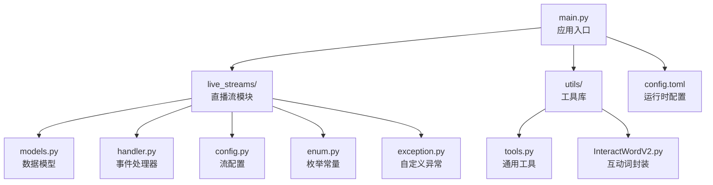
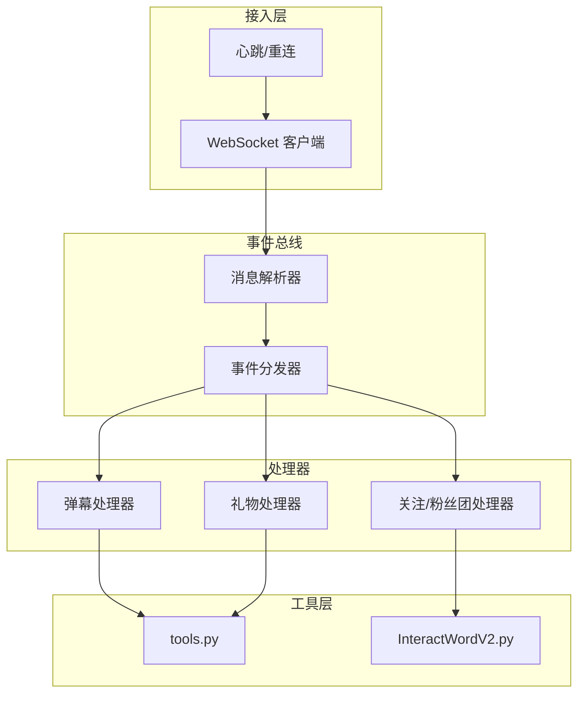
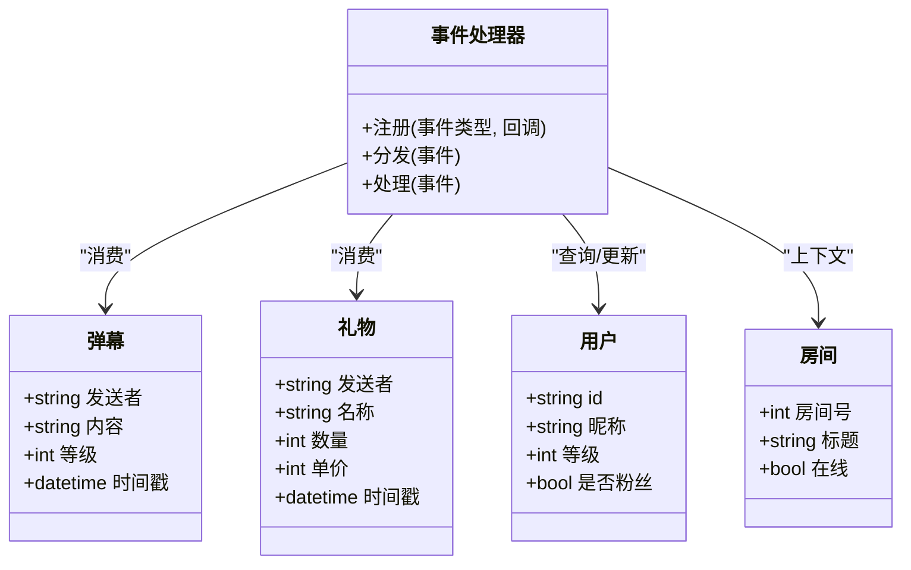
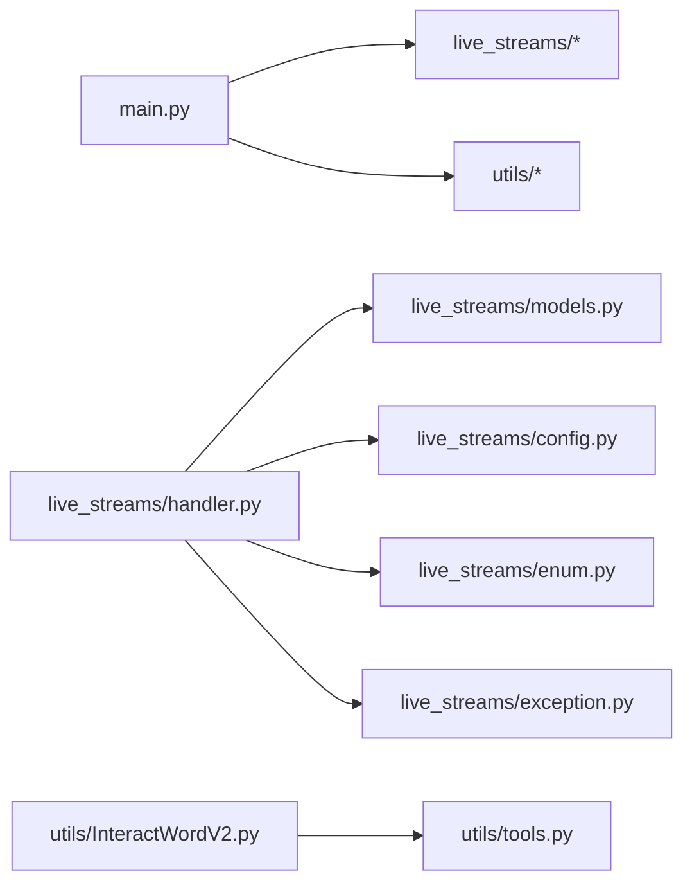

# 项目概览

<cite>
**本文引用的文件**   
- [main.py](file://main.py)
- [config.toml](file://config.toml)
- [pyproject.toml](file://pyproject.toml)
- [live_streams/__init__.py](file://live_streams/__init__.py)
- [live_streams/config.py](file://live_streams/config.py)
- [live_streams/enum.py](file://live_streams/enum.py)
- [live_streams/exception.py](file://live_streams/exception.py)
- [live_streams/handler.py](file://live_streams/handler.py)
- [live_streams/models.py](file://live_streams/models.py)
- [utils/__init__.py](file://utils/__init__.py)
- [utils/tools.py](file://utils/tools.py)
- [utils/InteractWordV2.py](file://utils/InteractWordV2.py)
- [tests/live_rooms.py](file://tests/live_rooms.py)
- [tests/test.py](file://tests/test.py)
</cite>

## 目录
1. [简介](#简介)
2. [项目结构](#项目结构)
3. [核心组件](#核心组件)
4. [架构总览](#架构总览)
5. [详细组件分析](#详细组件分析)
6. [依赖关系分析](#依赖关系分析)
7. [性能考量](#性能考量)
8. [故障排查指南](#故障排查指南)
9. [结论](#结论)
10. [附录：快速上手与配置示例](#附录快速上手与配置示例)

## 简介
本文件为 Blive-Bot 项目的全面概览文档，面向初学者与有经验的开发者。项目目标是构建一个直播弹幕机器人，通过 WebSocket 连接直播平台接口，实时接收并处理弹幕消息，支持事件驱动的消息分发、业务逻辑扩展与工具集成。整体采用模块化设计，将“直播流接入”“模型定义”“事件处理器”“工具库”等职责清晰分离，便于扩展与维护。

## 项目结构
项目采用按功能域划分的目录组织方式：
- live_streams：直播流相关能力（配置、枚举、异常、数据模型、事件处理器）
- utils：通用工具与第三方交互封装
- tests：测试用例
- 根目录：入口脚本、配置文件与依赖声明

图表来源
- [main.py](file://main.py)
- [live_streams/models.py](file://live_streams/models.py)
- [live_streams/handler.py](file://live_streams/handler.py)
- [live_streams/config.py](file://live_streams/config.py)
- [live_streams/enum.py](file://live_streams/enum.py)
- [live_streams/exception.py](file://live_streams/exception.py)
- [utils/tools.py](file://utils/tools.py)
- [utils/InteractWordV2.py](file://utils/InteractWordV2.py)
- [config.toml](file://config.toml)

章节来源
- [main.py](file://main.py)
- [live_streams/__init__.py](file://live_streams/__init__.py)
- [live_streams/config.py](file://live_streams/config.py)
- [live_streams/enum.py](file://live_streams/enum.py)
- [live_streams/exception.py](file://live_streams/exception.py)
- [live_streams/handler.py](file://live_streams/handler.py)
- [live_streams/models.py](file://live_streams/models.py)
- [utils/__init__.py](file://utils/__init__.py)
- [utils/tools.py](file://utils/tools.py)
- [utils/InteractWordV2.py](file://utils/InteractWordV2.py)
- [config.toml](file://config.toml)

## 核心组件
- 应用入口 main.py：负责初始化配置、启动直播流监听、注册事件处理器、运行主循环。
- 直播流模块 live_streams：
  - models.py：定义弹幕、礼物、用户、房间等数据模型。
  - handler.py：实现事件驱动的弹幕处理流程，包括鉴权、解析、分发与业务回调。
  - config.py：加载与校验直播流相关配置（如房间号、鉴权参数、重连策略）。
  - enum.py：定义事件类型、状态码、平台协议常量。
  - exception.py：定义业务异常与错误分类。
- 工具库 utils：
  - tools.py：提供网络请求、序列化、日志、时间戳等通用能力。
  - InteractWordV2.py：封装与平台的互动词接口调用。
- 配置与依赖：
  - config.toml：运行时配置项（如房间列表、鉴权信息、开关与阈值）。
  - pyproject.toml：项目元数据与依赖声明。

章节来源
- [main.py](file://main.py)
- [live_streams/models.py](file://live_streams/models.py)
- [live_streams/handler.py](file://live_streams/handler.py)
- [live_streams/config.py](file://live_streams/config.py)
- [live_streams/enum.py](file://live_streams/enum.py)
- [live_streams/exception.py](file://live_streams/exception.py)
- [utils/tools.py](file://utils/tools.py)
- [utils/InteractWordV2.py](file://utils/InteractWordV2.py)
- [config.toml](file://config.toml)
- [pyproject.toml](file://pyproject.toml)

## 架构总览
系统采用“接入层—事件总线—处理器—工具层”的分层架构：
- 接入层：WebSocket 客户端建立与平台服务通信，负责心跳、断线重连、消息收发。
- 事件总线：将原始消息解析为统一事件对象，并按类型分发给对应处理器。
- 处理器：根据事件类型执行具体业务逻辑（如弹幕过滤、统计、回复、积分等）。
- 工具层：提供网络、序列化、加密、日志等通用能力，以及平台 API 封装。

图表来源
- [live_streams/handler.py](file://live_streams/handler.py)
- [live_streams/models.py](file://live_streams/models.py)
- [utils/tools.py](file://utils/tools.py)
- [utils/InteractWordV2.py](file://utils/InteractWordV2.py)

## 详细组件分析

### 直播流模块（live_streams）
- 数据模型（models.py）
  - 定义弹幕、礼物、用户、房间等实体字段与校验规则，作为事件总线与处理器之间的契约。
- 事件处理器（handler.py）
  - 实现事件注册、匹配与调度；对原始消息进行鉴权、去重、限流后，再路由到具体处理器。
- 配置（config.py）
  - 读取并校验房间号、鉴权令牌、超时与重连策略等关键参数。
- 枚举（enum.py）
  - 集中管理事件类型、状态码、平台协议常量，避免魔法字符串。
- 异常（exception.py）
  - 定义业务异常类别（如鉴权失败、网络异常、消息格式错误），便于上层统一捕获与恢复。

图表来源
- [live_streams/models.py](file://live_streams/models.py)
- [live_streams/handler.py](file://live_streams/handler.py)

章节来源
- [live_streams/models.py](file://live_streams/models.py)
- [live_streams/handler.py](file://live_streams/handler.py)
- [live_streams/config.py](file://live_streams/config.py)
- [live_streams/enum.py](file://live_streams/enum.py)
- [live_streams/exception.py](file://live_streams/exception.py)

### 工具库（utils）
- tools.py：提供 HTTP/WebSocket 辅助、JSON 序列化、日志、时间转换、重试等通用方法。
- InteractWordV2.py：封装平台互动词接口，供处理器在需要时调用（如自动回复、抽奖、签到）。

章节来源
- [utils/tools.py](file://utils/tools.py)
- [utils/InteractWordV2.py](file://utils/InteractWordV2.py)

### 应用入口（main.py）
- 负责加载配置、初始化直播流客户端、注册事件处理器、启动主循环与优雅退出。
- 典型流程：读取 config.toml → 创建 WebSocket 客户端 → 订阅事件 → 进入事件循环。

章节来源
- [main.py](file://main.py)
- [config.toml](file://config.toml)

## 依赖关系分析
- 外部依赖由 pyproject.toml 声明，运行时由 uv.lock 锁定版本，确保可重复构建。
- 内部依赖：
  - main.py 依赖 live_streams 与 utils。
  - live_streams.handler 依赖 models、config、enum、exception。
  - utils.InteractWordV2 可能依赖 tools 或网络库。

图表来源
- [main.py](file://main.py)
- [live_streams/handler.py](file://live_streams/handler.py)
- [live_streams/models.py](file://live_streams/models.py)
- [live_streams/config.py](file://live_streams/config.py)
- [live_streams/enum.py](file://live_streams/enum.py)
- [live_streams/exception.py](file://live_streams/exception.py)
- [utils/tools.py](file://utils/tools.py)
- [utils/InteractWordV2.py](file://utils/InteractWordV2.py)
- [pyproject.toml](file://pyproject.toml)

章节来源
- [pyproject.toml](file://pyproject.toml)
- [uv.lock](file://uv.lock)

## 性能考量
- 连接稳定性：心跳保活与指数退避重连，降低抖动影响。
- 消息处理：事件总线采用异步分发与批处理，减少阻塞；对高频事件做去重与限流。
- 资源控制：限制并发任务数与队列长度，防止内存暴涨。
- 序列化优化：使用高效 JSON 编解码与对象池复用。
- 可观测性：结构化日志与指标上报，便于定位瓶颈。

[本节为通用指导，不直接分析具体文件]

## 故障排查指南
- 常见异常分类
  - 鉴权失败：检查 token 有效期与权限范围。
  - 网络异常：检查代理、防火墙、DNS 与超时设置。
  - 消息格式错误：核对平台协议变更与解析器兼容性。
- 定位步骤
  - 开启调试日志，记录握手、心跳、消息体与错误堆栈。
  - 复现最小场景（单房间、单事件），逐步缩小范围。
  - 使用测试用例验证解析与处理器链路。
- 恢复策略
  - 自动重连与降级模式（只读模式、跳过非关键逻辑）。
  - 告警与人工介入通道。

章节来源
- [live_streams/exception.py](file://live_streams/exception.py)
- [live_streams/handler.py](file://live_streams/handler.py)
- [utils/tools.py](file://utils/tools.py)

## 结论
Blive-Bot 以清晰的模块化与事件驱动架构，实现了稳定高效的直播弹幕处理能力。通过统一的模型与事件总线，业务处理器可快速扩展；工具层屏蔽底层差异，提升开发效率。配合完善的配置与异常体系，项目具备良好的可维护性与可扩展性。

[本节为总结性内容，不直接分析具体文件]

## 附录：快速上手与配置示例
- 环境准备
  - 安装 Python 与包管理器（如 uv）。
  - 克隆仓库并进入项目目录。
- 安装依赖
  - 使用 pyproject.toml 声明的依赖进行安装。
- 基本配置
  - 编辑 config.toml，填写房间号、鉴权信息与基础开关。
- 启动机器人
  - 运行 main.py，观察日志确认 WebSocket 连接成功与事件正常分发。
- 扩展处理器
  - 在 live_streams/handler.py 中注册新的事件类型与回调逻辑。
- 测试与验证
  - 参考 tests/live_rooms.py 与 tests/test.py，编写单元测试与集成测试。

章节来源
- [config.toml](file://config.toml)
- [pyproject.toml](file://pyproject.toml)
- [main.py](file://main.py)
- [live_streams/handler.py](file://live_streams/handler.py)
- [tests/live_rooms.py](file://tests/live_rooms.py)
- [tests/test.py](file://tests/test.py)